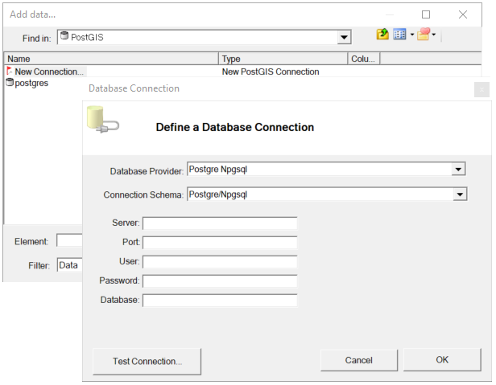

Daten hinzuzufügen
==================

Beim Erstellen einer Karte müssen im ersten Schritt Daten hinzugefügt werden.
Dazu klickt man in der Baumansicht auf den obersten Knoten (die Karte). Im *Ribbon* erscheinen dadurch *Context* Befehle, die sich auf die Karte anwenden lassen:

.. image:: img/adddata1.png

Der Dialog gleicht in der Navigation dem *gView Data Explorer*. Anstelle der
Baumansicht des Data Explorers steht Ihnen hier ein Kombinationsfeld (Suchen in) zur
Verfügung. Der mittlere Teil des Dialogs entspricht dem Contents-Bereich. Hier sind
allerdings im Gegensatz zum *Data Explorer* nicht alle Kontextmenüs vorhanden. So ist z. B.
zum Löschen und Umbenennen von Objekten immer der *Data Explorer* zu verwenden.

.. image:: img/adddata2.png 

Bei der ersten Anwendung müssen eventuell noch die Verbindungen zu Datenquellen eingestellt werden. Möchte man beispielsweise *PostGIS* Daten einbinden (empfohlen),
muss man im Dialog zuerst in den Ordner ``OGC`` wechseln. Dort gibt es den Unterpunkt ``PostGIS`` unter dem alle gespeicherten Verginden zu *PostGIS Servern* aufgelistet werden.
Sind noch keine Verbindungen vorhanden kann über ``New Connection`` eine neue Verbindung angelegt werden:

Bevor die Verbindung übernommen wird, kann mit ``Test Connection`` noch überprüft werden, ob alle Einstellungen richtig sind und eine Verbindung aufgebaut werden kann.

Ist die Verbindung erfolgt erstellt worden, kann sie mit einem Doppelkick geöffnet werden.

Im *Content-Bereich* können Featureklassen oder ein Dataset ausgewält und
danach der Dialog mit ``OK`` bestätigt werden. Im nächsten Schritt wird eine Liste aller ausgewählten
Featureklassen angezeigt:

.. image:: img/adddata4.png 

Hier kann das Laden einer Featureklasse wieder rückgängig machen. Außerdem
kann die primäre Sichtbarkeit des entsprechenden Layers angeben. Über den
Eigenschaften-Button sind alle Eigenschaften wie Legende, Maßstabsgrenzen, Filter usw. für
jeden Layer schon vor dem Laden zu vergeben. Alle diese Eingaben sind allerdings auch
später noch möglich. Nach dem Bestätigen des Dialogs erhält man beispielsweise folgende
Ansicht:

.. image:: img/adddata5.png 

