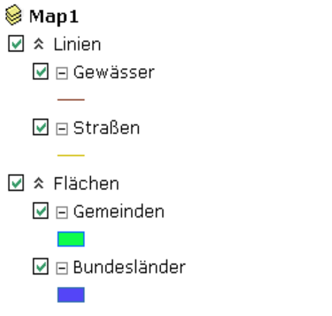

Themengruppierung
=================

Die Themen können im TOC auch gruppiert werden. Dazu klicken man mit der rechten
Maustaste auf irgendeinen Layer und wählt im Kontextmenü ``Neuen Gruppenlayer
anlege``. Um Layer einer Gruppe zuordnen, müssen die entsprechenden Layer markiert
werden. Hierzu können Umstell- (Shift) bzw. Steuerungstaste (Ctrl) benutzen werden,
um mehrer Layer auszuwählen. Das eigentliche Verschieben erfolgt über das Kontextmenü
``In Gruppenlayer verschieben``.

Zum Umbenennen eines Layers oder einer Gruppe kann ein Element im TOC doppelgeklickt werden. 
Dadurch erscheint ein Eingabefeld mit dem ein Name geändert werden kann. Bestätigt wird der neuen Name mit der Enter-Taste.

Die oben beschrieben Arbeitsschritte ergeben beispielsweise folgende Darstellung des TOC:

Mit den Kontrollkästchen kann die Sichtbarkeit der Themen geschaltet werden. 

.. note::
   Wird ein Gruppenlayer auf unsichtbar gestellt, sind auch alle in ihm enthaltenen Layer unsichtbar, egal ob diese auf sichtbar gesetzt wurden.
