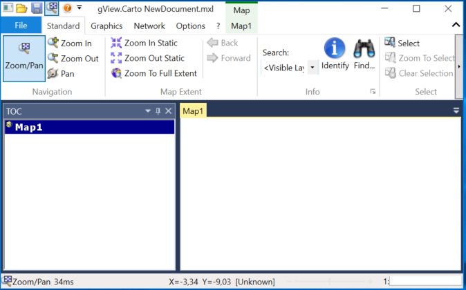

gView Carto
===========

Die Desktop Applikation gView Carto dient zum Erstellen und Betrachten von Karten. Diese
Karten können im *gView MapServer* veröffentlicht werden und stehen danach in unterschiedlichen Schnittstellenformaten zur Verfügung.
In diesem Abschnitt soll der Vorgang der Kartenerstellung beschrieben werden. Auf die einzelnen Werkzeuge
wird nur kurz bzw. gar nicht eingegangen. Sie sollten aber nach der Lektüre dieses Kapitels in
der Lage sein, Daten in eine Karte hinzuzufügen und die Legenden nach ihren Vorstellungen
zu gestalten.

Nach dem Start durch ``gView Carto.bat`` zeigt die Anwendungen vorerst ein leeres
Kartenbild:

.. toctree::
    :maxdepth: 2
    :caption: Inhaltsverzeichnis:
 
    adddata
    layerorder
    grouplayers
    symbology
    labeling
    scales
    layerprops
    managemaps
