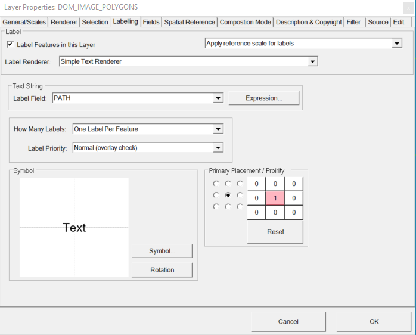
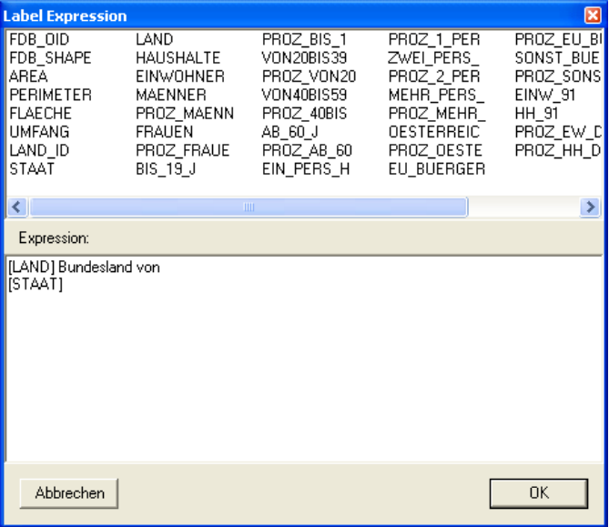
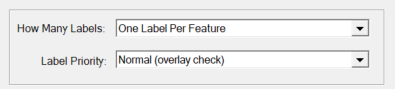

Beschriftung (Labeling)
=======================

Weiters wäre es wünschenswert die Bundesländer aus diesem Beispiel zu beschriften. Auch das lässt sich über den
``Eigenschaften`` Dialog des Layers einstellen. Die verantwortliche Registerkarte heißt ``Beschriften`` (oder ``Labeling``):

Hier steuert das Kontrollkästchen „Layer beschriften“, ob ein Thema beschriftet wird. Anstelle eines einfachen Beschriftungsfeldes, dass ebenfalls diesem Dialog angeführt werden kann,
kann auch eine so genannte ``Expression`` über den gleichnamigen Button angeben werden. Eine *Expresson* kann sich aus mehreren Feldern und fixem Text zusammensetzen:

Die Felder innerhalb einer Expression sind dabei in eckigen Klammern anzugeben. 
Durch einen Doppelklick auf einen Feldnamen im oberen Bereich des Dialogs wird das Feld an der aktuellen Cursorposition im Expressionfeld eingefügt.

.. note::
   Zeilenumbrüche werden ebenfalls in die Expression mit aufgenommen.

Weitere Einstellmöglichkeiten bei der  Beschriftungshäufigkeit angeboten:

* One Label Per Name: Ein Name wird in der Karte pro Featureklasse nur einmal angezeigt.
* One Label Per Feature: Ein Objekt wird nur einmal beschriftet, auch wenn es aus mehreren Teilen besteht.
* One Label Per Part: Jeder Teil eines Objektes wird beschriftet. Bei den Bundesländern von Österreich stellt z. B. Tirol mit Osttirol ein mehrteiliges Feature dar.

Die Beschriftung wird normalerweise so angeordnet, dass es keine Überlappungen der Texte
gibt. Sollen die Objekte eines Layers jedoch immer beschriften werden, egal ob es dabei zu
Überlappungen kommt, ist als Priorität ``Always (no overlay check)`` zu wählen.

Können Texte aufgrund von Überlappungen nicht angezeigt werden, können über die Positionierung des Labels relativ zum Geo-Objekt noch weiter alternative 
Positionen angegeben werden. Die bevorzugte Position wird über die neun Optionsbuttons (schwarte Punkte) angegeben. Daneben können über einen Klick auf 
die Buttons alternative Positionen angeklickt werden:

.. image:: img/labeling4.png

Die Zahl im Button gibt die Reichenfolge an, mit der versucht wird den Text in die Karte einzufügen, ohne eine Überlappung 
mit bestehenden Texten zu erzeugen. Mit dem ``Reset`` Button werden alle alternativen Beschriftungspositionen rückgängig gemacht.
