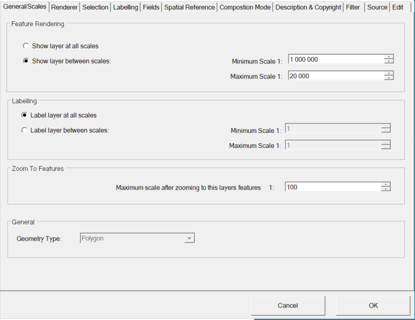

Maßstabsgrenzen
===============

Sehr häufig ist es notwendig, Layer oder Beschriftungen nur innerhalb gewisser
Maßstabsgrenzen anzuzeigen. Auch dass lässt sich über die Layer-Eigenschaften einstellen.
Die entsprechende Registerkarte lautet ``General/Scales``:

Hier wird ein Layer nur zwischen 1:20.000 und 1:1.000.000 dargestellt.

.. note::
   Die Maßstabsgrenzen lassen sich ebenso für die Beschriftung wählen, wobei als erstes immer der Darstellungs-Maßstabsbereich überprüft
   wird. Das heißt, wenn ein Layer aufgrund der Maßstabsgrenzen nicht dar-gestellt wird, wird er auch nicht beschriftet.

