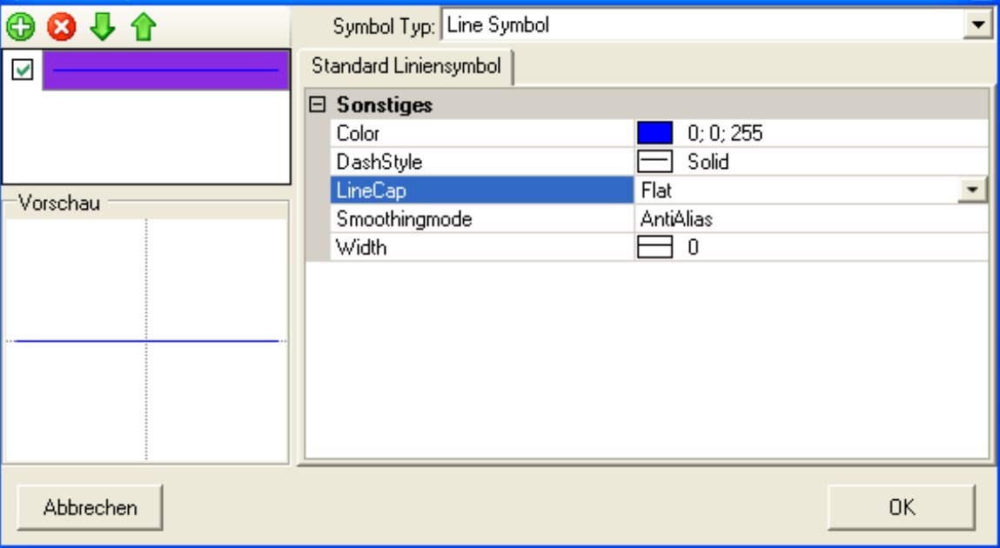
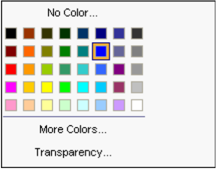
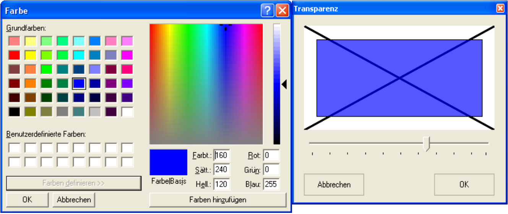
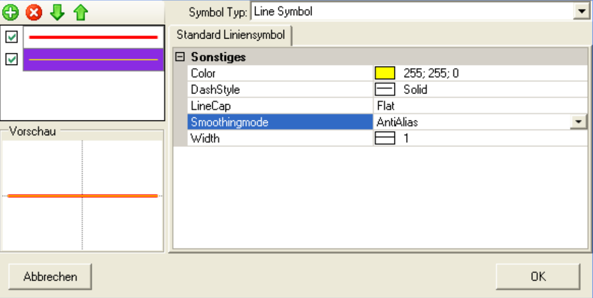
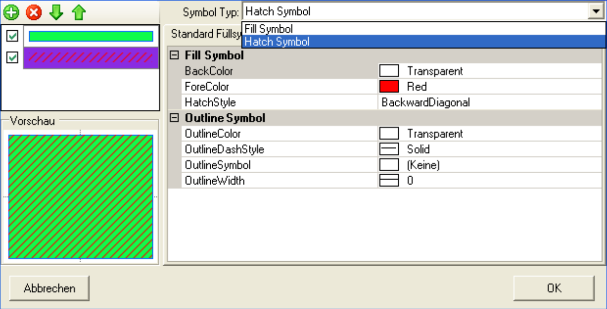
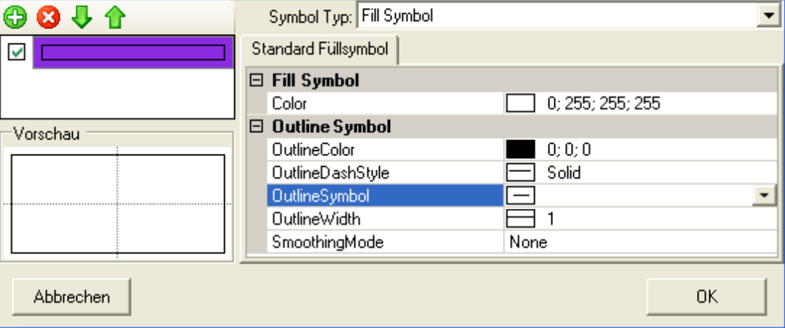
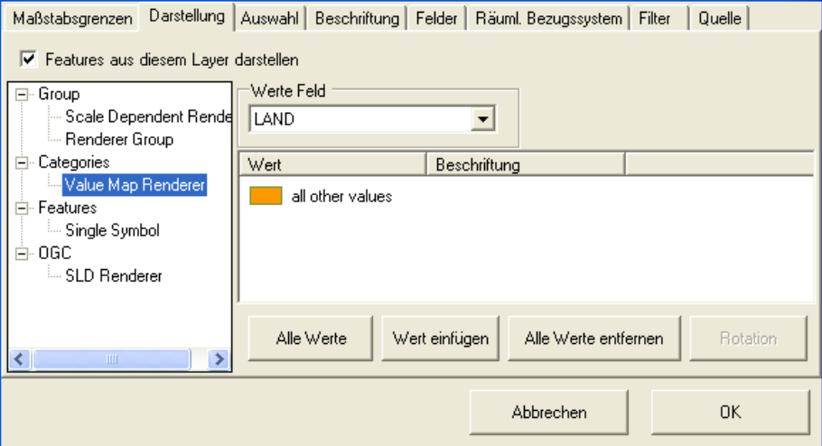
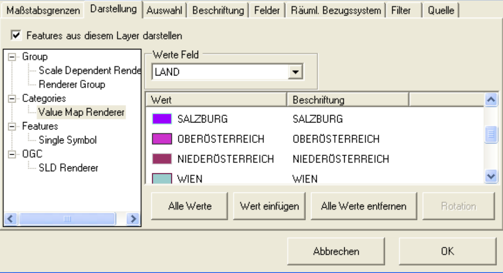
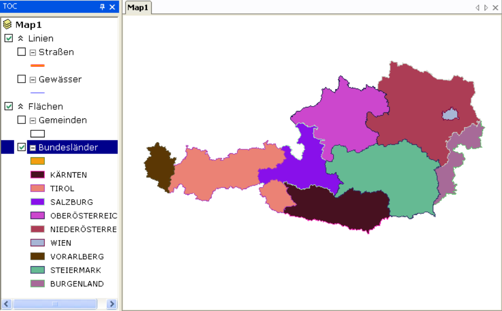

Darstellung und Symbolik
========================

Hier wird für beschrieben, wie die Darstellung einzelnen Layer angepasster werden kann. In diesem Beispiel sollten Gewässer blau und die
Straßen in gelb und rot erscheinen. Der einfachste Weg, um ein Symbol zu ändern, ist ein
Doppelklick auf das entsprechende Legendensymbol im TOC. Für die Gewässerlinie aus dem
Beispiel ergibt sich dabei folgender Dialog:

Der ÜSymbol Composer* gestaltet sich für alle Symbole ähnlich. Rechts können die Attribute
wie Farbe, Linienstärke usw. für ein Symbol angegeben werden. Links werden die
Symbolebenen und die Vorschau angezeigt. Zu beachten ist, dass bei den meisten
Attributen ein Auswahldialog existiert. Dieser öffnet sich mit dem Dreiecksymbol, das
erscheint, wenn Sie in eine Attributeingabezeile klicken. Bei Farbeigenschaften sieht dieser
Auswahldialog beispielsweise wie folgt aus:

``More Colors`` und ``Transparency`` öffnen wiederum neue Dialoge:

Auf eine genaue Beschreibung wird hier nicht eingegangen, da die Bedienung möglichst intuitiv gestaltet wurde. Entspricht
die Symbolvorschau den Vorstellungen kann der Dialog mit OK bestätigt werden.

Die Symbolik der Straßen soll in diesem Beispiel aus mehreren Symbolebenen bestehen. Dazu wird die erste Ebene als rote Linie mit der Linienstärke ``3`` realisiert:

.. image:: img/symbology4.png 

Durch einen Klick auf das Plussymbol (neue Ebene) wird eine neue Ebene mit dem Standard
Symbol Typ eingefügt. Die Eigenschaften können jeweils für die Symbolebene verändern,
die in der Symbolebenen Liste markiert ist:

Die Symbolebenenliste bietet auch Werkzeuge zum Löschen einer Symbolebene bzw. zum
Ändern der Zeichenreihenfolge. Mit dem Kontrollkästchen kann die Darstellung einer
Symbolebene gesperrt werden.
Im folgenden Beispiel soll noch gezeigt werden, wie der *Symbol Composer* für flächenhafte
Geometrien erscheint:

Dabei können unterschiedliche Symboltypen gemischte werden wie hier:
* Fill Symbol: ein einfaches Füllsymbol mit farbiger Umrandung
* Hatch Symbol: ein einfaches Schraffursymbol mit farbiger Umrandung
  
Änderungen des Symboltypes wirken sich immer auf die aktuell markierte Symbolebene aus.

Für die Gemeindeflächen aus dem Beispiel werden jetzt eine tranzparente Füllfarbe (``no
Color``) und eine schwarze Umrandung gewählt:

Für das Bundesländerthema sollten im nächsten Schritt nicht nur die
Symbolik, sondern auch die Art der Darstellung (das Renderering) geändert werden. Dazu wählen man
über das Kontextmenü des Layers den Punkt ``Eigenschaften`` aus. Im so geöffneten Dialog
wechselt man in die Registerkarte ``Darstellung``:

Hier werden alle verfügbaren Renderer für flächenhafte Features angezeigt. Der einfachste ist
der schon bekannte ``Single Symbol`` Renderer, mit dem alle bisher behandelten Featurelayer
dargestellt wurden. Wie der Name schon sagt, kann damit genau ein Symbol für die
Darstellung aller Elemente eines Layers angegeben werden.

Für die Bundesländer ist aber beispielsweise ein unterschiedliches Symbol, je Bundesland
gewünscht. Um dies zu realisieren kommt der ``Value Map Renderer`` zum Einsatz (siehe
Abbildung oben). Stellen Sie im der Auswahlliste ``Werte Feld`` das Feld ein, nach dem
eingefärbt werden soll. Danach klicken Sie auf den Button ``Alle Werte``. In der Datenbank
werden jetzt alle möglichen Werte gesucht und eine zufällige Symbolik vergeben:

Um ein Symbol zu Ändern reicht wieder ein Doppelklick auf die Legende zum Öffnen des *Symbol Composers*.

Die einzelnen Legendeneinträge können ebenfalls mit einem Doppelklick auf den entsprechenden Text im TOC erfolgen:

