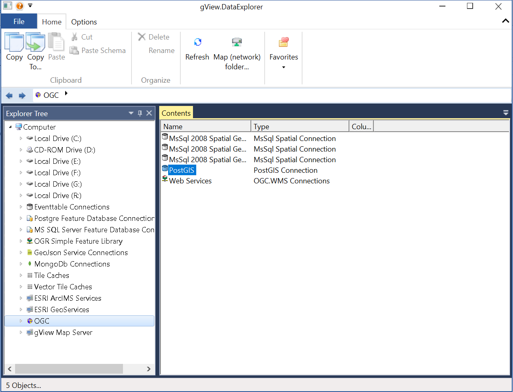
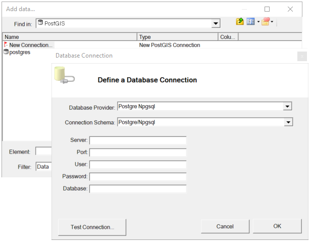

Daten(bank) Verbindungen
========================

Mit *gView.DataExplorer* können Verbindungen zu GeoDaten Quellen verwaltet und die Daten auf einfache Weise
visualisert werden.

File basierte Datenquellen kann einfach angezeigt werden, indem man zum jeweiligen Verzeichnis im Filesystem navigiert.

Bei Datenbank müssen zuerst die Verbunden erzeugt werden. Hier soll beispielhaft gezeigt werden, wie die Verbindung zu 
einer PostsGIS Datenbank erstellt wird.

.. note::
   Verbindungen, die im *gView.DataExplorer* erzeugt werden, stehen auch in *gView.Carto* beim Einfügen von Daten verwendet werden.

PostGIS Datenbank werden über den Knoten ``OGC`` eingebunden:

Unter ``PostGIS`` werden alle bestehenden Verbindungen aufgelistet. Mit ``New Connection`` kann eine neue Verbindung angelegt werden:

Nach Eingabe der Verbindungsparameter kann vor dem Anlegen noch mit ``Test Connection`` überprüft werden,
ob eine Verbindung möglich ist. Nach der Bestätigung des Dialogs mit ``OK`` wird die Verbindung angelegt und erscheint in der 
List. Durch ein Doppelklick wird die Verbindung geöffnet und die Layer in der Datenbank aufgelistet.

Klickt mit der **rechten Maustaste** auf eine Verbindung, erscheint das Kontextmenü. Damit kann eine Verbindung umbenannt oder gelöscht 
werden. Mit dem Menüpunkt ``Connection Properties...`` können die Verbindungsparameter nachträglich geändert werden.

.. note::
   Werden mit *gView Carto* Daten über eine Datenbank Verbindung eingebunden, werden alle Verbindungsparameter in die 
   MXL gespeichert. Ein nachträgliches Ändern der Verbindungsparameter im *gView DataExplorer* wirken sich nicht auf 
   bestehende, bereits erstellte *gView Carto* Karten aus.

