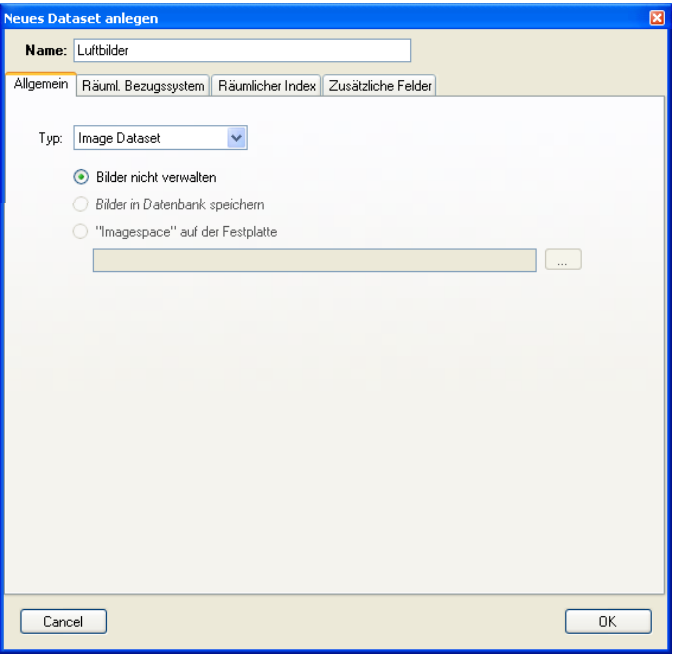
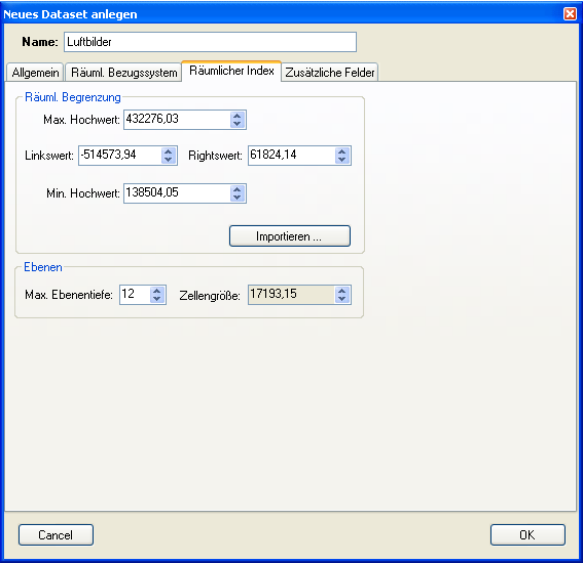
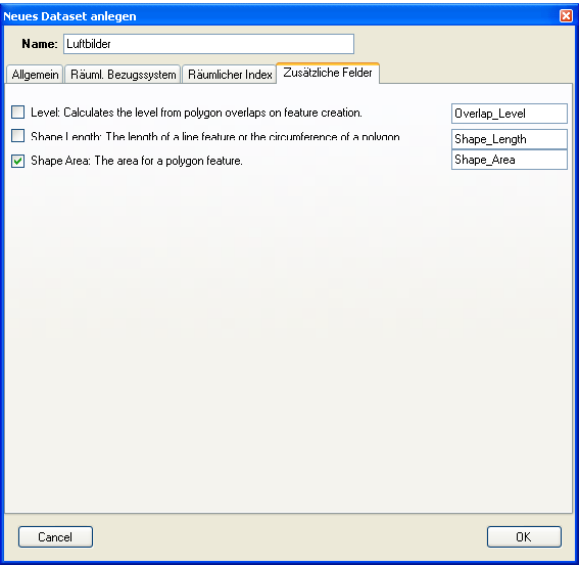
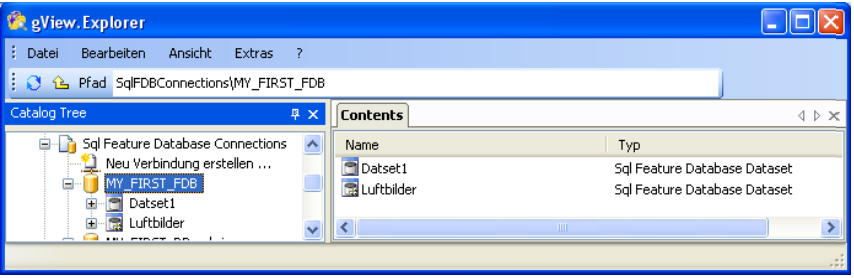
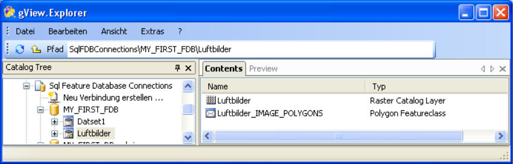
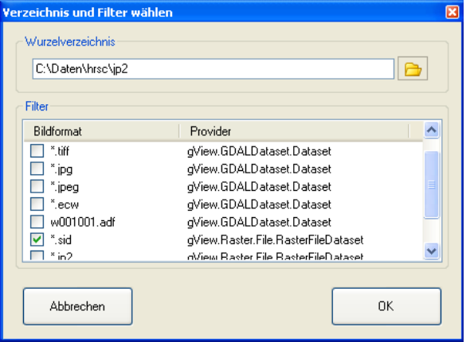
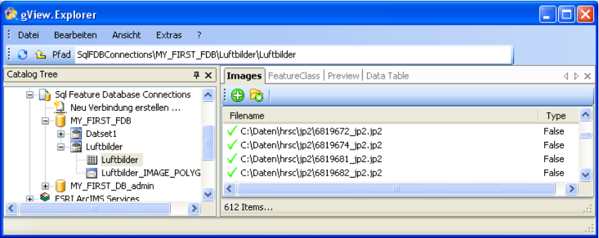
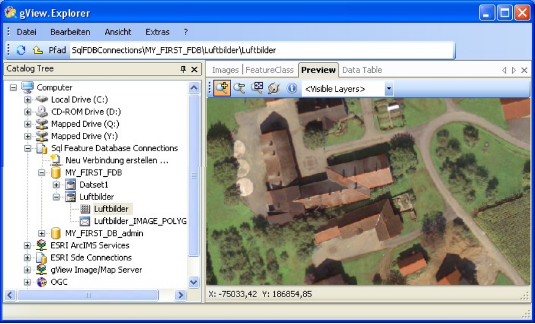

Anlegen eines Raster(katalog) Datasets
======================================

Im diesem Abschnitt wird das Anlegen eines Rasterkatalog Datasets in einer gView Feature
Database beschrieben. Dabei handelt es sich um Datasets mit nur einer Featureklasse, wobei
die Geometrie der Features den Ausdehnungen der einzelnen Bilder entspricht. In den
Sachdaten der Featureklasse werden die Verweise auf die Bilddateien gespeichert.

Zum Anlegen gehen Sie analog wie bei normalen Datasets vor. Klicken Sie mit der rechten
Maustaste in den Contents-Bereich einer Sql Feature Database und wählen ``New/Sql Feature
Database Dataset``. Im daraufhin erscheinenden Dialog stellen Sie den Typ Image Dataset
ein:

Vergeben Sie für den Namen des Datasets eine sprechende Bezeichnung, z.B. „Luftbilder“.
Derzeit ist nur die erste Option „Bilder nicht verwalten“ möglich. Nicht verwalten bedeutet
dabei, dass die Bilder im Dateisystem liegen bleiben. Im Dataset wird abgesehen von der
Ausdehnung und dem Speicherort der Bilder keine Bildinformation in die Datenbank
verspeichert.

In der Registerkarte „Räumliches Bezugssystem“ vergeben Sie die Projektionseigenschaften
für Ihre Daten. Die Vorgehensweise wurde oben bereits beschrieben.

Neu hinzugekommen sind im Gegensatz zu den normal Datasets die Registerkarten
„Räumlicher Index“ und „Zusätzliche Felder“.
In einer Feature Database wird für jede Featureklasse ein räumlicher Index angelegt. Diese
ist für einen schnellen Zugriff bei räumlichen Suchabfragen verantwortlich. Beim Kopieren
von Daten wird der räumliche Index automatisch angelegt. Dieser Punkt entfiel also in der
oben beschrieben Methode des Datenimports. Bei Rasterkatalogen ist jedoch die räumliche
Ausdehnung dieses Index beim Anlegen des Datasets anzugeben. Dabei sollte die
Rechtecksausdehnung so angegeben werden, dass alle georeferenzierten Bilder in den
Ausschnitt passen. Es ist jedoch auch möglich, Bilder einzuspielen, die nicht innerhalb der
Indexausdehnung liegen. Diese Bilder werden jedoch nicht indiziert. Geben sie also eine
großzügige Ausdehnung an. Um sich die Arbeit zu erleichtern, besteht die Möglichkeit die
Ausdehnung aus einer bestehenden Featureklasse zu importieren (Button „Importieren…“).
Die Indizierung der einzelnen Features erfolgt hierarchisch in einer Baumstruktur. Die
„Tiefe“ es Indexbaumes stellen Sie im Bereich Ebenen ein. Erhöhen Sie dazu den Wert
„Maximale Ebenentiefe“ so lange, bis die Zellengröße ungefähr zwei- bis dreimal so groß ist
wie die geographische Diagonale eines georeferenzierten Bildes. Sind alle Werte eingeben
sieht der Dialog zum Beispiel wie folgt aus: 

Unter ``Zusätzliche Felder`` können dann noch Felder in die Image-Featureklasse hinzugefügt
werden, die von der Datenbank für jedes Bildpolygon automatisch berechnet werden. Alle
diese Felder sind optional. Wählen Sie zum Beispiel ``Shape Area`` aus, wenn Sie zu jedem
Polygon die Fläche abspeichern wollen:

Bestätigen Sie den Dialog schließlich mit OK. Der gView Data Explorer legt jetzt das
Rasterkatalog Dataset an. Das Icon unterscheidet sich leicht von einem normalen Dataset
Icon, um erkenntlich zu machen, dass es sich um Rasterkatalog Dataset handelt:

Ein Doppelklick auf das Icon eröffnet den Inhalt dieses Datasets:

Wie schon oben beschreiben werden die Bildpolygone in einer Featureklasse angelegt. Der
Name der Featureklasse lautet immer gleich wie der Name des Datasets mit angehängtem
„_IMAGE_POLYGONS“. Dieser Name darf **nicht** geändert werden! Das erste Icon mit dem
Namen „Luftbilder“ (immer gleich wie das Dataset) dient zum Einspielen der Bilder. Nach
dem Öffnen durch ein Doppelklick erscheint folgende Ansicht:

.. image:: img/raster6.png 

In der Registerkarte ``Images`` werden die im Rasterkatalog Dataset enthaltenen Bilddatei
Pfade angezeigt. Die Liste ist nach dem Anlegen natürlich noch leer. Um Daten hinzuzufügen
stehen ihnen zwei Werkzeuge zur Verfügung:

* Einzelne Bilddateien auswählen. Dabei öffnet sich ein Dialog zum Öffnen von
  Dateien, in dem auch eine Mehrfachauswahl möglich ist.
* Ein Verzeichnis und dessen Unterverzeichnisse nach Bildern durchsuchen. Dabei
  wählen Sie in einem Dialog ein Wurzelverzeichnis und einen Filter aus:

Nachdem Sie mit einer der beiden Methoden Bilder ausgewählt haben, werden diese in das
Rasterkatalog Dataset hinzugefügt:

Sie können jetzt auf Wunsch auch noch weitere Bilder hinzufügen oder einzelne Bilder
wieder aus dem Dataset löschen. Dazu markieren Sie die Bilder in der List und wählen über
das Kontextmenü (rechte Maustaste) den entsprechenden Menüpunkt.

In der Registerkarte ``Preview`` können Sie die eingespielten Bilder betrachten, wobei
Sie mit den oben bereits beschriebenen Werkzeugen in der Karte navigieren können.

