Erstellen einer Karte (Ortspan)
===============================

Hier wird kurz und stichwortartig erklärt, wie mit gView GIS ein Ortsplan erstellt wird. Dieser 
Bericht soll im Speziellen die kartographischen Möglichkeiten von gView GIS zeigen. Zur 
Nachvollziehbarkeit wurde der Bericht mit ausreichend Screenshots ergänzt.

.. note::
   Diese Beschreibung wurde für gView 3.0 erstellt. Die Screenshots wurden nicht geändert und weichen teilweise von der aktuellen Version ab.
   Die grundlegende Vorgehensweise hat sich zur aktellen Version nicht geändert.

Allgemein
---------

In diesem Dokument werden anhand der Erstellung eines Ortsplanes die kartographischen 
Möglichkeiten von gView GIS gezeigt. Dabei werden Daten von Open Street Map verwendet, die 
als Shapedateien aus dem Internet geladen wurden und zur besseren Performance des Ortsplanes in 
eine PostGIS Datenbank geladen wurden.

Daten
-----

Als Daten wurde die Open Street Map Daten als Shapefile für den Bereich Österreich 
heruntergeladen. Nach dem Herunterladen erscheinen die Dateien im gView Explorer in folgender 
Form:

.. image:: img/data1.png

Beim Anzeigen der Datentabelle der Themen (z.B. roads.shp) zeigt sich allerdings, dass Umlaute
nicht richtig kodiert dargestellt werden:

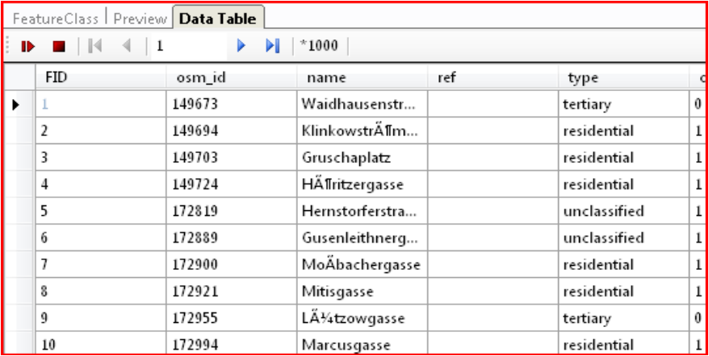

Das kommt daher, dass gView GIS bei Shapefiles standardmäßig eine UTF7 Kodierung erwartet.
Die OSM Daten sind allerdings UTF8 Kodiert. Um nun gView GIS diese Kodierung beizubringen
muss man im Verzeichnis, in dem sich die Shapedateien befinden, eine Textdatei mit dem Namen
``dbf_default_encoding.txt`` anlegen. In der ersten und einzigen Zeile in dieser Datei, muss der
Eintrag ``utf-8`` stehen:

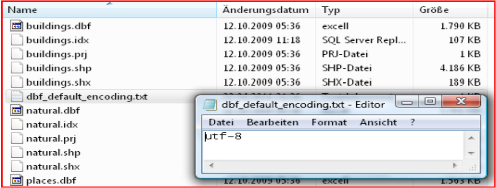

Danach sollte die Umlaute und Sonderzeichen richtig angezeigt werden.

.. note::
   Shapefiles können auf unterschiedliche Weise in *gView* eingebunden werden. Hier wird die Daten direkt über dein *gView Data Explorer* im 
   Filesystem angezeigt und übernommen. Das lesen der Daten übernimmt hier die *gView Shape Schnittstelle*. Alternativ können Daten allerdings
   auch über OGR (GDAL) Schnittstelle eingebunden werden (Shapefiles, GeoPackage, ...). Sollten, so wie hier Umlautprobleme auftreten, 
   kann diese durch eine Änderung Lese-Schnittstelle gehoben werden.

.. note::
   Der hier erstellte Ortsplan wird in einem weiteren Schritt in einen Tilecache umgewandelt. Über den*gView Server* werden nur die 
   vorprozessierten Kacheln angeboten. Möchte den Karten veröffentlichen, die *live* vom *gView Server* gerendert werden, empfiehlt es
   sich, die Daten in einer (Multiuser) Datenbank zu halten (PostGres/PostGIS, SQL Server)! 

Kartenprojekt anlegen
---------------------

Nach dem Starten von gView Carto können die Daten mit dem „Daten hinzufügen“ Button hinzugefügt werden. Dazu klickt man im TOC auf das Kartensymbol. Im Ribbon erscheinen danach, die für die Karte relevanten
Werkzeuge. Alternativ dazu kann auch mit der rechten Maustaste auf die Karte im TOC geklickt werden und der entsprechende Punkt aus dem Kontextmenü gewählt werden.
Nach den Einfügen kann kann der Layer „roads“ über das Kontextmenü geklont werden:

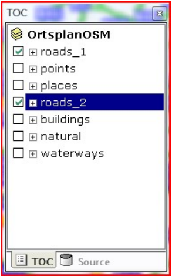

Der doppelt eingefügte Layer kann dazu verwendet werden, um die Straßen in unterschiedlichen
Maßstäben auf verschiedene Art dazustellen. Beginnen wir zuerst mit der Übersichtsdarstellung der
Straßen (roads_2). Über das Kontextmenü des Layers kann der Eigenschaftendialog geöffnet
werden:

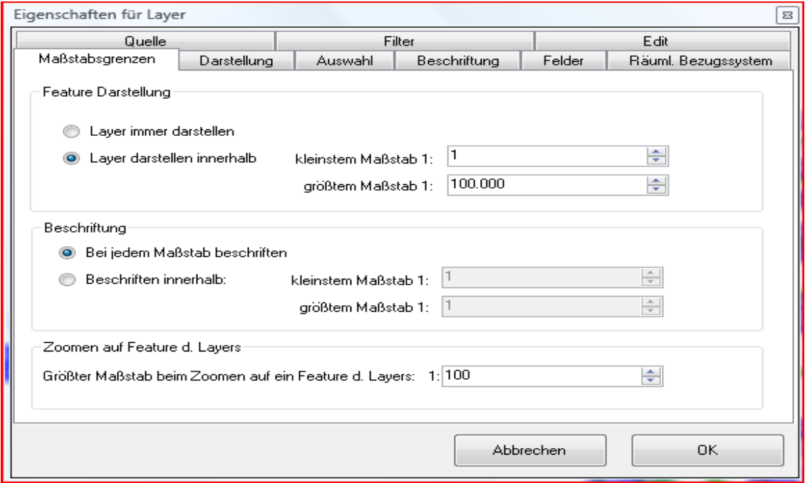

Zuerst müssen für diesen Layer die Maßstabsgrenzen angegeben werden. Der Layer soll für unseren
Ortsplan bis 1:100.000 sichtbar sein (Straßen Übersicht).
Bei der Darstellung soll ein Value Map Renderer verwendet werden, bei dem die Werte „motorway“
und ``primary`` eingefügt werden. Wie diese beiden Kategorien angefärbt werden zeigen die unten
angeführten Darstellungen:

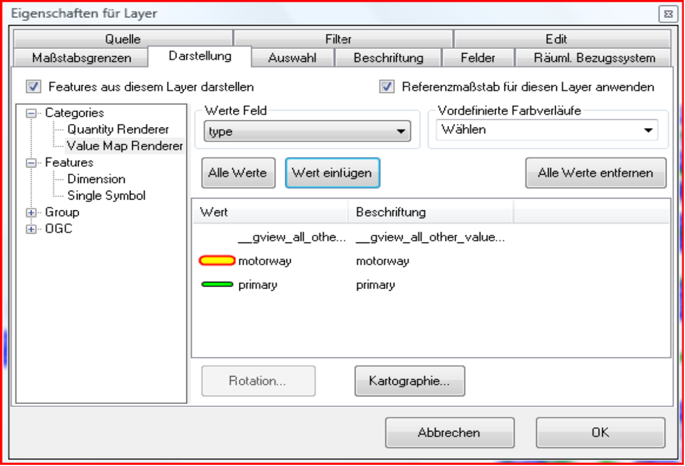

Symbol für ``motorway``:

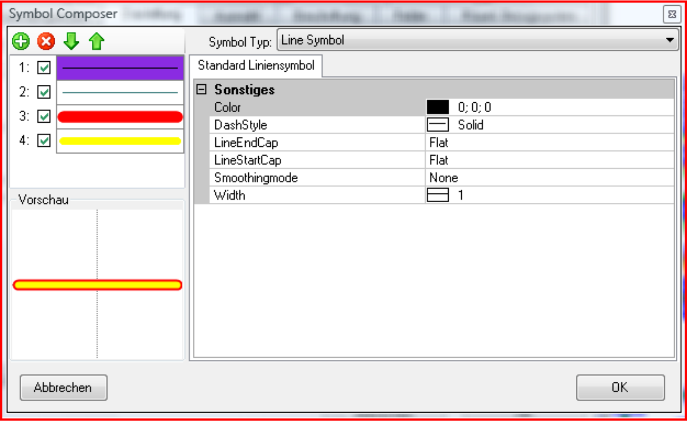

Symbol für ``primary``:

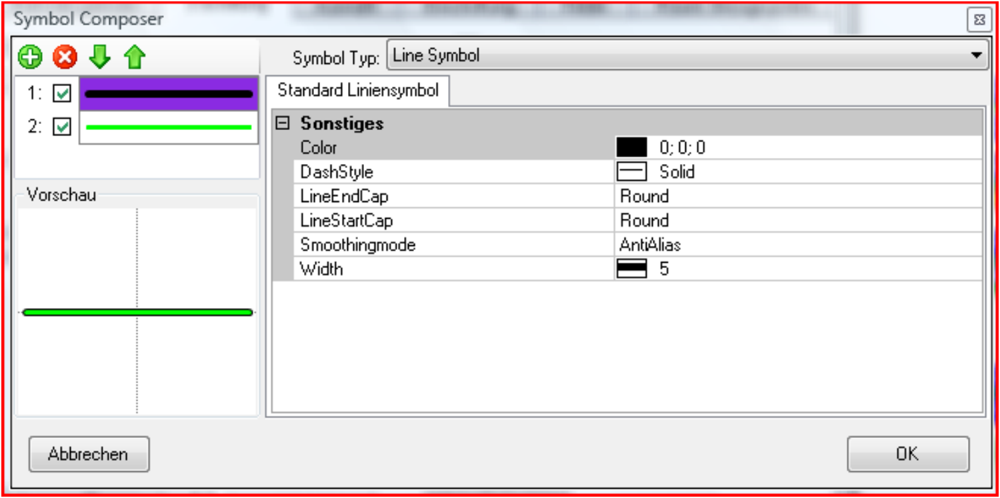

Um die gewünschte Darstellung zu erhalten werden also dickere rote bzw. schwarze Linien unter
dünneren gelben bzw. grünen Linen gezeichnet. Die Enden der Linien werden abgerundet. Außerden
wird als Glättungsmethode *Antialias* angeben. Bei den ``motorways`` werden hier noch zwei
*dummy* Ebenen eingefügt; die eigengliche Symbolik beginnt erst bei Ebene 3 und 4. Der Grund
wird unten noch erläutert.

Beschriftet soll nach dem Feld „ref“ werden wobei ein Block Symbol verwendet wird:

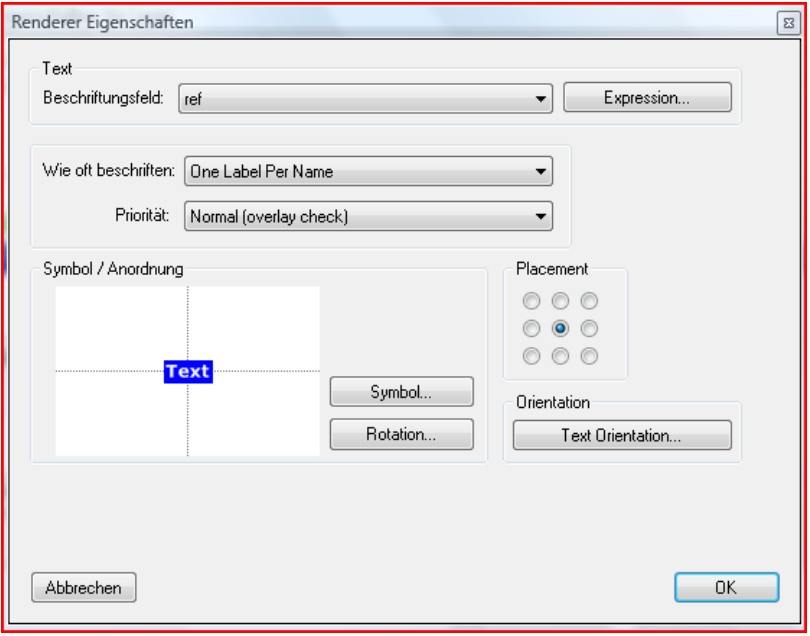

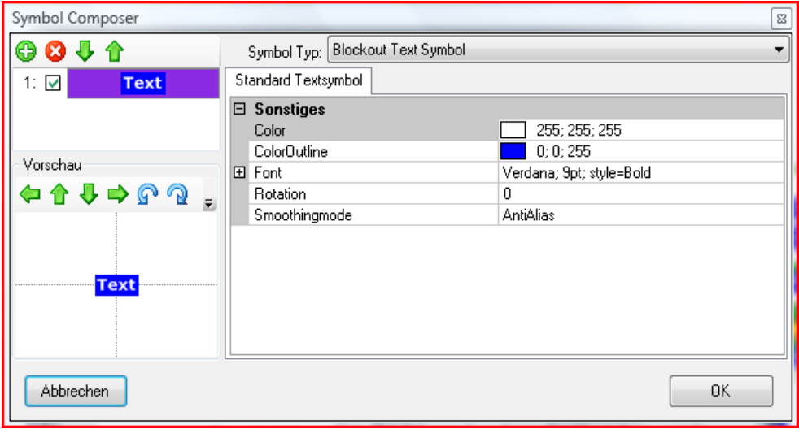

Nach der Bestätigung des Eigenschaftendialgs mit „OK“ sollte die Darstellung des Layers in der
Karte folgendermaßen aussehen:

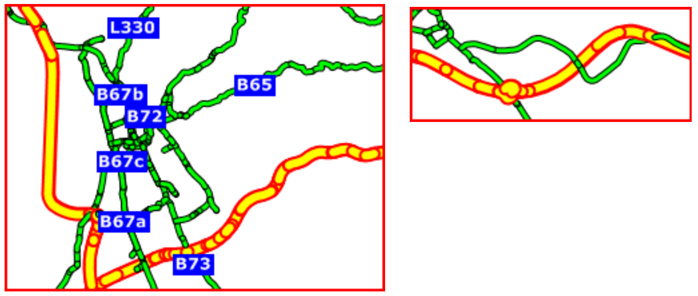

Hier ist ersichtlich, dass beim Rendern des Layers jedes Objekt für sich gezeichnet wird. Die
Zeichenreihenfolge der Objekte entspricht der Reihenfolge aus der Datenbank. Stoßen zwei
Straßenzüge aneinander ergeben sich hier unschöne Effekte. Außerdem werden je nach Reihenfolge
der Objekte in der Datenbank Bundesstraßen über die Autobahn gezeichnet. Um das zu verbessern
muss der Eigenschaften Dialog erneut geöffnet und bei ``Darstellung`` im *Value Map Renderer* auf
den Button ``Kartographie`` geklickt werden:

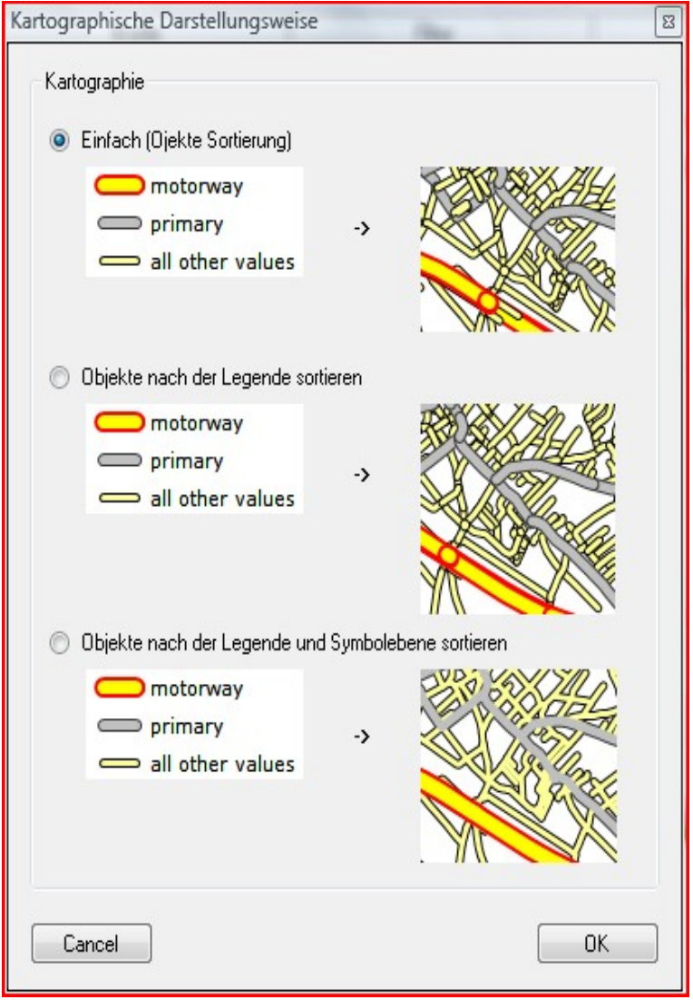

Wählen wir zu Anschauung erst die zweite Option (Objekte nach der Legende sortieren). Hierbei
werden die Objekte nach den Value Map Renderer Kategorien sortiert. Hier werden also an oberster
Stelle die Autobahnen gezeichnet:

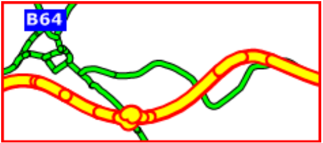

Der Effekt an den Feature Enden ist dadurch allerdings immer noch nicht behoben. Dazu muss bei
``Kartographie`` die Dritte Option (Objekte nach der Legende und Symbolebene sortieren) gewählt
werden. Dabei wird für alle Features zuerst die 1. Symbolebene usw. gezeichnet:

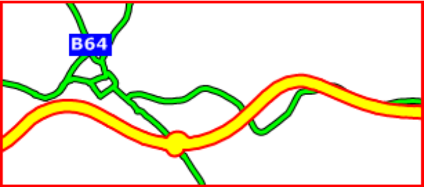

Nun kann die Legende für alle anderen Layer auch angepasst werden. Bei Straßenzügen sollte
wieder auf die kartographische Interpretation der Legende gedacht werden:

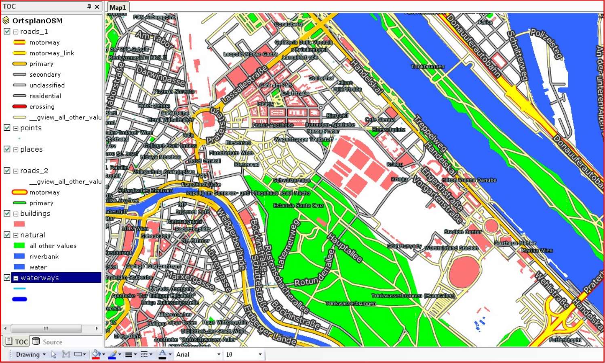

Der Layer ``roads_1`` wird hier nur unter 1:100.000 angezeigt und zeigt auch noch weitere
Kategorien (motorway, motorway_link, …). Außerdem werden für diesen Layer die Straßennamen
beschriftet:

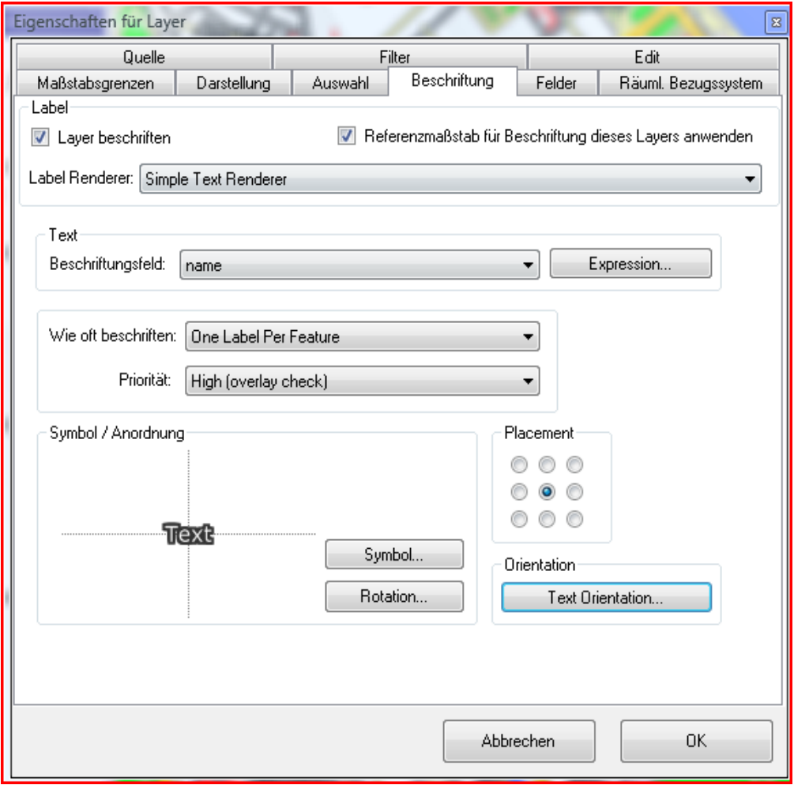

Interessant ist hier neben der Symbolik auch die ``Text Orientierung``. Ein Klick auf den Button
öffnet folgenden Dialog:

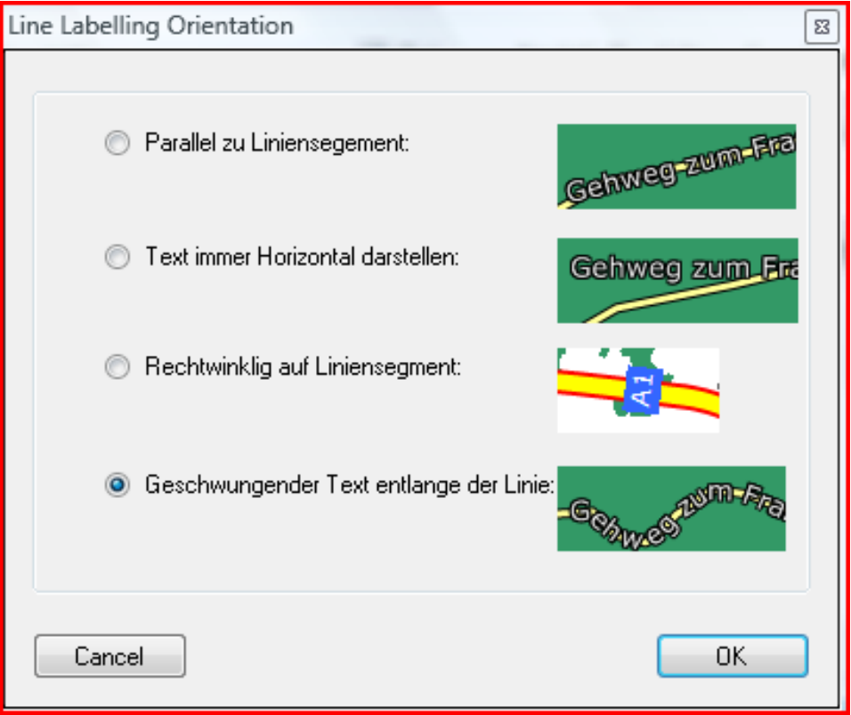

Hier kann für die angeben werden, das der Text entlang des Straßenzuges gezeichnet wird.
