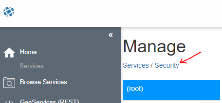

.. _publish-map-service-example:

Karten als *gView Server Dienst* veröffentlichen
================================================

Kartenprojekte, die mit *gView Carto* erstellt wurden, können im *gView MapServer* veröffentlicht werden. Dadurch können diese Karten
in unterschiedlichsten GIS Anwendungen einbunden werden (Desktop, WebGIS, Leaflet, ...)

Die Kartendienste werden über den *gView MapServer* in unterschiedlich Schnittstellen bereit gestellt, z.B:

* **OGC WMS**: Sehr verbreitet Schnittstelle, in in alle gängigen GIS Software Pakete eingebunden werden kann. Es können Kartenbilder und Legenden erzeugt und in einfacher Form auch Features abgefragt werden (*Punktidentify*)

* **OGC WMTS**: Bereitstellen von vorprozessierten Tile Kacheln.

* **GeoServices REST**: Eine von ESRI definierte Schnittstelle auf Basis von REST/Json aufrufen. Damit können Kartenbilder und Legendenbilder abgeholt werden und 
  komplexere Abfrage (Punkt, Rechteck, beliebige Geometrie) und Suche nach Attribute bereitgestellt werden. 
  Neben den Kartendiensten (*MapServer*) werden hier auch ein *Feature* Dienste (*FeatureServer*) angeboten, mit denen GeoObjekte nicht nur abgeholt/abgefragt
  sondern auch bearbeitet und erstellt werden (*Editing*)

Zum Veröffentlichen von Kartendiensten gibt es zwei Möglichkeiten. Der Weg über die Kommandozeile wird später beschrieben (gView.Cmd.MxlUtil).
Die hier beschreiben Vorgehensweise erfolgt über die WebOberfläche des Servers. Nach dem Aufruf des Servers wird folgende Oberfläche angezeigt:

.. image:: img/mapserver1.png

Um Kartendienste zu veröffentlichen, muss man sich entweder als Administrator oder als berechtigter *Client* beim Server anmelden. Um sich als Administrator anzumelden,
muss auf die Kachel ``Manage`` geklickt werden. Danach muss man sich über Login Formular anmelden.
Als *Client* kann man sich über die *Sidebar* (links) über ``Login`` anmelden. *Clients* haben bestimmen Rechte auf Dienste und Verzeichnisse mit Diensten (MapRequest, Query, Edit, Publish).
*Clients* dürfen allerdings selber keiner Verzeichnisse anlegen. Das ist nur dem Administrator erlaubt.

Da für das später gezeigte Veröffentlichen von Diensten mittels Kommandozeile ein Client notwendig ist, wird hier kurz gezeigt, wie die Vorgehensweise für das Anlegen von Clients ist.

Client anlegen
--------------

Im Administrationsbereich auf ``Securtity`` klicken:

In dieser Oberfläche kann ein neuer Client angelegt werden:

.. image:: img/manage2.png

Im nächsten Schritt sollte ein Verzeichnis angelegt werden, in dem der neue Client Karten veröffentlichen darf. Dafür wechselt man zuerst über die *Sidebar* zu ``Browse Services``.
In dieser Ansicht kann unter ``Create Folder`` ein neues Verzeichnis angelegt werden. Klick man danach auf ``Create new folder`` sollte das neue Verzeichnis in der Liste erscheinen.

.. image:: img/manage3.png

Als nächstens wechselt man zurück zum ``Manage`` Bereich. Auch dort sollte das neue Verzeichnis jetzt mit einem offen Schloss erscheinen erscheinen. Offen bedeutet hier,
das jeder Anwender für dieses Verzeichnis aller Rechte hat (für Produktionssystem nicht empfehlenswert).
Klickt man am auf das Schloss, öffnet sich ein Fenster. Hier kann in der Auswahlliste der vorhin angelegt User gefunden werden. Für diesen User sollte zumindest das ``publish`` Recht vergeben
werden. Für den anonymen Benutzer ``_anonymous`` können beispielsweise nur die ``map`` und ``query`` Rechte vergeben werden:

.. image:: img/manage4.png

Die nächten Schritte können mit dem bereits angemeldeten Administrator User durchgeführt werden. Allerdings könnte man sich jetzt auch abmelden und dann über die *Sidebar* mit 
``Login`` als *Client* ``publish-test`` anmelden.

Publish Services
----------------

Zum Veröffentlichen von Diensten ist in den Bereich ``Browse Services`` (*Sidebar*) zu wechseln. Hier muss noch in das gewünschte Verzeichnis gewechselt werden.
Ist man mit dem angemeldeten Benutzer zum Veröffentlichen von Diensten berechtigt, erscheint die Schaltfläche ``Publish``. Dort kann ein MXL File (Kartenprojekt)
ausgewählt werden:

.. image:: img/publish1.png

Unter ``Service Name`` kann der Name des Dienstes angegeben werden (wenn dieser nicht automatisch dem Namen des MXL Files entspricht). Klickt man auf den Button ``Publish Service``
wird versucht den Dienst zu veröffentlichen. Beim Veröffentlichen wird noch geprüft, ob alle Datenquellen vom Server aus erreichbar sind und ob alle verwendeten *Fonts* 
installiert sind. Ist das Veröffentliche erfolgreich, erscheint der Dienst in der Liste.
Besteht bereits ein Dienst mit diesem Namen, wird er automatisch ersetzt.

