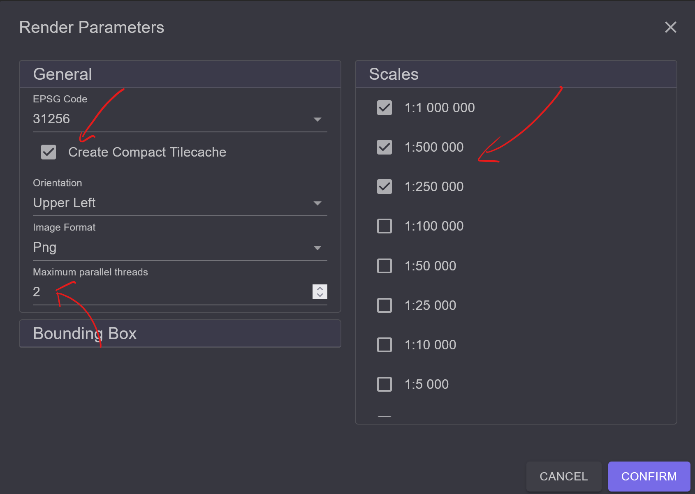
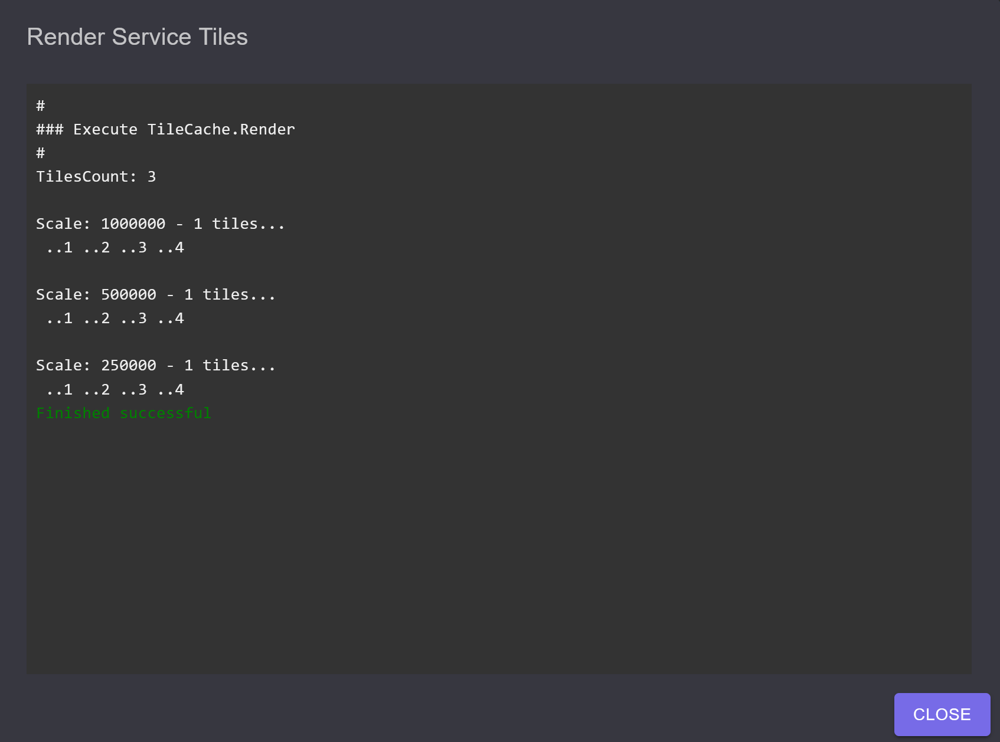

Berechnung eines *TileCaches* (Ortsplan)
========================================

In diesem Beispiel wird gezeigt, wie aus einem bestehenden *gView Server* Dienst ein TileCache gerechnet
werden kann. Dieser kann über die WMTS Schnittstelle in unterschiedlichen Anwendungen eingebunden werden.
Durch das Vorprozessieren der Kacheln erhöht sich die Performance des Dienstes. Außerdem vermindert 
sich die Serverlast.

Ein *TileCache* besteht am Ende nur noch aus einzelnen (Kachel) Bildern. Diese können auch als 
*Compact TileCache Kacheln* zusammengefasst werden, wodurch die Anzahl der vorgehaltenen Einzelbilder 
reduziert werden kann (einfacher zu kopieren, weniger Speicherplatz).

Ein *gView TileCache* bietet unterschiedliche *Styles* an. Die Kacheln können über Filter *on-the-fly* 
beispielsweise auch in Schwarz-Weiß angezeigt werden.

MapService Metadaten
--------------------

Um einen Dienst als *TileCache* verwenden zu können, müssen im ersten Schritt die Metadaten
des Dienstes angepasst werden. Dazu muss man sich über die **gView.Server** Web-Oberfläche
mit ``Manage`` (Sidebar) als **Administrator** anmelden.

Über die Eigenschaften des Dienstes kommt man zu den Metadaten des Dienstes:

.. image:: img/manage1.png

Im Metadaten Dialog wechselt man zuerst in den Bereich ``Tile Service Properties``:

.. image:: img/metadata1.png

Hier können die Eigenschaften des *TileCache* als YAML-Datei definiert werden. Die Änderungen
für den Dienst könnten etwa so aussehen:

.. code-block:: yaml

    use: true
    scales:
    - 1000000
    - 500000
    - 250000
    - 100000
    - 50000
    - 25000
    - 10000
    - 5000
    - 2500
    - 1000
    - 500
    epsgCodes:
    - 31256
    extents:
    31256:
        minX: -226900
        minY: 163300
        maxX: 0
        maxY: 315500
    originUpperLeft:
    31256:
        x: -5622500
        y: 5001000
    originLowerLeft:
    31256:
        x: -226900
        y: 163300
    tileWidth: 512
    tileHeight: 512
    useUpperLeft: true
    useLowerLeft: false
    cacheUpperLeftTiles: true
    cacheLowerLeftTiles: false
    supportPng: true
    supportJpg: false
    dpi: 95.9998080000121

.. note::

    Wichtig ist, dass ``use`` auf ``true`` gesetzt wird, damit der Dienst später auch die *TileCache*
    Schnittstellen anbietet.

Navigiert man über die ``Sidebar/Browse`` um Dienst und klickt diesen an, sollte ``WMTS`` als 
Schnittstelle angeboten werden:

.. image:: img/service1.png 

Auch die **Capabilities** sollten ein Ergebnis liefern (klick auf den Link):

.. image:: img/service2.png

.. note::

    Es werden zwar die WMTS Capabilities angezeigt, allerdings ohne einzelnen Maßstabsebenen. 
    Der Grund ist, dass bisher noch keine Kacheln berechnet wurden.

Kacheln berechnen
-----------------

Zum Berechnen der Kacheln muss in die **gView.DataExplorer** App gewechselt werden. Dort gibt es 
unter ``Tools`` ein Werkzeug, zum Berechnen der Kacheln (``TileCache.Render``):

.. image:: img/explorer1.png

Startet man das Werkzeug, muss zuerst die Url zum Server angegeben werden. Ist der Dienst geschützt,
muss noch eventuell ein *Client* und ein *Secret* angegeben werden.
Den entsprechenden Dienst aus der Liste auswählen und den Dialog mit ``Ok`` bestätigen:

.. image:: img/explorer2.png

Wird der Dienst als WMTS Dienst erkennt, erscheint ein Dialog mit den *TileCache* Möglichkeiten des 
Dienstes. Hier kann eingestellt wie der TileCache berechnet werden soll. 

Es wird empfohlen, einen 
``Compact Tile Cache`` zu rechnen, da hier weniger Files erzeugt werden. Tilecaches, die aus den 
einzelnen Kachel-Bildern bestehen, benötigen viel Speicherplatz und sind schwer zu kopieren.

Damit die Berechnung schneller funktioniert, können Anzahl der parallelen *Threads* angegeben werden.
Die Berechnung erfolgt grundsätzlich am **gView.Server**. Die Zahl, die hier angegeben wird,
steuert, wie viele *Render* Commandos gleichzeitig zum Server geschickt werden.

Über die ``Scales`` Liste kann gesteuert werden, welche Maßstäbe gerendert werden sollten.

Bestätigt man den Dialog mit ``Confirm`` wird eine Kommandozeile angezeigt, die man mit ``Start``
ausführen kann. Die Ausgabe sieht in etwa so aus:

.. note::

    Das Ausführen über den **gView.DataExplorer** kann auch über das Kommandozeilen Werkzeug 
    erfolgen, siehe :ref:`commandline-tools` (:ref:`commandline-tools-render-tile-cache`).
    Da TileCaches sehr lange zum Berechnen brauchen, wird empfohlen produktiv die Kommandozeile
    zu verwenden. Ansonsten muss garantiert werden, dass der **gView.DataExplorer** während 
    der gesamten Berechnung geöffnet bleibt.

    Der hier beschriebene Weg kann allerdings dazu verwendet werden, um die Übergabeparameter
    an das Kommandozeilen Tool über deine graphische Oberfläche zu erhalten. Poppt das Fenster
    mit der Kommandozeilenaufruf auf, kann dieser Einfach kopiert und am Server ausgeführt werden.

Wechselt man der Berechnung wieder zum **gView.Server** und zu den *WMTS Capabilities* des Dienstes
sollte jetzt auch die berechneten Maßstabsebenen angezeigt werden.
 
.. image:: img/service3.png

.. note::

    Es werden nur die Maßstabsebenen angezeigt, für die im TileCache Verzeichnis am Server 
    (siehe file ``_config/mapserver.json``) für den entsprechenden Dienst auch ein Verzeichnis 
    angelegt wurde:

    .. image:: img/service4.png

    Möchte man, das gewisse Maßsebenen ``on the fly`` berechnet werden sollten, kann man das 
    lösen, indem man das entsprechende Verzeichnis (Maßstabszahl) manuell anlegt. Findet der 
    **gView.Server** später keine Kacheln im Verzeichnis, werden die Kacheln immer ``on the fly``
    erstellt und ausgeliefert. 

    **Achtung:** Das sollte nur bei performanten Dienst gemacht werden. Und nur wenn eine 
    Berechnung der entsprechenden Maßstabsebene nicht möglich ist.
