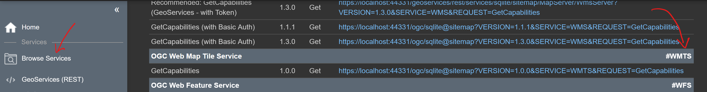

Berechnung eines *TileCaches* (Ortsplan)
========================================

In diesem Beispiel wird gezeigt, wie aus einem bestehenden *gView Server* Dienst ein TileCaches gerechnet werden kann.
Dieser kann über die WMTS Schnittstelle in unterschiedlichen Anwendungen eingebunden werden. Durch das Vorprozessieren der Kacheln
erhöht sich die Performance des Dienstes. Außerdem vermindert sich die Serverlast.

Ein *TileCache* besteht man Ende nur noch aus einzelnen (Kachel) Bilder. Diese können auch ein *Compact TileCache Kacheln* zusammengefasst werden,
wodurch die Anzahl der vorgehalten Einzelbilder reduziert werden (einfache zu kopieren, weniger Speicherplatz)

Ein *gView TileCache* bietet unterschiedliche *Styles* an. Die Kacheln können über Filter *on-the-fly* beispielsweise auch in Schwarz-Weiß angezeigt werden.

MapService Metadaten
--------------------

Um für einen Dienst später eine Tilecache erstellen zu können, muss dies schon im Kartenprojekt in *gView Carto* festgelegt werden. Dazu muss in der entsprechenden
Karte die *Karteneigenschaften* Seite aufgerufen werden. Dort finden man den *Tab-Reiter* ``MapService``. Klickt man dort auf ``Metadata`` öffnet sich das 
Metadatenfenster für das Kartenservice. Unter den Metadaten kann beispielsweise eingestellt werden, in welchen Projektionen WMS Dienste angeboten werden.

Bei den Metadaten auf ``Tile Service Properties`` klicken. Dort kann eingestellt werden, das Tiling Dienste für diese Karte möglich sind:

.. image:: img/metadata1.png

Hier sind schon die gewünschten Maßstäbe definiert und die Kachelgrößen von 256x256 auf 512x512 geändert. Da es sich beim dem Dienst um einen Ortsplan 
handelt, wird als Bildformat nur ``image/png`` angeboten.

Im nächsten Schritt muss die Ausdehnung des TileCache Dienstes und der Ursprung angegeben werden:
Für einen Dienst können mehrere TileCaches für unterschiedliche Koordinatensystem gehalten werden. Bevor die Ausdehnung festgelegt wird, muss noch ein Koordinatensystem 
angeben werden (``+`` Button):

.. image:: img/metadata2.png

FÜr die Berechnung der Tiles kann ein Ursprung (Tile 0/0/0) links oben oder links unten angegeben werden. Tilecaches mit Ursprung links unten sind allerdings veraltet und 
werden hier nur der Vollständigkeit angeboten. FÜr WMTS Dienste sollten Einstellungen mit dem Ursprung links oben erzeugt werden.

Werden die Einstellungen auf für andere Dienste verwendet, könne diese auch mit dem ``Speichern`` / ``Laden`` Button gespeichert bzw. geladen werden.
Für WebMercator Karten können die Einstellungen beispielsweise von ``gview5/desktop/misc/tiling/osm.xml`` geladen werden.

Dienst veröffentlichen
----------------------

Im nächsten Schritt muss der Dienst in *gView MapServer* veröffentlicht werden. Dazu kann jede *gView MapServer* Instanz verwendet werden, die Zugriff auf die Daten
unsere Karte haben. Da die Berechnung TileCaches Resource- und Zeitaufwendig sein kann, kann hier auch ein *lokale* *gView MapServer* Instanz sein. Diese kann einfach über den 
Installationspfad per Script gestartet werden. Mit dieser Instanz kann der TileCache berechnet werden. Danach kann der Dienst auch in einer produktiven Instanz veröffentlicht 
werden und der TileCache kopiert werden.

Der TileCache wird bei der Berechnung im Dateisystem angelegt. Der Pfad wird in der Datei ``_config/mapserver.json`` angeben:

.. code::

    "tilecache-root": "C:\\temp\\tilecache"

Unter diesem Verzeichnis werden alle TileCaches abgelegt. Es kann nachträglich geändert werden. Dabei sind alle Caches zu kopieren und nach dem Änderen des Eintrags in der 
``_config/mapserver.json`` der *gView Server* neu gestartet werden.

Für dieses Beispiel wurde die Kartendienst ``ortsplan`` im Verzeichnis ``cache`` veröffentlicht:

Klickt man in dieser Ansicht auf den Dienst, werden alle möglichen Schnittstellen aufgelistet, mit denen der Dienst abgefragt werden kann.
Darunter sollte auch ein Schnittstelle für TileCaches sein (*OGC Web Map Tile Service* bzw. *WMTS*):

.. image:: img/service2.png

Der hier angeführte Link leitet zu den *Capabilities* des *WMTS* Services weiter. Das Ergebnis sollte in etwa folgendermaßen aussehen:

.. image:: img/service3.png

Ist der Dienst nicht für Tilecaches zugelassen, kann hier auch folgende Ansicht kommen:

.. image:: img/service4.png

In diesem Fall wurden die *MapService Metadaten* aus dem ersten Schritt nicht in den Dienst übernommen. Um dem Fehler zu beheben müssen die Einstellungen aus dem ersten Schritt noch einmal kontrolliert
aus ausgebessert und der Dienst neu publiziert werden. 

Wer mit *WMTS* vertraut ist wird wahrscheinlich auffallen, dass in den *Capabilities* noch keine *MatrixSets* angegeben sind.
Der Grund ist, das der *gView Server* die *MatrixSets* erst dann auflistet, wenn Tiles dafür vorhanden sind. Im Verzeichnisbaum in dem der TileCache angelegt wird muss es dazu für den entsprechenden Maßstab 
ein Verzeichnis geben. Erst wenn dieses Verzeichnis existiert, wird der Maßstab auch in den *Capabilities* aufgelistet.

.. note::
   Hier wird nicht überprüft, ob im (Maßstabs)Verzeichnis auch alle Tiles vorhanden sind. Es reicht in der Regen auch ein leeres Verzeichnis. Ein leeres Verzeichnis macht sinn, wenn die Tiles für den Dienst *on-the-fly* berechnet werden sollten.
   Dann werden keine Tiles im Filesystem angelegt. Die Verzeichnisse müssen in diesem Fall eventuelle händisch angelegt werden. *On-the-fly* Berechnung sollte aber aus Performance überlegung in der Praxis nicht verwendet werden, warum dieser 
   Vorgang hier nicht beschrieben wird.
   
Tiles berechnen
---------------

Zum Berechnen der Tiles wird ein Kommandozeilen Tool angeboten ``gView.Cmd.RenderTileCache``. Damit werden unter Angabe des des Severs und des Dienstes die einzelnen Tiles für ein TileCache berechnet.
Die Beschreibung erfolgt im Abschnitt Kommandozeilen Werkzeuge.  

