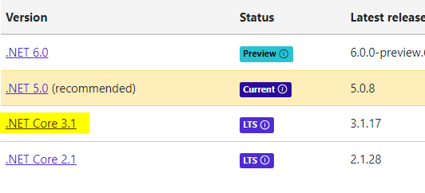
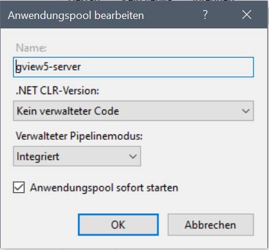

Microsoft Internet Information Server (IIS) (Windows) 
=====================================================

.NET Core Runtime Installieren
------------------------------

gView Server ist eine .NET Core Anwendungen und setzt daher die .NET Core Laufzeitumgebung voraus. 
Diese kann unter folgender Web Seite heruntergeladen werden: 

https://dotnet.microsoft.com/download/dotnet-core

Hier muss die aktuelle Version gewählt werden. Zur Zeit der Erstellung dieser Dokumentation ist die
aktuelle Version unter der gView Server läuft .NET Core 3.1

Hier ist das Runtime & Hosting Bundle zu wählen, damit die Applikation im IIS gehostet werden kann.

Ob nach der Installation alle notwendigen Runtimes am Rechner vorhanden sind, 
kann mit dem Kommandozeilen Tool „dotnet.exe“ überprüft werden. 
(Dieses sollte nach erfolgreicher Installation gefunden werden, wenn alle die PATH Variablen 
richtig gesetzt wurden).

.. image:: img/iis3.png

Nach Installation der Runtime & Hosting Bundle sollte 
* Microsoft.AspNetCore.App 
* Microsoft.NETCore.App
in der richtigen Version (3.1.x) aufscheinen.

.NET Core Anwendung in IIS einbinden
------------------------------------

Voraussetzung, damit .NET Core Anwendungen im IIS laufen ist das entsprechende Modul 
„AspNetCoreModuleV2“. Dieses Modul steuert die Überwachung und die Weiterleitung der 
Requests vom IIS zur Applikation. Ob dieses Module im obigen Schritt richtig installiert wurde, 
kann über den IIS Manager überprüft werden:

Im nächsten Schritt ist ein Applikation Pool anzulegen:

Wichtig für .NET Core Anwendungen ist, dass als .NET CLR-Version „Kein verwalteter Code“ angeführt wird. 

Im nächsten Schritt muss die Anwendung eingebunden werden. Dazu sollte die Applikation auf deiner Festplatte auf dem Server
vorliegen. Im IIS Manager mit der rechten Maustaste auf die entsprechende WebSite klicken und Anwendung hinzufügen 
auswählen:

.. image:: img/iis6.png

Im Anwendung hinzufügen Dialog muss dann noch ein Alias Name vergeben werden. Mit diesem Namen kann man die Applikation später über den Browser aufrufen.
Weiters muss der vorher erstellte Applikation Pool angeführt werden.

.. image:: img/iis7.png

Jetzt sollte der gView Server beispielsweise über https://localhost/gview5-server erreichbar sein:

.. image:: img/iis8.png

GDAL Driver
-----------

GDAL zum anzeigen von Rasterdaten (GeoTIFF, ...) ist im Installationspaket enthalten.
Damit auch zusätzliche Formate (JPG2000, ECW) funktionieren muss GDAL das ``gdalplugins`` Verzeichnis
finden. Dieses befindet sich im Programmverzeichnis. Wird die Applikation allerdings 
in einem IIS Applikation Pool gehostet, muss das Verzeichnis über die Umgebungsvariable 
``GDAL_DRIVER_PATH`` gesetzt werden. Der Pfad kann hier der absolute oder relative angegeben werden.

**Variante 1:**

* ``GDAL_DRIVER_PATH=C:\.....\gview\server\gdalplugins``
* ``GDAL_DRIVER_PATH=.\gdalplugins``

Damit der Applikation Pool die Informationen aus den Umgebungsvariablen bekommt, muss in den 
``Erweiterten Einstellungen`` die Option ``Benutzerprofil laden`` auf ``true`` gesetzt werden.

**Variante 2: (empfohlen)**

Verwendet man IIS 10  kann für einen Applikation Pool 
alternativ die Umgebungsvariablen auch über die IIS Konfiguration (Abschnitt ``system.applicationHost``) 
gesetzt werden:

https://docs.microsoft.com/en-us/iis/configuration/system.applicationhost/applicationpools/add/environmentvariables/

**Variante 3:**

Lässt man die Applikation ``OutOfProcess`` laufen, kann die Umgebungsvariable in der ``web.config``
der WebApplikation gesetzt werden:

.. note::
   Diese Methode sollte nur Verwendet werden, wenn Variante 1 und 2 nicht möglich sind.
   Empfohlen wird, die Applikation aus Performance Gründen ``InProcess`` laufen zu lassen.

.. code::
   
   ...
   <aspNetCore processPath="%LAUNCHER_PATH%" stdoutLogEnabled="false" hostingModel="OutOfProcess">
      <environmentVariables>
        ...
        <environmentVariable name="GDAL_DRIVER_PATH" value=".\gdalplugins" />
      </environmentVariables>
   ...

