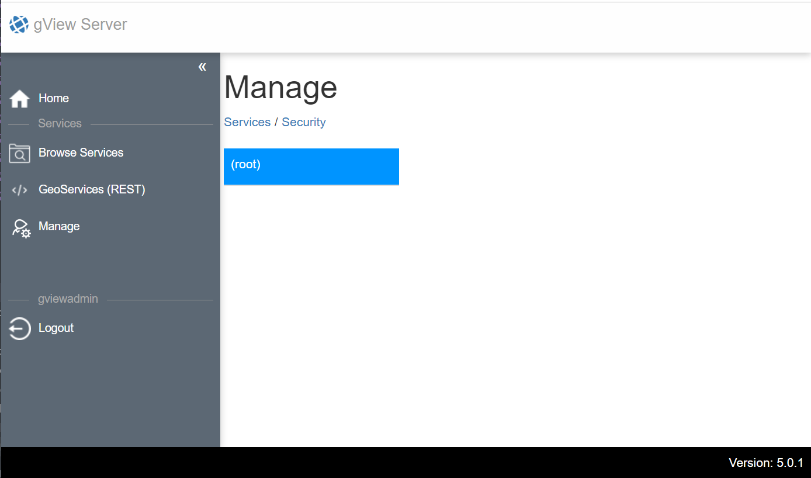

Postinstallation
================

Nach der Installation des gView Server folgt die Postinstallation. Beim ersten Aufruf des Servers über den Browsers
wird eventuell folgende Meldung angezeigt:

.. image:: img/postinstallation1.png

Diese Fehlermeldung zeigt, dass die Konfiguration des Servers noch nicht korrect ist.
Im Beispiel hier, existiert die Datei _config/mapserver.json noch nicht. Wie Form und Funktion 
dieser Datei wird im Abschnitt **Konfiguration** gezeigt.

Nach erfolgreicher Konfiguration erscheint die Anwendung nach dem ersten ersten Aufruf folgendermaßen:

.. image:: img/postinstallation2.png

Der rote Button **Manage** zeigt, dass nicht kein Administrator angelegt wurde. Der gView Server
benötigt einen Administrator Benutzer, der **Logins** und **Folder** (Verzeichnisse für Kartendienste)
anlegen darf. 

Solange die diese Schaltfläche rot ist, muss dieser Administrator angelegt werden. Zum Anlegen des
Administrators auf die rote Kachel klicken und einen Benutzernamen und ein Passwort für den
Administrator vergeben:

Ist das Passwort nicht stark genug, muss ein eventuell ein stärkeres Passwort angeben werden.
Nach erfolgreiche Anlegen des Administrators wechselt die Oberfläche in den **Manage** Bereich 
von gView Server. Diese ist nur für den Administrator nach erfolgreicher Anmeldung sichtbar:

