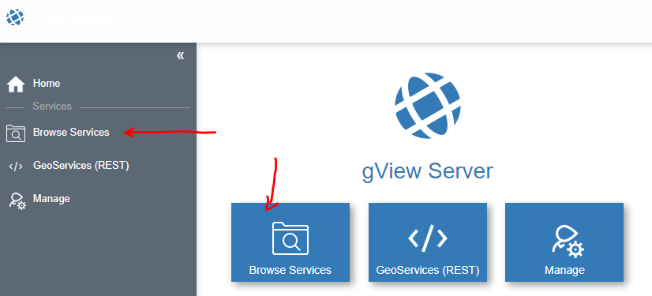
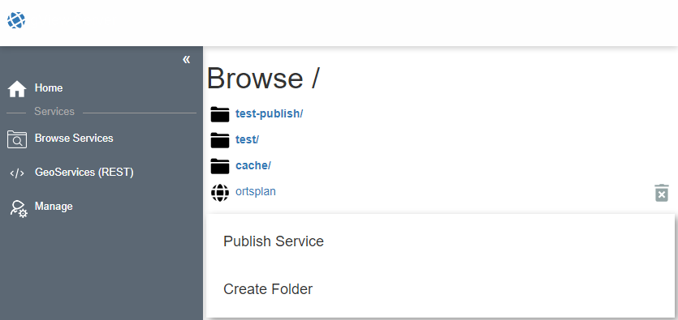
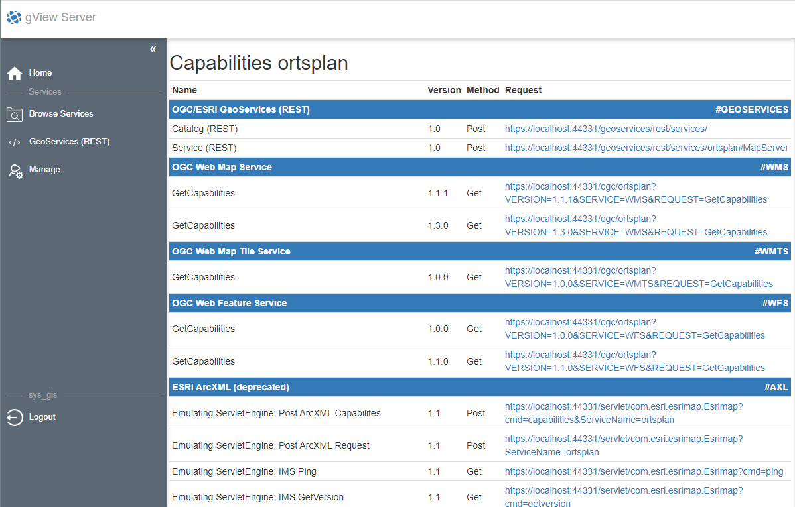
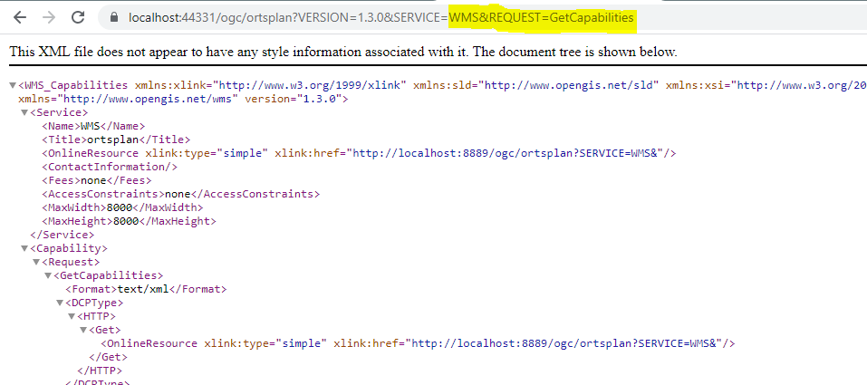

Browse Services
===============

In diesem Abschnitt wird gezeigt, wie *gView MapServer* Dienste und Verzeichnisse in der 
Web-Oberfläche aufgelistet werden. Zum Auflisten der Dienste steht der Menüpunkt ``Browse Services`` 
zur Verfügung (Kachel auf der Startseite bzw. Sidebar):

Die Startansicht bei ``Browse Service`` sieht in etwa folgendermaßen aus:

Fett gedruckt werden hier **Folder** (Verzeichnisse) angezeigt. Dienste werden mit normaler Schrift
angezeigt. Außerdem besteht bei Diensten auch die Möglichkeit, sie über das Papierkorb-Symbol zu löschen.
Dieses wird nur angezeigt, wenn der angemeldete Benutzer/Client dazu berechtigt ist.

.. note::
   ``Browse Services`` ist für jeden User möglich (auch ohne Anmeldung). Es werden allerdings nur 
   jene Dienste aufgelistet, für die der aktuelle Anwender berechtigt ist.

.. note::
   In diesem Beispiel ist immer noch der Administrator angemeldet. Daher stehen auch noch die 
   Optionen ``Publish Service`` und ``Create Folder`` zur Verfügung. Die Vorgehensweise für das 
   Veröffentlichen wird unter :ref:`publish-map-service-example` im Abschnitt :ref:`examples` 
   behandelt.

.. note::
   In diesem Beispiel liegt der Dienst ``ortsplan`` nicht in einem Verzeichnis, sondern im 
   sogenannten **root** Bereich. In der Praxis sollten Dienste immer in Verzeichnissen organisiert 
   werden!

Klickt man auf einen Dienst in dieser Ansicht, werden alle möglichen Schnittstellen für diesen Dienst 
angezeigt:

Für jede dieser Schnittstellen werden Links angeboten, mit denen diese Dienste in diverse 
*GIS-Programme* eingebunden werden können. Klickt man beispielsweise auf einen Link für WMS,
wird im Browser der *Capabilities Request* für diesen Dienst angezeigt:

Dieser Link könnte beispielsweise auch in **QGIS** als *WMS Layer* eingebunden werden.

Welche Schnittstellen hier angeboten werden, kann über die *Manage Web-Oberfläche* bei
den Berechtigungen für den Dienst oder für das Verzeichnis festgelegt werden.
