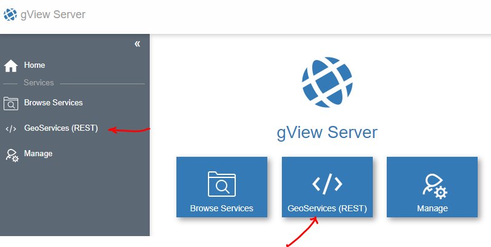
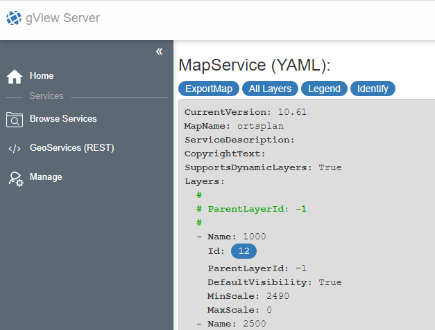

GeoServices REST Schnittstelle 
==============================

*GeoServices REST* ist eine Schnittstelle, die von ESRI für den ArcGIS Server entwickelt wurde.
*gView MapServer* unterstützt diese Schnittstelle (*MapServer* und *FeatureServer*). Da über diese 
Schnittstelle diverse Werkzeuge in der WebOberfläche angeboten werden,
mit denen ein *gView MapServer* Dienst getestet werden kann, wird eine eigener Menüpunkt dafür angeboten:

*GeoServices REST* ist eine *RESTful API* bei der über HTTP GET und POST Requests, Befehle zum um Server
geschickt und in der Regel ein JSON Dokument zurückgegeben wird.

Über die WebOberfläche können diese JSON Dokumente angezeigt werden. Zur besseren Lesbarkeit,
wird hier allerdings nicht JSON sondern YAML als Anzeigestandard gewählt.

Das Übergeordnete JSON File gibt die *Folder* und Services der ersten Ebene zurück:

.. image:: img/geoservices2.png

Hyperlinks werden im YAML als Buttons hervorgehoben. Außerdem werden einige Auflistungen (Services) nach
definierten Attributwerten gruppiert (``Type: MapServer``, ``Type: FeatureServer``)

Klickt man auf einen der Hyperlinks kommt man zur nächsten Ansicht. Die YAML Darstellung für einen ``MapServer``
Dienst sieht etwas folgendermaßen aus:

Hier gibt es weiterführenden Links zu den einzelnen Layern. Darin werden dann beispielsweise
Details zu den Feldern aufgelistet.

Über der YAML Darstellung gibt es für manche Typen noch weiterführende Link-Buttons.
Bei ``MapServer`` Typen ist beispielsweise ``ExportMap`` interessant. Mit einen ``ExportMap`` Request,
kann ein Kartenbild für einen bestimmten Ausschnitt abgeholt werden. Klickt man auf ``ExportMap``
erscheint ein Formular, in das man die gewünschten Werte für den Request eintragen kann:

.. image:: img/geoservices4.png

Das Outputformat kann von ``json`` auf ``pjson`` umgestellt werden (das ``p`` steht für *Pretty*, 
was für das Ergebnis eine bessere Lesbarkeit garantiert). Bestätigt man das Formular mit ``Submit``
kommt in etwa folgendes Ergebnis:

.. image:: img/geoservices5.png

Der Server erstellt ein Bild und legt es im *Outputverzeichnis* ab. Die zurückgegebene Url
kann aus dem JSON kopiert und in Browseradresszeile kopiert werden. Hat alles geklappt, sollte ein Kartenbild
angezeigt werden.

Das selbe Ergebnis sollte man erhalten, wenn man ein Schritt zurück geht und im Formular als ``OutputFormat``
den Wert ``image`` angibt. Damit entfällt der Zwischenschritt über das JSON Dokument:

.. image:: img/geoservices6.png

.. note::
   Standardmäßig wird im Formular der größtmögliche Ausschnitt angezeigt. Sind in diesem Maßstab keine Themen sichtbar, kann das Ergebnis auch ein leeres Bild sein.
   Außerdem wird vom Server die Standard Layer Sichtbarkeit zurückgegeben, wenn keine Sichtbarkeit im Formular angeben wird.

Auf die gleiche Art und Weise können auch Abfragen auf Layer getestet werden (zum *Layer YAML* und dort auf ``Query`` klicken)

.. note::
   Die Parameter entsprechen der GeoServices REST Spezifiktion. Diese kann bei ESRI nachgeschlagen werden, beispielsweise unter https://developers.arcgis.com/rest/services-reference/enterprise/export-map.htm

