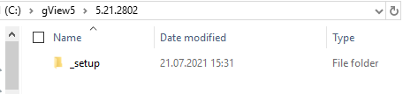
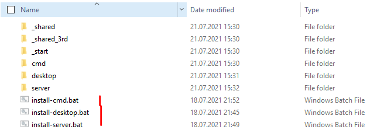
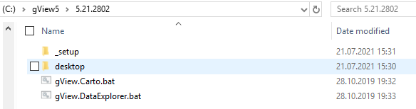
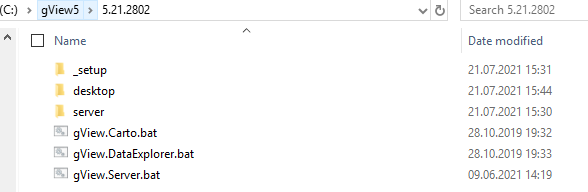
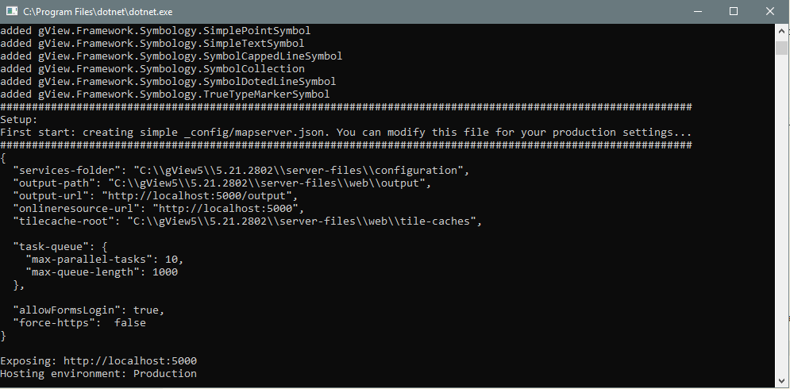
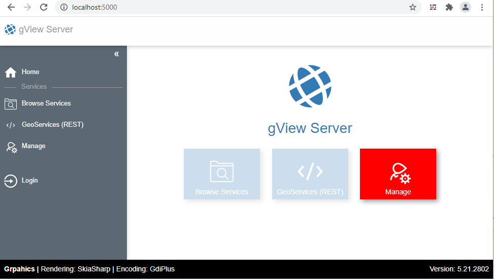

Installation
============

*gView GIS* läuft mit Ausnahme der Desktop Programme auf unterschiedlichen Plattformen. Die einzelnen Komponenten sind sowohl (Windows) Destop, (Web) Server oder Kommandozeilen Werkzeuge.
Da alle Komponenten zumindest auf Windows laufen, gibt es für Windows ein Installationspaket. Die Software muss nicht direkt Installiert werden sondern läuft auch als *Portable* Version. 
Allerdings wird für die Desktop Programme (*gView.Carto* und *gView.DataExplorer*) unter Windows ein .NET Framework 4.7.2 vorausgesetzt. Server un Kommandozeilen Werkzeuge setzten 
eine .NET Core 3.1 Laufzeitumgebung voraus, die es sowohl für Windows, Linux und MacOS gibt.

Die Installationspakete können als *Releases* aus dem GitHub Repository https://github.com/jugstalt/gview5/releases heruntergeladen werden. Das Paket besteht aus einer ZIP-Datei und 
muss im ersten Schritt an einer beliebigen Stelle entpackt werden. Es können unterschiedliche Versionen von *gView GIS* parallel installiert werden. Diesen empfiehlt es sich das
ZIP File unter ``C:\gview5\5.21.2801`` zu entpacken:

Im Verzeichnis ``_setup`` befindet sich folgende Verzeichnisstruktur:

In hier Unterverzeichnis dargestellen Unterverzeichnissen befinden sich die eigentlichen Softwarekomponenten. Diese müssen und sollten nicht geöffnet oder geändert werden.
Der Setupvorgang wird von den drei Batch Dateien erledigt:

* ``install-desktop.bat``: Installiert die Desktop Applikationen *gView.Carto* und *gView.DataExplorer*
* ``install-server.bat``: Installiert den *gView.MapServer*
* ``install-cmd.bat``: Installiert die Kommandozeilen Werkzeuge

Desktop
-------

Ein Doppelklick auf ``install-desktop.bat`` startet das Zusammenstellen der notwendigen Softwarekomponenten für *gView Desktop*. Das Skript sollte ja nach Geschwindigkeit des Datenträgers nur einige Sekunden dauern.
Ziel jeder Installation ist immer der Ordner, in sich auch das ``_setup`` Verzeichnis befindet. Wechselt man ein Ordner nach oben, erscheinen jetzt zusätzich folgende Dateien/Ordner:

Im Verzeichnis ``desktop`` befinden sich jetzt die fertig zusammengestellten Softwarekomponenten. Der Inhalt des Verzeichnisses ist allerdings nicht relevant. Die beiden *Desktop Applikationen* werden über die entsprechenden
Batch Dateien gestartet (Doppelklick):

* ``gView.Carto.bat``: Öffnet *gView.Carto*
* ``gView.DataExplorer.bat``: Öffnet *gView.DataExplorer*

Öffnet man *gView.Carto* erscheint ein *Splash Screnn* und *gView GIS* sucht im Programmverzeichnis nach möglichen Plugins. Danach sollte das Programm in etwa so angezeigt werden:

.. image:: img/setup4.png

Server
------

Die Installation des *gView.MapServer* erfolgt analog zu *gView.Desktop*:
``install-server.bat`` startet den Kopiervorgang der notwendigen Server Komponenten. Wechselt man ein Ordner höher wird folgendes angezeigt:

Der Server kann auf unterschiedliche Arten gestartet werden (Microsoft IIS, Docker Container, Standalone). Eine Beschreibung erfolgt später. Hier kann nur einmal kurz die *Standalone* Variante getestet werden.
Dazu die Datei ``gView.Server.bat`` starten. Auch hier wird zuerst nach Plugins gesucht und dann der Server gestartet. Läuft alles korrekt ab, sieht die Ausgabe im Kommandozeilen Fenster in etwa so aus:

Der Karten Server benötigt einige Verzeichnisse, in die später die Kartenprojekte abgelegt werden. In der Standard Konfiguration erfolgt die Erstellung dieser Verzeichnis automatsch: Verzeichnis ``server-files``
*gView.MapServer* läuft *Standalone* als Web-Server und läst jetzt unter http://localhost:5000

Kommandozeilen Werkzeuge
------------------------

Zur Installation der Werkzeuge muss unter ``_setup`` die Datei ``install-cmd.bat`` gestartet werden. Einen Ordner höher befindet sich danach ein Verzeichnis ``cmd``. Darin befinden sich alle notwendigen Softwarekomponenten.
Bei den Kommandozeilen Werkzeugen wird kein ``.bat`` File zum Starten angelegt. Die Mögliche Werkzeuge werden später behandelt.

.. note::
   Alle drei hier gezeigten Komponenten sind voneinander unabhängig und können einzeln oder in Kombination installiert werden. Grundsätzlich sollten nur die Komponenten installiert werden, die auch gebraucht werden.
   Verwendet man ein lokalen Rechner beispielsweise nur Karten die man auf einem produktiven *gView.MapServer* veröffentlichen möchte, reicht eine *gView.Desktop* Installation. Möchte man zusätzlich die Karten 
   über die Kommandozeile (nicht über die WebOberfläche des Servers) veröffentlichen, muss zusätzlich *gView.Cmd* installiert.
   Ist es auch noch notwendig die Dienste vorher auf einem *lokalen gView.MapServer* zu testen, kann dieser ebenfalls installiert als *Standalone* bei bedarf gestartet werden.

   Auf dem Server muss man ausschließlich *gView.Server* Installieren.

