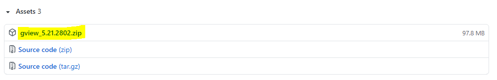

Installation
============

Die Installation erfolgt über das Kommandozeilen-Programm ``gview.deploy`` oder ``gview.deploy.exe``.
Unter Windows kann das Programm beispielsweise nach ``C:\deploy\gview-gis`` kopiert werden.

Startet man das Programm zum ersten Mal, muss zuert ein Profil angelegt werden.
In Profil kann beispielweise ``test``, ``staging``, ``production`` sein. Da wir im ersten
Schritt *gView GIS* nur einmal local testen wollen, bietet sich ein Profil mit dem 
Namen ``local`` für den Start an:

.. code::

   1> .\\gview.deploy.exe

   Work-Directory: C:\\deploy\\gview-gis
   Choose a profile or create a new by enter an unique name, eg. production, staging, test
   Input profile index [0]: local

In nächten Schritt bietet das Programm an, den aktuellen Release von Github herunter zu laden,
falls noch nicht vorhanden. 

.. code::

   Do you want to download latetest version from GitHub? Y/N [Y]

Ist das nicht möglich, kann der letzte Release auch manuell 
herunter geladen werden. Dazu müssen die ZIP Dateien ins ``download`` Verzeichnis gelegt werden.
Im Beispiel also hier: ``C:\deploy\gview-gis\download``

Liegen ZIP Dateien im ``download`` Verzeichnis, werden die unterschiedlihen Versionen
angezeigt:

.. code::

   Choose a version
   0 ... 6.24.1801
   Input version index [0]:

Die neueste Version bekommt den Index ``0``. 

.. note::

   Alle Werte die über das ``gviewdeploy`` eingeben werden, müssen bei späteren
   Aufrufen nicht mehr eingegeben werden. Stattdessen werden diese Werte mit einer 
   Indexnummer angezeigt. Man muss damit nur noch die entsprechende Nummer eingeben 
   bzw reicht es einfach ``ENTER`` zu drücken, wenn der gewünschte Index der
   vorgeschlagene Wert ist, zB ``Input version index [0]`` => ``ENTER`` => Version mit
   Index ``0``.

Nachdem die Version gewählt wurde, fragt das Deployment Tool noch einmal nach, ob 
tatsächlich die gewählte Version mit dem Profil deployed werden sollte:

.. code::

   Deploy version 6.24.1801 to profile local
   Do you want to continue? Y/N [Y]

Ein ``ENTER`` oder ``Y`` Started den Deploy Vorgang.

Publiziert man ein Profil (hier ``local``) das erste Mal, müssen noch ein paar 
Werte bekannt geben werden. Möcht man den Standardwert verwenden, reicht es, die Frage
mit ``ENTER`` zu bestätigen.

.. code::

   Target installation path [C:\\apps\\gview-gis]:
   Repsitory path [C:\\apps\\gview-gis\\local\\gview-repository]:
   gView Server online url [http://localhost:5050]:

* **Target installation path:** Der Pfad, an dem gview-gis installiert werden sollte
  unter diesem Verzeichnis, legt das Deploy Werzeug noch einem Order mit dem Profil
  Namen und der Version an. Hier würde die App unter ``C:\\apps\\gview-gis\\local\\6.24.1801``
  installiert werden.

* **Repository path:** Im Repository Path, werden unterschiedliche Dateien gespeicht, die
  für das funktioneren der Software notwendig sind, beispielsweise die Karten Dokumente (XML 
  Files), die vom Kartenserver veröffentlicht werden. Der Repository Ordner wird 
  normaleweise im Verzeichnis des Profiles (hier: ``C:\\apps\\gview-gis\\local``) gelegt.
  Da der Ordner nicht im Verions Ordner liegt, kann er von einer neuen installierten Version
  gleich mit verwendet werden. Wichtig ist, dass unterschiedliche Profile ihr eigenes 
  Repository Verzeichnis verwenden.

* **gView Server online url:** Eine Url, unter der der *gView.Server* zugänglich sein wird.
  Möchte man das ``local`` Profil testen und die Proramme nur lokal ausführen, erfolgt das 
  in der Regel über http://localhost:5050.
  Der Verteil diesen Wert hier Festzulegen ist, dass später in der *gView.Web* App eine
  zusätzliche Kachel zum Aufruf des *gView.Servers* angeboten wird. Das erleicht die 
  Administration. Ohne diese Url, würden nur die Kacheln für *gView.Carto* und 
  *gView.Explorer* angezeigt werden.

Die nächsten Werte legen wir den **Admin User** und das Admin Passwort fest.
Außerdem definieren wir einen **Carto User** ein.
Das Passwort ist jeweils einzugeben:

.. code::

   gView Admin Username [admin]:
   gView Admin Password [*****]: my-secret-admin-password
   gView Admin Username [carto]:
   gView Admin Password [*****]: my-secret-carto-password

Der Unterschied der beiden User ist, dass der **Carto User** nur auf eingeschränkte 
Werzeuge zugreifen kann. Er kann beispielsweise den **gView.Explorer** nicht aufrufen
sondern nur **gView.Carto**. Außerdem sieht er die eigentlichen *Connection Strings*
der Verbindungen nicht. Der **Carto User** kann somit nur auf vordefinierte Verbindungen
zugreifen, aber keinen eigenen Verbindungen zu Datenbanken anlegen, etc. Dieser User 
sollte von Benutzern verwendet werden, um neue Karte zu erstellen. Diese User müssen in 
der Regel keine Datenbank Credentials kennen.

Danach started der Deploy Vorgang:

.. code::

   ***********************************************************************
   Create a new webgis repositiry C:\apps\gview-gis\local\gview-repository
   ***********************************************************************

   Deploy version 6.24.1801
   Deploy gView Server:
   ...succeeded 972 items created
   Deploy gView Web:
   ...succeeded 448 items created
   Overrides
   Copy C:\deploy\gview-gis\_deploy_repository\profiles\local\server\override\_config\mapserver.json
   ...succeeded 1 items created/overridden
   Copy C:\deploy\gview-gis\_deploy_repository\profiles\local\web\override\_config\gview-web.config
   ...succeeded 1 items created/overridden

Installation old
================

*gView GIS* läuft mit Ausnahme der Desktop Programme auf unterschiedlichen Plattformen. Die einzelnen Komponenten sind sowohl (Windows) Destop, (Web) Server oder Kommandozeilen Werkzeuge.
Da alle Komponenten zumindest auf Windows laufen, gibt es für Windows ein Installationspaket. Die Software muss nicht direkt Installiert werden sondern läuft auch als *Portable* Version. 
Allerdings wird für die Desktop Programme (*gView.Carto* und *gView.DataExplorer*) unter Windows ein .NET Framework 4.7.2 vorausgesetzt. Server un Kommandozeilen Werkzeuge setzten 
eine .NET Core 3.1 Laufzeitumgebung voraus, die es sowohl für Windows, Linux und MacOS gibt.

Die Installationspakete können unter *Releases* aus dem GitHub Repository https://github.com/jugstalt/gview5/releases heruntergeladen werden:

Das Paket besteht aus einer ZIP-Datei und 
muss im ersten Schritt an einer beliebigen Stelle entpackt werden. Es können unterschiedliche Versionen von *gView GIS* parallel installiert werden. Dabei empfiehlt es sich das
ZIP File beispielsweise unter ``C:\gview5\5.21.2801`` zu entpacken:

.. image:: img/setup1.png

Im Verzeichnis ``_setup`` befindet sich folgende Verzeichnisstruktur:

.. image:: img/setup2.png

Im hier dargestellen Unterverzeichnissen befinden sich die eigentlichen Softwarekomponenten. Diese müssen und sollten nicht geöffnet oder geändert werden.
Der Setupvorgang wird von den drei Batch Dateien erledigt:

* ``install-desktop.bat``: Installiert die Desktop Applikationen *gView.Carto* und *gView.DataExplorer*
* ``install-server.bat``: Installiert den *gView.MapServer*
* ``install-cmd.bat``: Installiert die Kommandozeilen Werkzeuge

Desktop
-------

Ein Doppelklick auf ``install-desktop.bat`` startet das Zusammenstellen der notwendigen Softwarekomponenten für *gView Desktop*. Das Skript sollte je nach Geschwindigkeit des Datenträgers nur einige Sekunden dauern.
Ziel jeder Installation ist immer der Ordner, in dem sich auch das ``_setup`` Verzeichnis befindet. Wechselt man einen Ordner nach oben, erscheinen jetzt zusätzich folgende Dateien/Ordner:

.. image:: img/setup3.png

Im Verzeichnis ``desktop`` befinden sich jetzt die fertig zusammengestellten Softwarekomponenten. Der Inhalt des Verzeichnisses ist allerdings nicht relevant. Die beiden *Desktop Applikationen* werden durch die entsprechenden
Batch Dateien gestartet (Doppelklick):

* ``gView.Carto.bat``: Öffnet *gView.Carto*
* ``gView.DataExplorer.bat``: Öffnet *gView.DataExplorer*

Öffnet man *gView.Carto* erscheint ein *Splash Screnn* und *gView GIS* sucht im Programmverzeichnis nach vorhandenen Plugins. Danach sollte das Programm in etwa so angezeigt werden:

.. image:: img/setup4.png

Server
------

Die Installation des *gView.MapServer* erfolgt analog zu *gView.Desktop*:
``install-server.bat`` startet den Kopiervorgang der notwendigen Server Komponenten. Wechselt man ein Ordner höher wird folgendes angezeigt:

.. image:: img/setup5.png

Der Server kann auf unterschiedliche Arten gestartet werden (Microsoft IIS, Docker Container, Standalone). Eine Beschreibung erfolgt später. Hier kann nur einmal kurz die *Standalone* Variante getestet werden.
Dazu die Datei ``gView.Server.bat`` starten. Auch hier wird zuerst nach Plugins gesucht und dann der Server gestartet. Läuft alles korrekt ab, sieht die Ausgabe im Kommandozeilen Fenster in etwa so aus:

.. image:: img/setup6.png

Der Karten Server benötigt einige Verzeichnisse, in die später die Kartenprojekte abgelegt werden. In der Standard Konfiguration erfolgt die Erstellung dieser Verzeichnis automatsch: Verzeichnis ``server-files``
*gView.MapServer* läuft *Standalone* als Web-Server und läst jetzt unter http://localhost:5000

.. image:: img/setup7.png 

Kommandozeilen Werkzeuge
------------------------

Zur Installation der Werkzeuge muss unter ``_setup`` die Datei ``install-cmd.bat`` gestartet werden. Einen Ordner höher befindet sich danach ein Verzeichnis ``cmd``. Darin befinden sich alle notwendigen Softwarekomponenten.
Bei den Kommandozeilen Werkzeugen wird kein ``.bat`` File zum Starten angelegt. Die Mögliche Werkzeuge werden später behandelt.

.. note::
   Alle drei hier gezeigten Komponenten sind voneinander unabhängig und können einzeln oder in Kombination installiert werden. Grundsätzlich sollten nur die Komponenten installiert werden, die auch gebraucht werden.
   Verwendet man ein lokalen Rechner beispielsweise nur Karten die man auf einem produktiven *gView.MapServer* veröffentlichen möchte, reicht eine *gView.Desktop* Installation. Möchte man zusätzlich die Karten 
   über die Kommandozeile (nicht über die WebOberfläche des Servers) veröffentlichen, muss zusätzlich *gView.Cmd* installiert.
   Ist es auch noch notwendig die Dienste vorher auf einem *lokalen gView.MapServer* zu testen, kann dieser ebenfalls installiert als *Standalone* bei bedarf gestartet werden.

   Auf dem Server muss man ausschließlich *gView.Server* Installieren.

