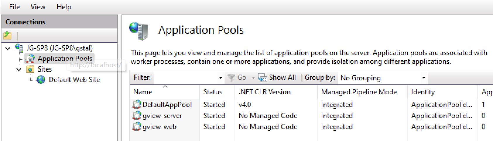

Im Internet Information Server (IIS) ausführen
==============================================

Beide Anwendungen können auch in einem WebServer (zB IIS auf Windows Systemen) gehostet werden.

Dazu muss im ersten Schritt für jede Anwendung ein *Application Pool* angelegt werden.

Als **.NET CLR Version** sollte ``No Managed Code`` und als **Managed Pipeline Mode** ``Integrated`` 
angegeben werden.

Im nächsten Schritt legt am in der gewünschten Web Seite (hier ``Default Web Site``) jeweils eine 
neue Anwendung an (Rechtsklick: ``Add Application...``):

.. image:: img/run-iis02.png 

Hier muss eine Name, der Application Pool und das Verzeichnis, in dem die Anwendung installiert 
wurde, angegeben werden.

Auf die gleiche Weise kann die *gView.Server* Anwendung erstellt werden:

.. image:: img/run-iis03.png

Die Anwendungen können mit http(s)://{host}/gview-web bzw http(s)://{host}/gview-server 
aufgerufen werden:

.. note::

    Falls IIS Anwendungen nicht starten, dann es darin liegen dass das entsprechende **.NET Core 
    Hosting Bundle** nicht installiert wurde. 
    Falls ich vorhanden muss ``dotnet-hosting-8.0.x-win.exe`` von der **dotnet** Downloadseite 
    herunter geladen und installiert werden.
   

