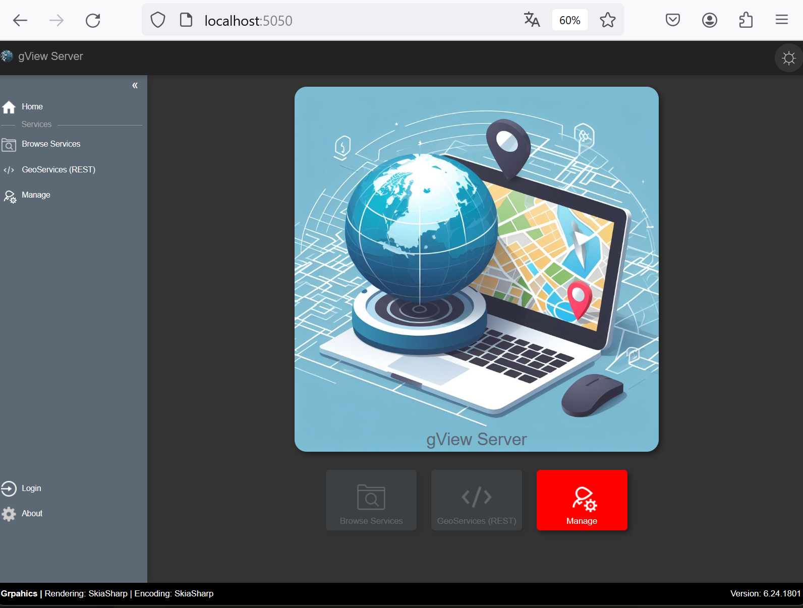

Lokal ausführen (Desktop Modus)
===============================

Sowohl *gView.Web* als auch *gView.Server* können lokal auf dem Desktop gestartet werden.

Bei *gView.Server* macht dass eigentlich nur für Testzwecke Sinn. 

.. note:: 
    
    Ein Anwendungsfall könnte allerdings sein, den *gView.Server* innerhalb eine Offline Lösung 
    zu verwenden. Dazu müssten auf den Offline Geräte folgende Komponenten vorhanden sein:

    * Kartenserver (*gView.Server*)
    * Alle notwendigen Daten (zB in einer SQLite Datenbank)
    * Eine WebGIS Lösung, die über den Kartenserver Karten darstellt.

Da *gView.Web* die früheren Desktop Anwendungen *gView.Carto* und *gView.DataExplorer* ablöst, kann 
es sehr wohl Sinn machen, diese Applikation immer nur bei bedarf zu starten.

Dazu muss man das Verzeichnis wechseln, in dem im vorherigen Schritt die Anwendung *deployed* wurde
(hier: C:\\apps\\gview-gis\\local\\6.24.1801)

.. note::

    Die letzten beiden Unterverzeichnisse entsprechen dem Profil und der Versionsnummer des vorhin 
    erstellen *Deployments*.

In diesem Verzeichnis sollte sich folgende Dateien und Ordner befinden:

.. image:: img/run01.png

* ``gview-server.bat`` startet den *gView.Server* lokal
* ``gview-web.bat`` startet *gView.Web* (*gView.Carto*, *gView.DataExplorer*) lokal

Start man ``gview-web.bat`` bekommt man folgende Ausgabe:


Hier wird ausgegeben unter welcher Url die Anwendung aufgerufen werden soll 
(hier: http://localhost:5051)

.. note::

    Die Url kann über die Datei ``gview-web.bat`` geändert werden. Dazu muss die Datei mit einem 
    Texteditor geöffnet werden.

Gibt man die Url in einem Browser ein (zB Firefox), sollte die Anwendung angezeigt werden.


.. note::

    Manche Browser leiten ``http://`` Requests automatisch auf ``https://`` um. Das funktioniert leider
    nicht für *lokale* Anwendungen. Das kann ein Grund sein, dass die Anwendung nicht angezeigt wird.
    Abhilfe kann kann sein, ein anderen Browser (zB Firefox zu verwenden).

Da wir im vorigen Schritt beim *Deploy* Benutzer und Passwort definiert haben, muss man sich in 
der Anwendung erst authentifizieren um die Programme nutzen zu können.

Dazu auf Login klicken und sich als ``admin`` Anmelden. Danach stehen alle Programme zur Verfügung:

.. image:: img/run04.png

.. note::

    Die Kachel **Local gView Server** kann nur erfolgreich gestartet werden, wenn der Server 
    mit ```gview-server.bat`` gestartet wurde.

.. note::

    Die Kachel **Used Memory** dient nur dem Zweck, die Speicherbelegung zu optimieren, wenn *gView.Web*
    viele Resourcen verbraucht. Ein Klick auf das Symbol in der Kachel führt dazu ein ``GC.Collect()`` 
    aus.

Klickt man auf eine Kachel wird die entsprechende Anwendung im aktuellen Browser Tab geöffnet.
Möchte man die die Anwendung in einem neuen Tab öffnen, muss man auf das Pfeilsymbol im der 
entsprechenden Kachel klicken.

Start man die Datei ``gview-server.bat`` ist das Verhalten ähnlich wie oben.
In der Ausgabe wird die Url angezeigt, unter der der *gView.Server* läuft:


Öffnet man die Url im Browser (hier: http://localhost:5050) sollte folgendes angezeigt werden:



.. note::

    Ruf man den *gView.Server* das erste mal auf, sind in der Regel noch kein Administrator User 
    definiert. Der *gView.Server* agiert unabhängig von *gView.Web* und greift nicht auf 
    die Benutzereinstellung dieser Anwendung zu. 

    Es Empfiehlt sich, nach dem Einsteigen auf die rote Kachel **Manage** zu klicken und 
    hier einen User und ein Passwort einzugeben. Dieser erste User und dann automatisch 
    der Administrator für den gView Server.

