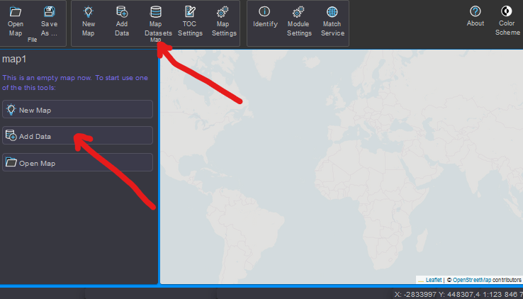

Daten hinzuzufügen
==================

Beim Erstellen einer Karte müssen im ersten Schritt Daten hinzugefügt werden.
Dazu klickt man in der Werkzeugleiste auf den Button ``Add Data`` (bzw. auf den
Schnelleinstieg Button im TOC Bereich)

Der Dialog gleicht in der Navigation dem *gView.DataExplorer*. Anstelle der
Baumansicht des Data Explorers steht hier ein Kombinationsfeld (Folder/Path) zur
Verfügung. Der mittlere Teil des Dialogs entspricht dem Contents-Bereich. Hier sind
allerdings im Gegensatz zum *gView.DataExplorer* nicht alle Kontextmenüs vorhanden. So ist z. B.
zum Löschen und Umbenennen von Objekten immer der *gView.DataExplorer* zu verwenden.

Bei der ersten Anwendung müssen eventuell noch die Verbindungen zu Datenquellen eingestellt werden.
Möchte man beispielsweise *PostGIS* Daten einbinden (empfohlen), muss man im Dialog zuerst in den Ordner ``Databases`` wechseln. 
Dort gibt es den Unterpunkt ``PostGIS`` unter dem alle gespeicherten Verbinden zu *PostGIS Servern* aufgelistet werden.
Sind noch keine Verbindungen vorhanden kann über den ``+`` Button neben dem ``Folder/Path``
Auswahlfeld eine neue Verbindung angelegt werden:

.. image:: img/adddata3.png

.. note::

    Der Button steht nur *Admin Usern* zur Verfügung. *Carto Usern* stehen nur vom *Admin*
    bereitgestellte Verbindungen zur Verfügung. 

Bevor die Verbindung übernommen wird, kann mit ``Test Connection`` noch überprüft werden, 
ob alle Einstellungen richtig sind und eine Verbindung aufgebaut werden kann.

Ist die Verbindung erfolgt erstellt worden, kann sie mit einem Doppelkick geöffnet werden.

Im *Content-Bereich* können Featureklassen oder ein Dataset ausgewählt und
danach der Dialog mit ``OK`` bestätigt werden. Damit werden die Daten der Karte hinzugefügt 
und angezeigt:

.. image:: img/adddata4.png 

In TOC Bereich können die Themen sichtbar bzw. unsichtbar gesetzt werden (*Checkbox*). 
Der *Pfeil* Button bewirkt ein aufklappen. Hier bei bei Vektordaten Layern die Legende
angezeigt:

.. image:: img/adddata5.png

