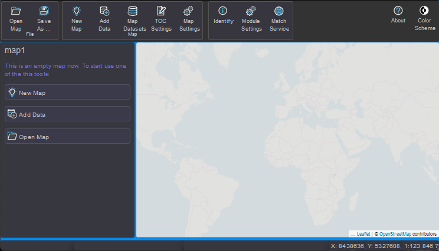

gView Carto
===========

Die App **gView.Carto** dient zum Erstellen und Betrachten von Karten. Diese
Karten können im **gView.Server** veröffentlicht werden und stehen danach in unterschiedlichen 
Schnittstellenformaten zur Verfügung.

In diesem Abschnitt soll der Vorgang der Kartenerstellung beschrieben werden. Auf die einzelnen Werkzeuge
wird nur kurz bzw. gar nicht eingegangen. Ziel sollte sein, nach der Lektüre dieses Kapitels in
der Lage sein, Daten in eine Karte hinzuzufügen und die Legenden zu gestalten.

Nach dem Start durch einen Klick auf die ``gView.Carto`` zeigt die Anwendungen vorerst ein leeres
Kartenbild mit einem transparentem Hintergrund *TileCache*. Dieser Hintergrund ist nicht Teil 
der eigentliche Karte, sondern dient nur zur Orientierung. Speichert man die Karte und 
veröffentlicht sie im **gView.Server** wird dieser Hintergrund nicht übernommen. Der Hintergrund
erleichtert es, sich in der Karte zurecht zu finden, besonders wenn die Karte später 
nur aus Vektordaten besteht. 

.. toctree::
    :maxdepth: 2
    :caption: Inhaltsverzeichnis:
 
    newmap
    adddata
    toc
    symbology
    labeling
    scales
    layerprops
    managemaps
