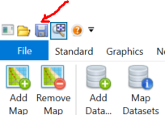
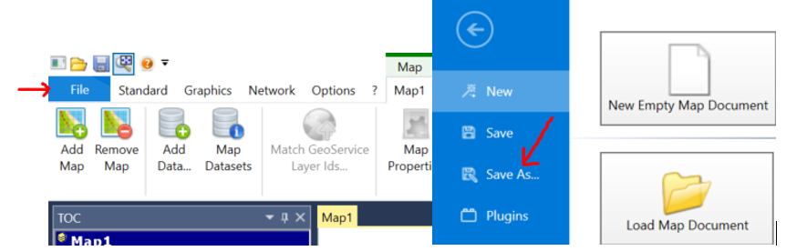
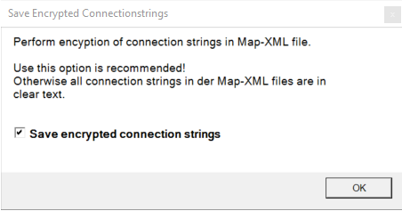

Speichern und Verwalten von Kartendokumenten
============================================

Zum Schluss sollte die Karte natürlich noch gespeichert werden. Verwenden Sie dazu das
entsprechende Werkzeug oder den Menüpunkt ``Speichern unter``. Kartendokumente werden
immer mit der Dateierweiterung mxl (Map XML) gespeichert. Dabei handelt es sich um eine
XML Datei in der alle Einstellungen abgelegt werden.

Beim Speichern von Karten im *gView Carto* gibt es zwei Möglichkeinten:

Save 
----

Speicher die aktuelle Karte. Existiert die Karte bereits, wird sie kommentarlos überschrieben.

Sava As
-------

Hier damit wird eine Karte mit einem neuen Namen oder Speicherort gespeichert. 

Speichert man eine Karte mit ``Save As`` wird vor dem speichern noch folgender Dialog angezeigt:

Normalerweise werden die Verbindungseigenschaften zu Datenbanken im MXL File verschlüsselt. Möchte man diese Eigenschaften in einem Texteditor ändern, kann durch die *Checkbox* bestimmt werden,
dass die Verbindungseigenschaften im Klartext gespeichert werden.

.. note::
   Aus Sicherheitsgründen sollten die Verbindungseigenschaften immer verschlüsselt werden. Allerdings ist auch diese Verschlüsselung nicht 100% sicher. *gView GIS* ist eine Open Source Software und
   jeder kann sich den Mechanismus dieser Verschlüsselung aneignen und umgehen. MXL Dateien mit vertraulichen Verbindungseigenschaften sollte daher immer mir Sorgfalt behandelt und nicht weitergeben werden.

Eine gespeicherte Karte im ``mxl`` Format lässt sich nahtlos über *gView Map Server*
publizieren.