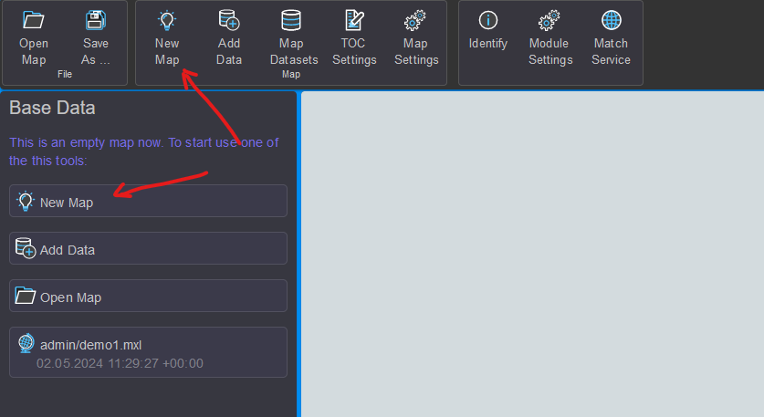
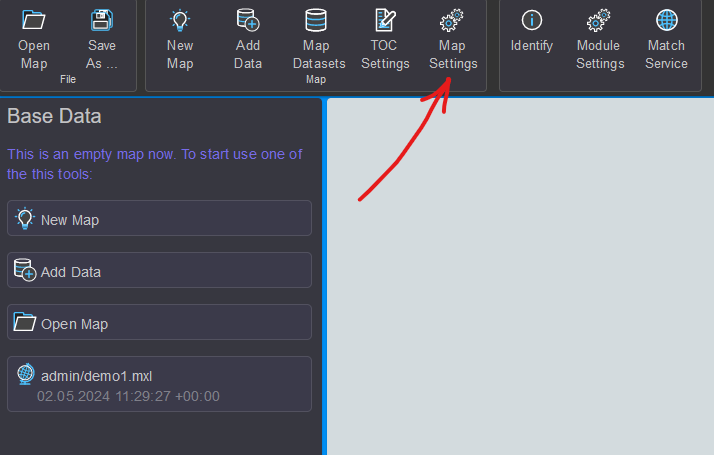

Neue Karte anlegen
==================

Zu Beginn kann optional eine neue Karte angelegt werden. Das erfolgt über den Button 
``New Map`` oder den Schnelleinstiegsbutton im TOC-Bereich:

Im Dialog kann ein Name für die neue Karte vergeben werden. Mit ``Confirm`` wird die 
neue Karte erstellt. Der neue Name erscheint jetzt anstelle von *map1* im TOC-Bereich.

Karten-Einstellungen
--------------------

Weitere Einstellungen können über den Button ``Map Settings`` getroffen werden. 
Hier kann auch später noch der eben gewählte Name der Karte geändert werden:

Im Bereich ``Display`` kann ein Referenzmaßstab gesetzt werden. Ist dieser Wert größer als 
``0``, beziehen sich Symbol- und Schriftgrößen auf diesen Maßstab. Je nach Kartenmaßstab 
werden die Symbole und die Beschriftung größer oder kleiner.

Als *Map/Display Units* sollte für die meisten Anwendungsfälle ``Meter`` eingestellt werden.
Ohne *Map Units* kann der Referenzmaßstab nicht berücksichtigt werden.

Im Bereich ``Current`` werden die Koordinaten des aktuellen Kartenausschnitts angezeigt, bezogen
auf das aktuell eingestellte Koordinatensystem. Ebenfalls die Größe des Kartenbildes.
Diese Information ist oft hilfreich, wenn man Dienste im **gView.Server** testen möchte.

Links im Dialog werden noch weitere Einstellungsseiten angeboten:

Darstellung (Appearance)
++++++++++++++++++++++++

Diese Seite kann verwendet werden, um den Glättungsmodus (Smoothing Mode) der Symbolik und 
Beschriftung zu bestimmen. Klickt man auf einen dieser Buttons, wird der entsprechende Modus
auf alle in die Karte aktuell eingefügten Layer angewendet:

.. image:: img/newmap3.png

Spatial Reference (System)
++++++++++++++++++++++++++

Hier kann das räumliche Bezugssystem für die Karte vergeben werden. Es sollte das 
Koordinatensystem eingestellt werden, in dem die Daten zum großen Teil vorliegen. Zum Ändern
des Koordinatensystems klickt man auf ``Select``. Im Dialog gibt man im Suchfeld den Namen 
oder den EPSG-Code des gewünschten Koordinatensystems ein und klickt dann in der Liste auf das 
gewünschte Item. Damit wird das Koordinatensystem übernommen:

.. image:: img/newmap4.png

.. note::

    Das Koordinatensystem, in dem die Daten in **gView.Carto** angezeigt werden, entspricht 
    immer dem des transparenten Hintergrund-TileCaches. Eine Änderung hier wird also nicht
    sofort in der Darstellung erkennbar.

    Allerdings ändern sich die angezeigten Koordinaten in der Statusleiste. Diese Einstellung 
    ist ebenfalls relevant, wenn die Karte später im **gView.Server** publiziert wird. Alle 
    Koordinaten und *BoundingBox*-Werte in den Diensteigenschaften beziehen sich auf das hier 
    eingestellte Koordinatensystem.

Ein weiterer Punkt in diesem Dialog ist ``Spatial Behavior``.
Damit kann eingestellt werden, wie sich der Dienst später verhalten sollte, wenn er im
*WebMercator*-System abgerufen wird. In der Regel wird der Maßstab ohne Berücksichtigung der 
Verzerrung berechnet. Egal wo man sich auf der Karte befindet, der berechnete Maßstab entspricht 
dem Maßstab am Äquator. Da die Nord/Süd-Verzerrung beim *WebMercator* sehr groß sein kann,
ist das nicht immer wünschenswert. Stellt man hier anstelle von ``default`` den Wert 
``Include Latitude When Calculating Map Scale`` ein, wird die geographische Breite beim Berechnen 
des internen Maßstabs berücksichtigt (Faktor ``cos(lat)``).

Default Layer Spatial Reference (SRef)
++++++++++++++++++++++++++++++++++++++

Fügt man später Daten der Karte hinzu, kann es vorkommen, dass manche Layer keine Information 
besitzen, in welchem Koordinatensystem die Daten liegen. Das sollte nicht die Regel sein, aber 
falls dieses Problem auftritt, kann hier ein ``Default Koordinatensystem`` eingestellt werden.
Für alle Layer ohne Koordinatenangabe wird dieses verwendet:

.. image:: img/newmap5.png

.. note::

    Diese Einstellung hier sollte nur in Ausnahmefällen notwendig sein. In der Regel ist 
    darauf zu achten, dass alle Layer Informationen zu ihrem Koordinatensystem besitzen.

Description & Copyright
+++++++++++++++++++++++

Unter diesem Punkt kann ein sprechender Titel für die Karte sowie eine Beschreibung und 
Copyright-Hinweise angegeben werden. Diese erscheinen später als Metadaten in den 
**gView.Server** Diensten:

.. image:: img/newmap6.png

Resources
+++++++++

Hier können der Karte binäre Objekte übergeben werden. Diese werden später innerhalb des
Kartendokuments gespeichert. Hier sollten und dürfen keine großen Dateien hinterlegt werden,
weil sonst das Kartendokument sehr groß wird.

Ein Anwendungsfall sind kleine PNG-Grafiken, die später als Symbole verwendet werden 
sollten (*RasterSymbol* bei Punkten). Die Symbole können auch als Pfad zum Bild 
eingestellt werden. Das hat jedoch den Nachteil, dass der gleiche Pfad später auch auf 
dem Server vorhanden sein muss, auf dem **gView.Server** ausgeführt wird. Gibt man das 
Bild hier an, kann später beim *RasterMarkerSymbol* darauf verwiesen werden. Ist das Symbol 
im Kartendokument gespeichert, sind keine identischen Pfade notwendig.

.. note::

    Eine weitere Möglichkeit, Symbole darzustellen, sind *True Type Fonts* (empfohlene Methode). 
    Diese können hier nicht hochgeladen und verwendet werden. Die Fonts müssen auch auf 
    dem **gView.Server** Server installiert sein.

