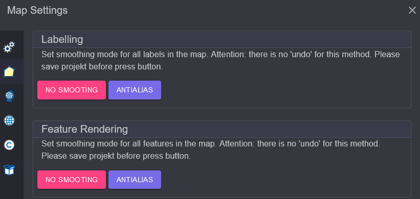
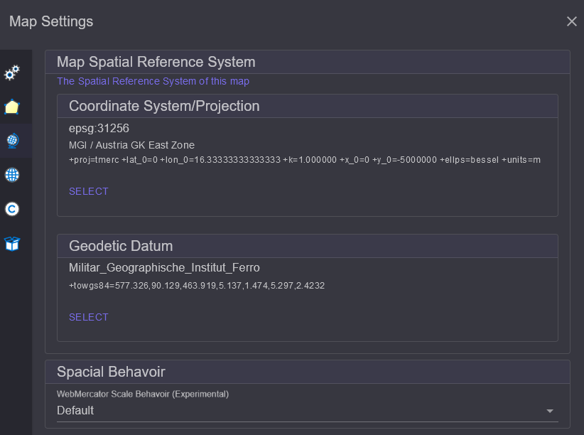

Neue Karte anlegen
==================

Zu Begin kann optional eine neue Karte angelegt werden. Das erfolgt über den Button 
``New Map`` oder dem Schnelleinstieg Button im TOC Bereich:

.. image:: img/newmap1.png

Im Dialog kann eine Name für die neue Karte vergeben werden. Mit ``Confirm`` wird die 
neue Karte erstellt. Der neue Name erscheint jetzt anstelle von *map1* im TOC Bereich.

Karten Einstellungen
--------------------

Weitere Einstellungen können über dem Button ``Map Settings`` getroffen werden. 
Hier auch später noch der eben gewählte Name der Karte geändert werden:

.. image:: img/newmap2.png

Im Bereich ``Display`` kann Referenz Maßstab gesetzt werden. Ist dieser Wert größer als 
``0`` beziehen sich Symbol- und Schriftgrößen auf diesen Maßstab. Je nach Karten Maßstab 
werden die Symbol und die Beschriftung größer oder kleiner.

Als *Map/Display Units* sollte für die meisten Anwendungsfälle ``Meter`` eingestellt werden.
Ohne *Map Units* kann der Referenzmaßstab nicht berücksichtigt werden.

Im Bereich ``Current`` werden die Koordinaten des aktuellen Kartenschnittes angezeigt, bezogen
auf das aktuell eingestellte Koordinatensystem. Ebenfalls die Größe des Kartenbildes.
Diese Information ist oft hilfreich, wenn man Dienste im **gView.Server** testen möchte.

Links im Dialog werden noch weiter Einstellungsseiten angeboten:

Darstellung (Appearence)
++++++++++++++++++++++++

Diese Seite kann verwendet werden um den Glättungsmodus (Smootingmode) der Symbolik und 
Beschriftung zu bestimmen. Klickt man auf einen dieser Buttons, wir der entsprechende Modus
auf alle in die Karten aktuell eingefügten Layer angewendet:

Spatial Reference (System)
++++++++++++++++++++++++++

Hier kann das räumliche Bezugssystem für die Karte vergeben werden. Es sollte hier das 
Koordinaten System eingestellt werden, in dem die Daten zum großen Teil vorliegen. Zum Ändern,
des Koordinaten Systems klickt man auf ``Select``. Im Dialog gibt man im Suchfeld den Namen 
oder EPSG Code des gewünschten Koordinatensystems an und klickt dann in der Liste auf das 
gewünschte Item. Damit wird das Koordinatensystem übernommen:

.. note::

    Das Koordinaten System, in dem die Daten in **gView.Carto** angezeigt werden, entspricht 
    immer dem des transparenten Hintergrund TileCaches. Eine Änderung hier wird also nicht
    sofort in der Darstellung erkennbar. 

    Allerdings ändern sich die angezeigten Koordinaten in Statusleiste. Diese Einstellung hier 
    ist ebenfalls relevant, wenn die Karte späte im **gView.Server** publiziert wird. Alle 
    Koordinaten und *BoundingBox* Werte in den Diensteigenschaften beziehen sich auf das hier 
    eingestellte Koordinatensystem.

Ein weiter Punkt in diesem Dialog ist ``Spatial Behavoir``.
Damit kann eingestellt werden, wie sich der Dient späte verhalten sollte, wenn er im
*WebMecator* System abgeholt wird. In der Regel wird der Maßstab ohne Berücksichtigung der 
Verzerrung berechnet. Egal wo man sich in der Karte befindet, der berechnete Maßstab entspricht 
dem Maßstab am Äquator. Da die Nord/Süd Verzerrung beim *WebMercator* sehr groß werden, 
ist das nicht immer wünschenswert. Stellt man hier anstelle von ``default`` den Wert 
``Include Latitude When Calculate Map Scale`` ein, wird die geographische Breite beim Berechnen 
es intern Maßstabs berücksichtigt (Factor ``cos(lat)``)

Default Layer Spatial Reference (SRef)
++++++++++++++++++++++++++++++++++++++

Fügt man später Daten der Karte hinzu, kann es vorkommen, das manche Layer keine Information 
besitzen, in welche Koordinatensystem die Daten liegen. Das sollte nicht dir Regel sein, aber 
falls diese Problem auftritt, kann hier ein ``Default Koordinatensystem`` eingestellt werden.
Für alle Layer ohne Koordinatensystem angebe, wird diesen verwendet: 

.. image:: img/newmap5.png

.. note::

    Diese Einstellung hier sollte nur in Ausnahme Fällen notwendig sein. In der Regel ist 
    darauf zu achten, dass alle Layer Information zu ihrem Koordinatensystem besitzen.

Description & Copyright
+++++++++++++++++++++++

Unter diesem Punkt kann ein sprechender Title für die Karte sowie Beschreibung und 
Copyright hinweise angegeben werden. Diese Erscheinen späten als Metadaten in den 
**gView.Server** Diensten:

.. image:: img/newmap6.png

Resources
+++++++++

Hier können der Karte binäre Objekte übergeben werden. Diese werden später innerhalb des
Kartendokuments gespeichert. Hier sollten und dürfen keine großen Files hinterlegt werden,
weil sonst das Kartendokument sehr groß wird.

Ein Anwendungsfall sind kleine PNG Grafiken, die später als Symbole verwendet werden 
sollte (RasterSymbol beim Punkten). Die Symbole könnten können auch als Pfad zum Bild 
eingestellt werden. Das hat jedoch den Nachteil, das der gleiche Pfad später auch auf 
dem Server vorhanden sein muss, auf dem **gView.Server** ausgeführt wird. Gibt man das 
Bild hier an, kann später beim *RasterMarkerSymbol* darauf verwiesen werden. Ist das Symbol 
im Kartendokument verspeichert, sind keine identen Pfade notwendig.

.. note::

    Eine weiter Möglichkeit, Symbole darstellen sind *True Type Fonts* (empfohlene Methode). 
    Diese können hier nicht hochgeladen und verwendet werden. Die Fonts müssen hier auch auf 
    dem **gView.Server** Server installiert sein. 

