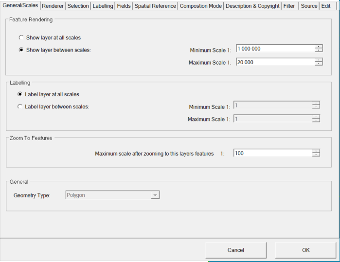

Maßstabsgrenzen
===============

Sehr häufig ist es notwendig, Layer oder Beschriftungen nur innerhalb gewisser
Maßstabsgrenzen anzuzeigen. Das lässt sich über den **Layer Settings** Dialog 
im Bereich ``Map / Display`` einstellen:

Hier wird ein Layer nur zwischen 1:20.000 und 1:1.000.000 dargestellt.

.. note::
   Die Maßstabsgrenzen lassen sich ebenso für die Beschriftung wählen, wobei als erstes 
   immer der Darstellungs-Maßstabsbereich überprüft wird. Das heißt, wenn ein Layer aufgrund 
   der Maßstabsgrenzen nicht dargestellt wird, wird er auch nicht beschriftet.

Weiterhin kann hier eingestellt werden, ob für die Symbole der Referenzmaßstab berücksichtigt wird.

.. note::

   Der Referenzmaßstab wurde bei den Eigenschaften der Karte festgelegt. Wird er auf einen
   Layer angewendet, bedeutet das, dass das Symbol für diesen Maßstab die eingestellte 
   Größe hat. Zoomt man weiter in die Karte, wird das Symbol größer und umgekehrt.

* **Apply reference scale:** Der Referenzmaßstab wird für die Symbolik dieses Layers angewendet.

* **Do not apply reference scale:** Der Referenzmaßstab wird nicht angewendet. Die Symbolik bleibt
  für jeden Maßstab unverändert.

* **Apply reference scale (max scale up):** Der Referenzmaßstab wird angewendet, allerdings können 
  die Symbole nicht beliebig groß skaliert werden. Über den Schieberegler kann beispielsweise 
  definiert werden, dass ein Symbol nur auf die doppelte Größe vergrößert werden kann.

.. note::

   Alle diese Einstellungen funktionieren gleich für Texte.

