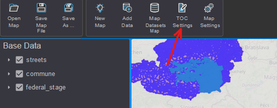
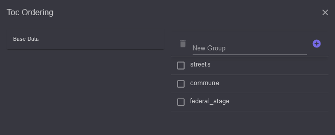
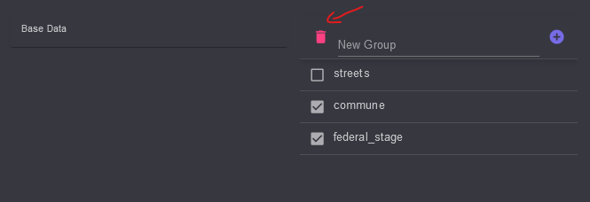
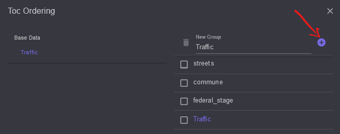
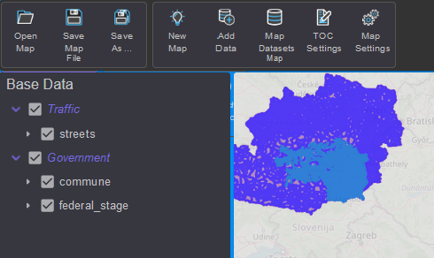
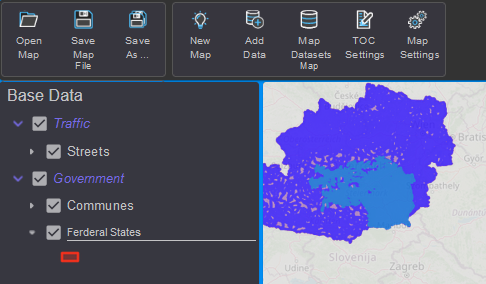

Zeichenreihenfolge/TOC
======================

Die Zeichenreihenfolge der einzelnen Layer ist im Inhaltsverzeichnis (Table of Contents, kurz
TOC) ersichtlich. Der am weitesten unten stehende Layer wird zuerst gezeichnet. Die
Reihenfolge ist also von unten nach oben.

Um die Reihenfolge zu ändern, klickt man auf den Button ``TOC Settings`` in der Werkzeugleiste:

Damit öffnet sich folgender Dialog:

Links wird der *Gruppen Bereich* angezeigt (hier: derzeit nur die Karte mit dem Namen *Base Data*).
Rechts die Layer in der entsprechenden Reihenfolge.

Zeichenreihenfolge ändern
-------------------------

Möchte man die Reihenfolge ändern, zieht man
einen Layer aus der rechten Liste mit gedrückter Maustaste und lässt die Maustaste an der gewünschten
Stelle wieder los.

Layer aus der Karte entfernen
-----------------------------

Das Entfernen von Layern erfolgt ebenfalls über diesen Dialog. Dazu müssen die Layer (rechter Bereich)
zuerst über die Checkbox ausgewählt werden. Danach klickt man oben auf das ``Papierkorb`` Symbol.
Auf diese Weise können mehrere Layer gleichzeitig gelöscht werden:

Layer Gruppieren
----------------

Layer können eine Gruppe zugeordnet werden. Das kann dabei helfen, Layer logisch zusammen zu fassen.
Gruppen-Layer können auch bestimmte Eigenschaften haben, die alle Layer innerhalb die Gruppe 
betreffen (z.B. Maßstabsgrenzen, Sichtbarkeit).

Um eine neue Gruppe anzulegen, gibt man im Feld ``New Group`` den Namen der Gruppe ein und 
klickt danach auf das ``+`` Symbol:

Der neu Gruppen-Layer wird jetzt links im *Gruppen Bereich* angezeigt. Da sich die Gruppe in der
aktuellen Ebene befindet (direkt unter der Karte) erscheint sie auch auf der rechten Seite auf.

.. note::

    Zur bessern Unterscheidung werden Gruppen farblich unterschiedlich dargestellt.

Durch Klicken auf der linken Seite kann man die aktuelle *Eltern Gruppe* auswählen.
Klickt man auf die neue Gruppe, werden rechts keine Layer angezeigt, weil die Gruppe noch 
leer ist. Um das zu Ändern, wechselt man eine Ebene höher (Klick im linken Bereich).

Sind auf der rechten Seite die gewünschten Layer angezeigt, kann man sie mit gedrückter 
Maustaste auf die neue Gruppe im linken Bereich ziehen. Der Layer verschwindet damit aus der 
aktellen Ebene. Klickt man rechts wieder auf die Gruppe sollte sich der Layer darin befinden.

Mehrere Layer können auch gleichzeitig in eine Gruppe verschoben werden. Dazu die Layer zuerst 
Rechts mit der *Checkbox* auswählen. Dann einen ausgewählten Layer nach links in die 
gewünschte Gruppe ziehen.

Ist man mit der Gruppierung und Festlegung der Reihenfolge fertig kann der Dialog geschlossen 
werden (``x`` Symbol). Im TOC sollten die Änderungen sofort sichtbar werden:

Abschließend können noch die angezeigten Namen der Layer geändert werden. Dazu reicht es,
im TOC mit einem Doppelklick auf den Text zu klicken. Nach Eingabe des neuen Namens kann 
die Eingabe mit ``Enter`` bestätigt werden:

.. note::

    Sollten die Symbole der Legende ein Label bekommen, kann das auf die gleiche Weise
    durch Doppelklick auf den Bereich rechts neben dem Symbol erfolgen:

    .. image:: img/toc7.png

