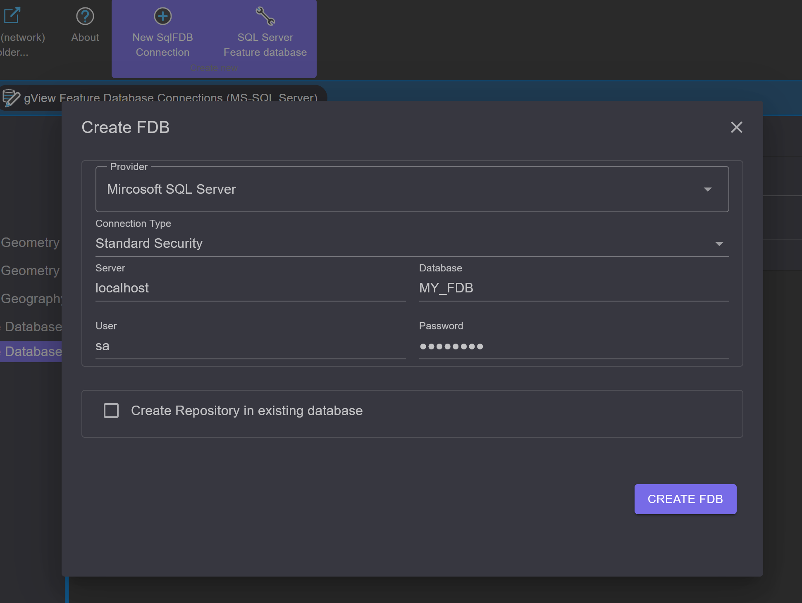
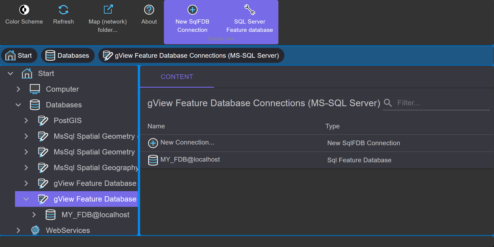
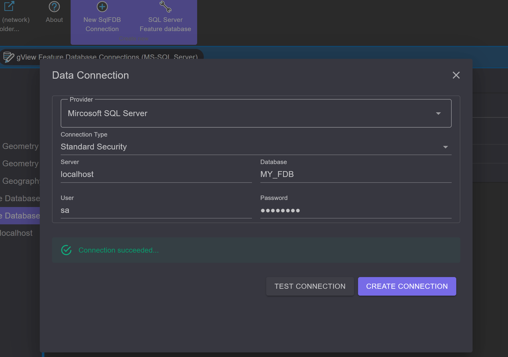
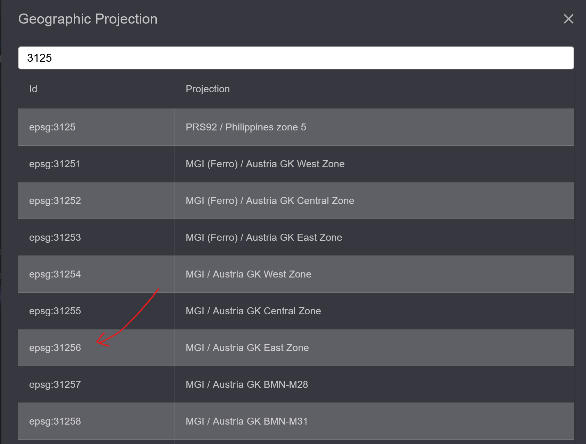
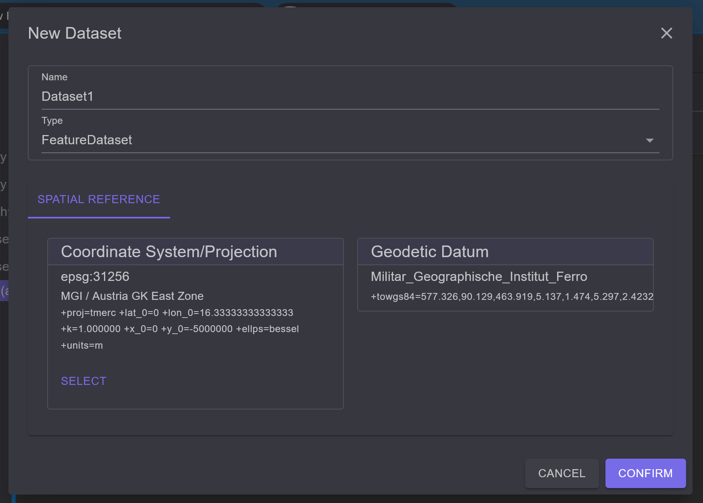
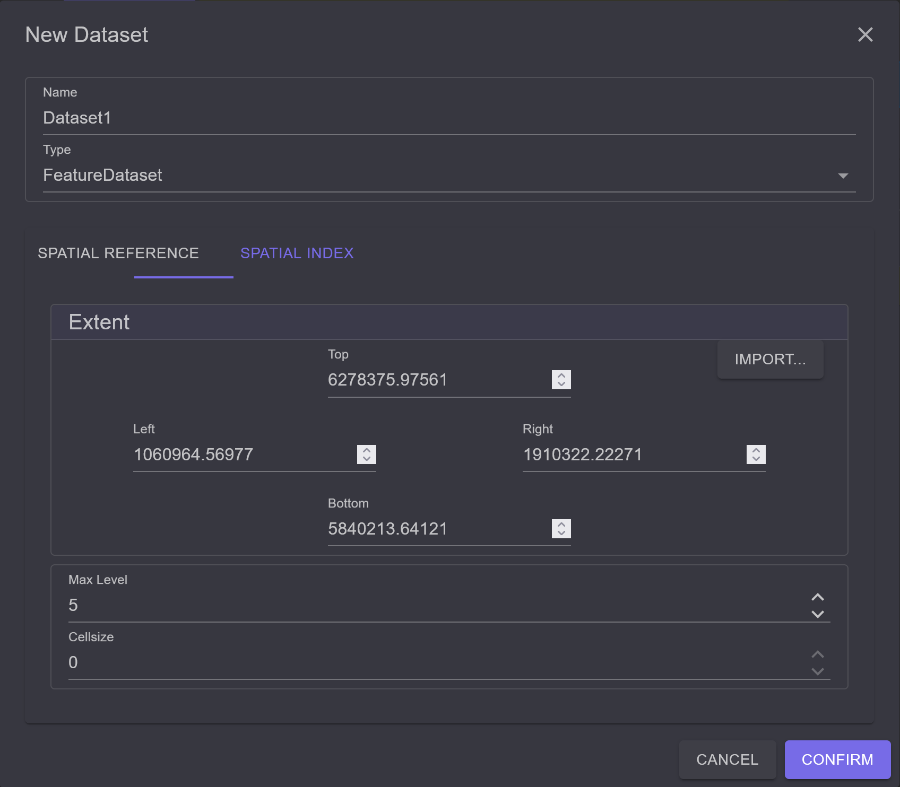
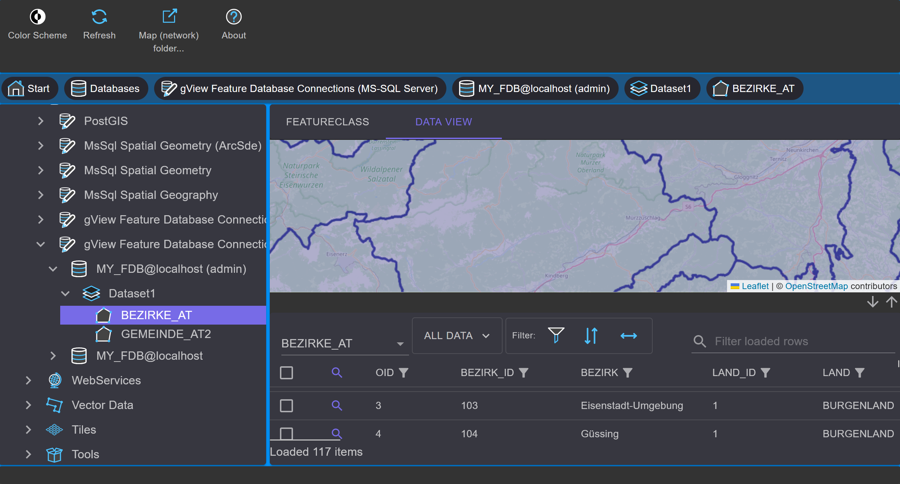
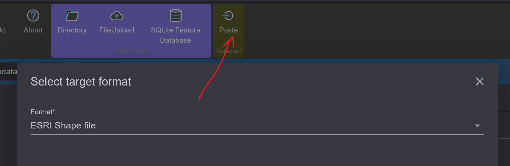

Anlegen einer MS SQL Feature Database
=====================================

Bei dieser Datenbank handelt es sich um ein proprietäres Format und kann nur mit gView GIS
verwendet werden. Der Vorteil ist jedoch die hohe Performance bei großen Datenmengen.
Außerdem können mit diesem Format Imagekataloge in einer komfortablen graphischen
Oberfläche erstellt und verwaltet werden. Voraussetzung zur Erstellung einer Datenbank ist
ein MS SQLServer 2008 oder höher. Wird die kostenlose Express Variante vom MS SQL
verwendet, gelten die entsprechenden Einschränkungen des Servers (max. 4GB pro
Datenbank, …). Die Feature Database Funktionalität wird dadurch aber nicht eingeschränkt.

.. note::
   Der hier gezeigt Weg bezieht sich auf eine *gView Feature Database* in SQLServer. 
   Die Erstellung von *gView Feature Database* in Postgres erfolgt analog.
   Um eine *gView Feature Database* auf Basis von SQLite zu erstellen muss zuerst an die 
   Stelle im Filesystem navigiert werden, wo die Datenbank angelegt werden sollte. Im *Context Menü* 
   kann dort dann der Punkte ``Create New: SQlite Feature Database`` ausgewählt werden.

Um eine neue Feature Database anzulegen, wählen Sie in der Baumansicht den Knoten ``Sql Feature Database Connections`` aus:

.. image:: img/create1.png 

Klicken sie nun mit der rechten Maustaste in den *Contents-Bereich*. Im dort erscheinenden
Kontextmenü wählen sie ``New/Sql Feature Database``:

Stellen Sie hier die Verbindung zur SQL Server Instanz ein. Durch den Verbindungstyp wird
angeben, ob die Anmeldung über Windows Authentifizierung oder über Benutzername und
Passwort erfolgen soll. Der Datenbankname vollendet die Eigenschaften der neuen
Datenbank.

Um später über den *gView Data Explorer* die Datenbank administrieren zu können, wählen
Sie die Option ``Verbindungs-Icon erzeugen`` aus und geben eine Bezeichnung für das Icon
an.

Nach Bestätigung mit ``OK`` wird die Datenbank mit allen notwendigen Tabellen angelegt. Ist
das Erstellen erfolgreich, zeigt der Data Explorer das neue Datenbankicon im *Contents-Bereich* an:

Die Icons im *Contents-Bereich* werden immer mit einem Doppelklick geöffnet. Sie können so
auch ein Verbindungsicon auf eine bestehende Feature Database erstellen. Doppelklicken Sie
hierzu einfach das Icon ``Neue Verbindung erstellen…``

Sie können so zum Beispiel noch ein Icon auf unsere Beispieldatenbank mit Administratorrechten erstellen:

.. image:: img/create5.png 

Über das Kontextmenü (rechte Maustaste) eines Icons, kann dieses schließlich noch
umbenannt werden:

.. image:: img/create6.png 

Im nächsten Schritt wollen wir ein Dataset für unsere Geodaten anlegen. Datasets sind
Sammlungen von Featureklassen, die gleiche Eigenschaften besitzen. Zum Beispiel können
alle Klassen, die dem Kataster zugehörig sind, in ein Dataset mit der Bezeichnung
KATASTER gelegt werden.

.. note::
    Alle Featureklassen eines Datasets verwenden das gleiche räumlichte Bezugssystem! Wenn sich also ihre Daten in unterschiedlichen Bezugssystemen befinden, sind die
    Featureklassen auf mehrere Datasets aufzuteilen. Dabei darf ein **Featureklassenname** in
    einer **Datenbank** nur **einmal** vorkommen.
    
Um ein neues Dataset anzulegen, doppelklicken sie auf das Datenbankicon
(MY_FIRST_FDB) im *Contents-Bereich*. Da noch keine Datasets existieren, erscheint nur
ein leerer Bereich. Klicken sie nun mit der rechten Maustaste in den leeren *Contents-Bereich*
und wählen Sie ``New/Sql Feature Database Dataset``:
    
.. image:: img/create7.png 

Ändern Sie den Namen auf ``Dataset1``. Als Typ belassen Sie die Einstellung Feature Dataset.
Das bedeutet, dass in diesem Dataset Vektordaten für alle Geometrietypen (Punkt, Linie,
Fläche) abgelegt werden können. Der Typ Image Dataset ist für das Anlegen von
Imagekatalogen gedacht und wird weiter unten behandelt.

Die zweite Registerkarte des Dialogs bestimmt das räumlichte Bezugssystem für das
Dataset. Wie oben schon erwähnt, ist das Bezugssystem nur auf dieser Ebene bestimmbar.
Alle Featureklassen in einem Dataset erben diese Eigenschaft.

Ein räumliches Bezugssystem setzt sich immer aus zwei Teilen (Koordinatenssysten und
geodätisches Datum) zusammen, wobei der zweite Teil theoretisch auch weggelassen werden
kann. Bei der Projektion wird dann allerdings kein Datumsübergang angebracht. Mit dem
Auswählen Knopf, können Sie aus vordefinierten Systemen wählen:

Um die Liste einzuschränken, geben Sie unten einen Suchbegriff (z.B. Austria, EPSG Code) ein und
klicken auf Suchen. Markieren Sie ihr gewünschtes System und bestätigen Sie dann den
Dialog mit OK. Die Vorgehensweise für das geodätische Datum ist identisch. Bei einigen
Projektionen ist das Datum auch schon inkludiert. Nach erfolgter Auswahl sieht der Dialog
etwa wie folgt aus:

Mit ``Bearbeiten`` können Sie einzelne Parameter der Projektion verändern. Mit ``Exportieren``
und ``Importieren`` ist es möglich, ein räumliches Bezugssystem abzuspeichern bzw. zu laden.
Das Importieren ist dabei auch von bestehenden Datasets möglich.

Über die dritte Registerkarte ``Räumlicher Index`` lässt sich in Prototyp für den räumlichen
Index des Datasets anlegen. Wenn immer eine neue Featureklasse angelegt wird, wird dieser
Prototyp vorgeschlagen. Da später für jede Featureklasse ein eigener Index angelegt werden
kann, ist die Angabe dieses Prototyps allerdings optional.

Die einzige Eigenschaft in diesem Dialog, die für das gesamte Dataset und die darin enthalten
Featureklassen gilt, ist ``Index Typ``. Das Anlegen und verwalten von räumlichen Indices
wird im nächsten Abschnitt (Der räumliche Index der Feature Database) behandelt.

Nach der Bestätigung des Dialogs wird das neue *Dataset* erzeugt:

.. image:: img/create11.png 

Über das Kontextmenü des Dataseticons kann noch eine Namensänderung durchgeführt
werden. Es ist ebenso möglich die Parameter für das räumliche Bezugssystem nachträglich zu
ändern.

.. note::
    Bei einer nachträglichen Änderung des räumlichen Bezugssystems, werden die im
    Dataset befindlichen Featureklassen nicht projeziert. Das heißt, die Koordinaten der Features
    bleiben gleich. Es ändern sich nur die vom Dataset geerbten Projektionsparameter.

Im nächsten Schritt wollen wir Daten aus einem ESRI Shapefile in die Sql Feature Database
kopieren. Dazu navigieren Sie mit dem gView Data Explorer in das Verzeichnis, in dem sich
die Shape-Daten befinden.

.. image:: img/create12.png 

Grundsätzlich funktioniert das Kopieren von Daten mit dem gView Data Explorer - gleich
wie im Windows Explorer - mittels Kopieren und Einfügen (Copy/Paste). Wählen Sie dazu
die gewünschten Dateien aus. Mit der Umstell- (Shift) bzw. Steuerungstaste (Ctrl) können Sie
in gewohnter Weise auch mehre Dateien markieren. Klicken Sie nun die rechte Maustaste und
wählen Kopieren. Navigieren Sie zurück zum vorhin erstellten Dataset. 
Der *Contents-Bereich* des Datasets ist noch leer. Nach einem Klick auf Einfügen aus dem Kontextmenü
erscheint folgender Dialog:

.. image:: img/create13.png 

In der Liste im linken Teil des Dialogs werden die Quellfeatureklassen angeführt. Rechts
stehen der Name der jeweiligen Zielfeatureklasse und die Felder. Mit den Kontrollkästchen
können Sie bestimmen, welche Featureklassen und Felder migriert werden sollten.
Nach einem Klick auf OK beginnt der Kopiervorgang. Dabei werden die Quelldaten zuerst
analysiert und in der Datenbank ein räumlicher Index erstellt. Danach werden die einzelnen
Features kopiert. Nach erfolgreicher Migration erscheinen die entsprechenden Icons im
*Contents-Bereich* des Datasets. An den Symbolen können Sie erkennen welchen
Geometrietyp die Featureklassen haben.

Doppelklicken Sie nun auf eines der neu erstellten Featureklassen Icons. 
In der *Contents-Ansicht* erscheinen die Felder mit den entsprechenden Feldtypen:

.. image:: img/create14.png 

Außerdem erscheinen neben ``FeatureClass`` noch weitere Registerkarten: ``Preview`` und ``Data Table``. 
Beide dienen zum Anzeigen des Inhalts der Featureklassen. ``Preview`` stellt die
Geographie der Daten dar, ``Data Table`` zeigt die zugehörigen Sachdaten an:

In der geographischen Vorschau stehen einige Navigationswerkzeuge zur Verfügung, die in
identischer Form auch im Visualisierungstool *gView Carto* vorhanden sind. Hier folgt nur
eine kurze Einführung in die Navigation:

.. image:: img/create16.png 

Die Lupensymbole bewirken ein „in die Karte zoomen“ bzw. „aus ein aus der Karte zoomen“.
Dabei ist entweder in die Karte zu klicken oder mit gedrückter linker Maustaste ein Fenster
aufzuziehen.

.. image:: img/create17.png 

Mit dem Handsymbol kann die Karte bei gedrückter linker Maustaste verschoben werden. Der
Maßstab bleibt dabei erhalten.

.. image:: img/create18.png 

Das Lupe/Verschieben Symbol vereinigt alle drei oben beschriebenen Werkzeuge. Die linke
Maustaste verhält sich bei diesem Werkzeug wie das Verschieben Werkzeug. Mit gedrückter
rechter Maustaste können Sie in der Karte zoomen. Bewegen Sie die Maus nach oben (von
sich weg) bewirken Sie ein hinauszoomen aus der Karte. In umgekehrter Richtung zoomen
Sie wieder in der Karte hinein.

Neben dem Import von Daten in eine Sql Feature Database können diese Daten auch wieder
exportiert werden. Geben Sie dazu umgekehrt vor wie oben beschrieben. Erst die
Featureklassen markieren und kopieren. Danach zum Zielordner navigieren und dort
einfügen. Kopieren Sie Daten zurück in Dateisystem, muss im Kopieren-Dialog noch das
Ausgabeformat (Outputformat) angegeben werden:

Neben ESRI Shape File ist auch noch das Format OGC GML möglich. Beide Formate sind
von den meisten GI System lesbar und eigenen sich somit sehr gut zum Austausch von Daten
zwischen verschiedenen Systemen.

