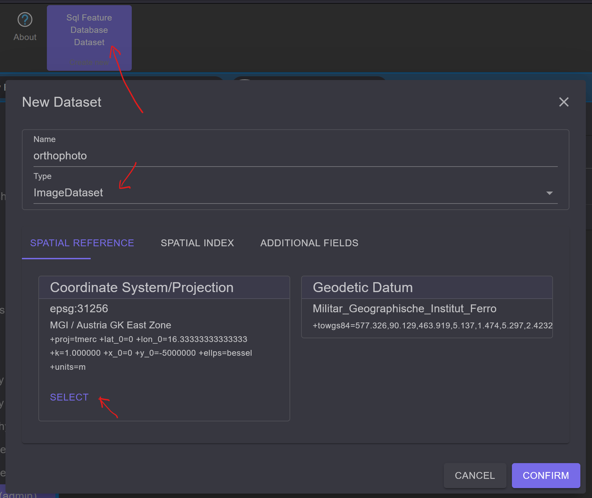
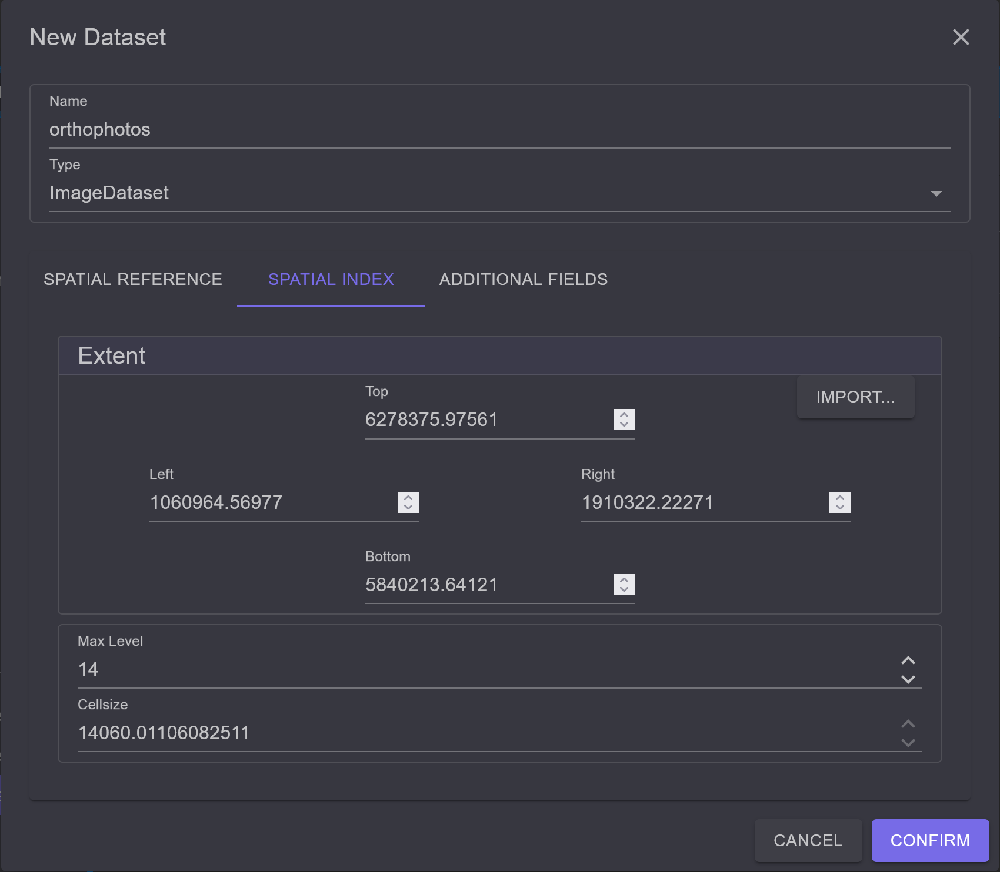
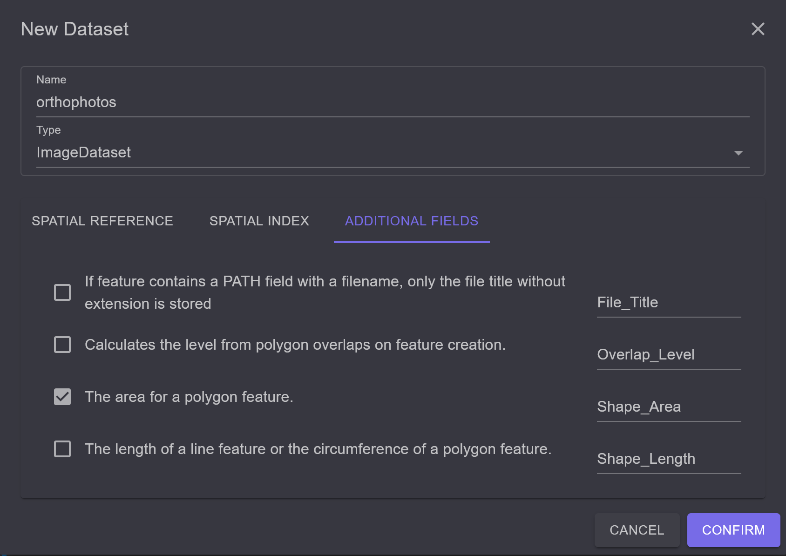
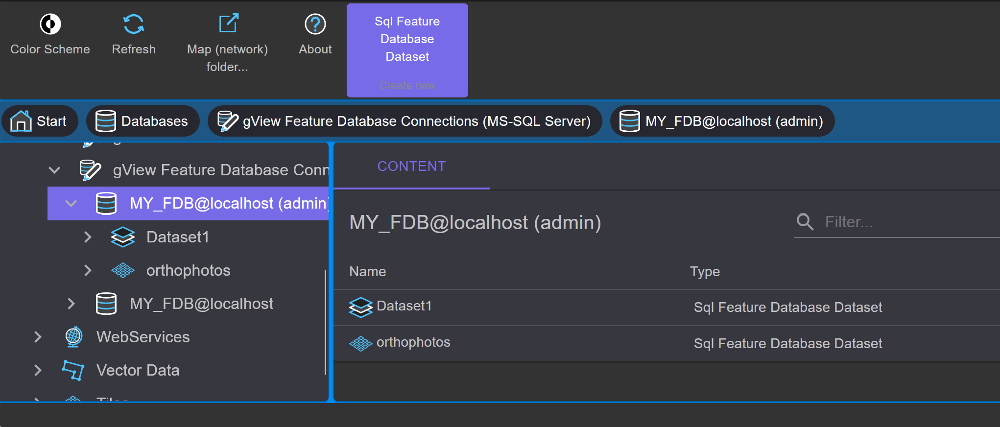
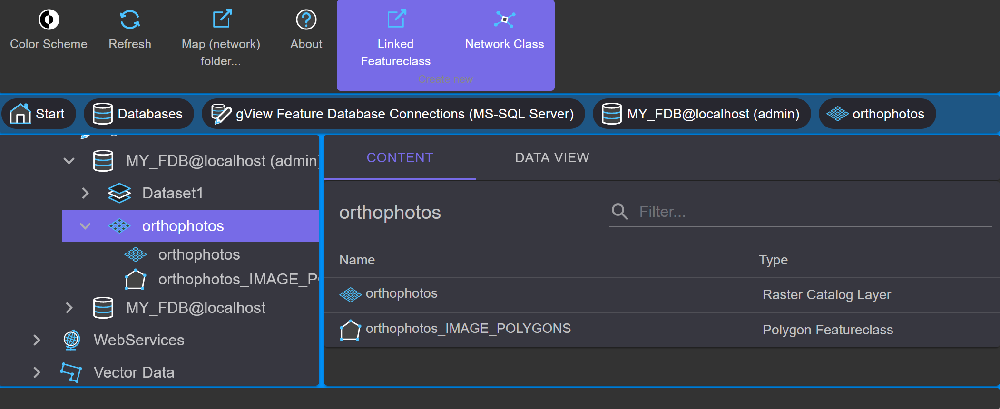
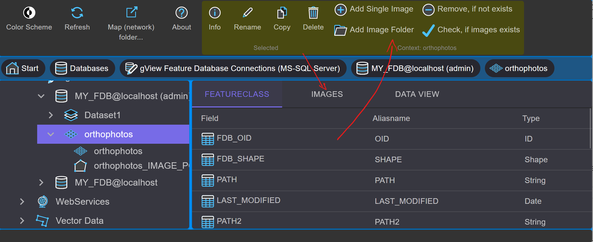
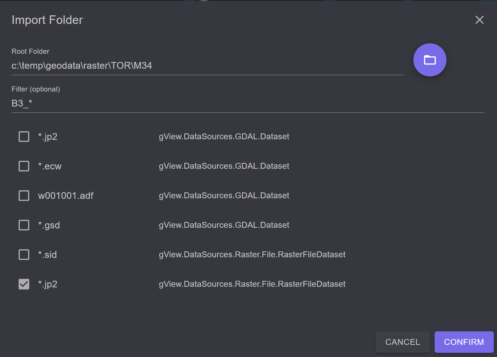
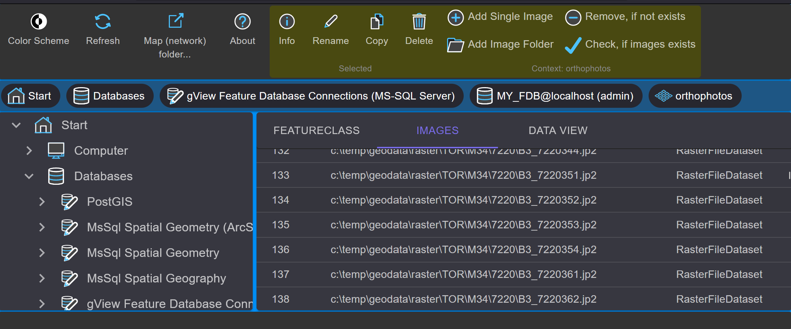
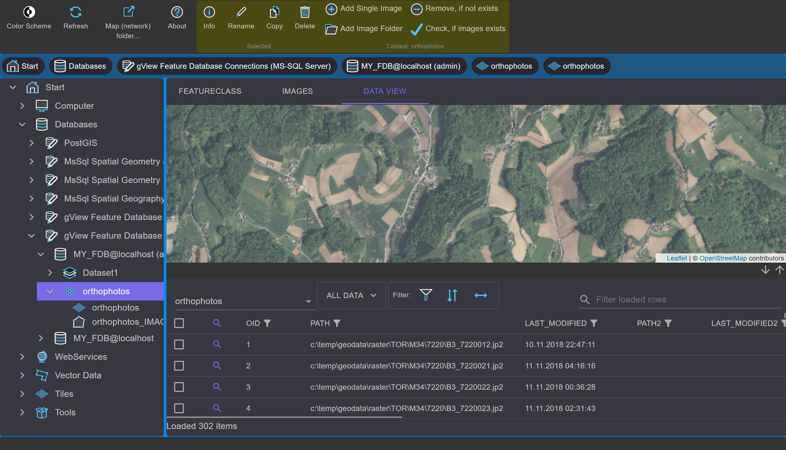

Anlegen eines Raster(katalog) Datasets
======================================

In diesem Abschnitt wird das Anlegen eines Rasterkatalog Datasets in einer *gView Feature
Database* beschrieben. Dabei handelt es sich um *Datasets* mit nur einer *Featureklasse*, wobei
die Geometrie der Features den Ausdehnungen der einzelnen Bilder entspricht. In den
Sachdaten der Featureklasse werden die Verweise auf die Bilddateien gespeichert.

Zum Anlegen geht man wie bei normalen Datasets vor. Durch Klicken auf den ``New/Sql Feature
Database Dataset`` Button im Kontextbereich der Werkzeugleiste erscheint folgender Dialog:

Vergeben Sie für den Namen des Datasets eine sprechende Bezeichnung, z.B. ``orthophotos``.

In der Registerkarte ``Spatial Reference`` vergibt man, wie im letzten Kapitel beschrieben,
das räumliche Bezugssystem, in dem die Daten liegen.

Neu hinzugekommen sind, im Gegensatz zu normalen Datasets, die Registerkarten
``Spatial Index`` und ``Additional Fields``.
In einer *Feature Database* wird für jede *Featureklasse* ein räumlicher Index angelegt. Dieser
ist für einen schnellen Zugriff bei räumlichen Suchabfragen verantwortlich. Beim Kopieren
von Daten wird der räumliche Index automatisch angelegt. Dieser Punkt entfiel also in der
oben beschriebenen Methode des Datenimports. Bei Rasterkatalogen ist jedoch die räumliche
Ausdehnung dieses Index beim Anlegen des Datasets anzugeben. Dabei sollte die
Rechtecksausdehnung so gewählt werden, dass alle georeferenzierten Bilder in den
Ausschnitt passen. Es ist jedoch auch möglich, Bilder einzuspielen, die nicht innerhalb der
Indexausdehnung liegen. Diese Bilder werden jedoch nicht indiziert. Geben Sie also eine
großzügige Ausdehnung an. Um sich die Arbeit zu erleichtern, besteht die Möglichkeit, die
Ausdehnung aus einer bestehenden *Featureklasse* zu importieren (Button ``Import...``).

Die Indizierung der einzelnen Features erfolgt hierarchisch in einer Baumstruktur. Die
*Tiefe* des Indexbaumes stellt man im Bereich ``Max Levels`` ein. Der Wert hier ist so lange
zu erhöhen, bis die Zellengröße ungefähr zwei- bis dreimal so groß ist
wie die geographische Diagonale eines georeferenzierten Bildes. Sind alle Werte eingegeben,
sieht der Dialog beispielsweise wie folgt aus:

Unter ``Additional Fields`` können Felder in die Image-Featureklasse hinzugefügt
werden, die von der Datenbank für jedes Bildpolygon automatisch berechnet werden. Alle
diese Felder sind optional. Wählen Sie zum Beispiel ``Shape Area`` aus, wenn Sie zu jedem
Polygon die Fläche abspeichern wollen:

Bestätigt man den Dialog mit ``OK``, erscheint das ``Script``-Fenster zur Erzeugung des Datasets.
Wird das Script erfolgreich ausgeführt, erscheint das neue Dataset im *Content-Bereich*.
Das Icon unterscheidet sich leicht von einem normalen Dataset-Icon, um erkennbar zu machen, dass es sich um ein Rasterkatalog Dataset handelt:

Ein Doppelklick auf das Icon eröffnet den Inhalt dieses Datasets:

Wie schon oben beschrieben, werden die Bildpolygone in einer *Featureklasse* angelegt. Der
Name der Featureklasse lautet immer gleich wie der Name des Datasets mit angehängtem
``_IMAGE_POLYGONS``. Dieser Name darf **nicht** geändert werden! Das erste Icon mit dem
Namen ``orthophotos`` (immer gleich wie das Dataset) dient zum Einspielen der Bilder. Nach
dem Öffnen durch einen Doppelklick erscheint folgende Ansicht:

In der Registerkarte ``Images`` werden die im Rasterkatalog-Dataset enthaltenen Bilddateipfade 
angezeigt. Die Liste ist nach dem Anlegen natürlich noch leer. Um Daten hinzuzufügen, stehen 
zwei Werkzeuge zur Verfügung:

* **Add single image:** Dabei öffnet sich ein Dialog zum Öffnen von Dateien, in dem auch eine 
  Mehrfachauswahl möglich ist.

* **Add image folder:** Ein Verzeichnis und dessen Unterverzeichnisse nach Bildern durchsuchen.  
  Dabei wählt man in einem Dialog ein Wurzelverzeichnis und einen Filter aus:

Nachdem der Dialog mit ``OK`` bestätigt wird, erscheint wieder ein Script-Fenster, um den Import 
zu starten. Ist der Import erfolgreich durchgelaufen, erscheinen die Bilder als Liste in der 
Registerkarte ``Images``:

In der Registerkarte ``Data View`` können Sie die eingespielten Bilder betrachten:

