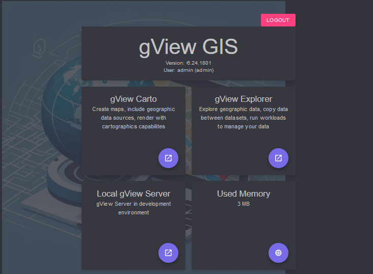

gView WebApps
=============

**gView.WebApps** löst **gView.Desktop** aus den Versionen *gView < 6* ab. Um auch mit den
Werkzeugen von *gView GIS* Plattform unabhängig zu sein, wurden die bestehenden 
Windows Anwendungen in Web Anwendungen überführt. Diese Apps (Carto, DataExplorer) laufen 
jetzt im Browser. Eine Installation auf einem Server ist allerdings nicht notwendig.
Die Applikation **gView.WebApps** kann auch lokal gestartet werden. Die Anwendung läuft dann 
im Browser unter ``localhost`` (siehe Abschnitt Installation). 

In diesem Abschnitt werden die einzelnen Komponenten von *gView.WebApps* kurz vorgestellt. 
Es wird das Verwalten und Umwandeln von Vektordaten und Rasterkatalogen sowie das Erstellen 
von einfachen Karten vorgestellt. Eine Kenntnis über die Grundlagen von Geodaten und 
GI Systemen wird dabei voraus gesetzt.

Startet man die Anwendung (nach Installationsanleitung) gibt es unterschiedliche Kacheln,
die die einzelnen Apps entsprechen:

.. note::

   Wurde bei der Installation Admin/Carto User angelegt, muss man sich zuerst noch 
   anmelden. Je nach Anmeldung stehen mehr oder weniger Kacheln zur Verfügung.

.. note::

   Ein Klick auf eine Kachel öffnet die App. Möchte man eine *App* in einem neuem Fenster 
   öffnen, Kann man auf der *Pfeil-Symbol* innerhalb der Kachel klicken.

.. note::

   Die Kachel ``Used Memory`` steht nur Administratoren zur Verfügung. Hier wird der aktuell
   verbrauchte Speicher angezeigt. Ein Klick auf das *Symbol* zwingt den *Garbage Collector* 
   zum Freigeben von Speicher (nur zu Diagnose)

Obwohl über **gView.WebApps** jetzt alle Apps auch auf einen Server Installiert werden können,
sollte es nicht mit einem klassischen WebGIS verwechselt werden. Die Anwendungen sollte keinem 
großen Anwenderkreis im Internet zur Verfügung stehen, sondern dazu dienen Karten führen den 
**gView.Server**  zu erstellen. **gView.WebApps** ist nicht *stateless*, eine Skalierung wäre 
nur schwer Möglich.

Möchte man GIS Funktionalität einem großen Anwenderkreis anbieten, sollte man eine WebGIS 
Anwendung verwenden,  dass auf **gView.Server** Dienste zugreift. **gView.Server** ist 
*stateless*, kann beliebig skaliert werden und ist auf auf *Performance* getrimmt.   
   
.. toctree::
   :maxdepth: 2
   :caption: Inhaltsverzeichnis:

   carto/index
   dataexplorer/index