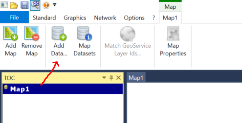
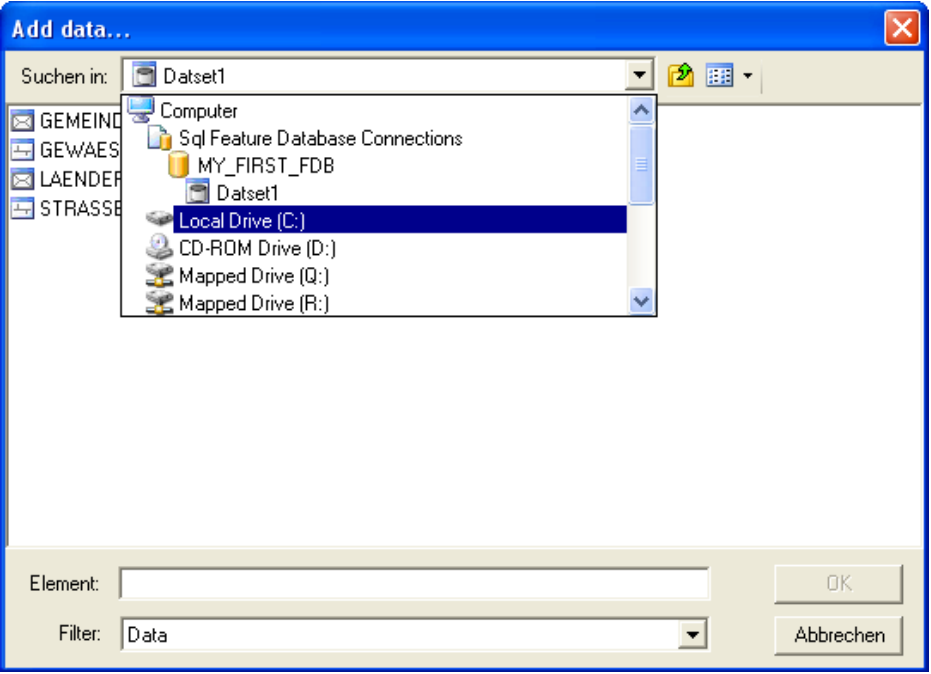
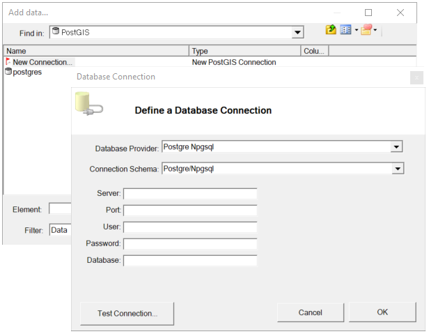
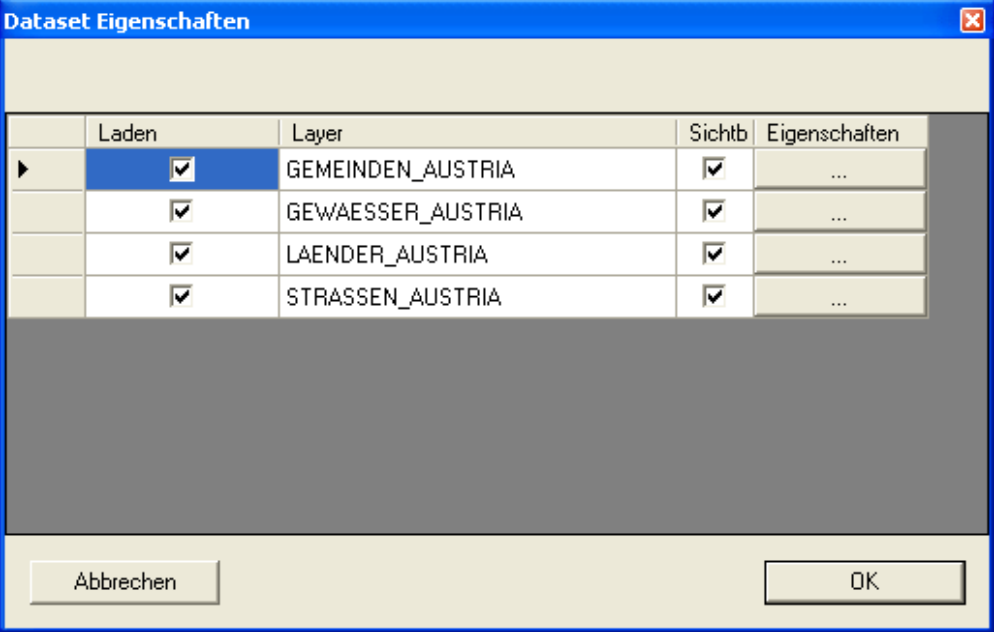
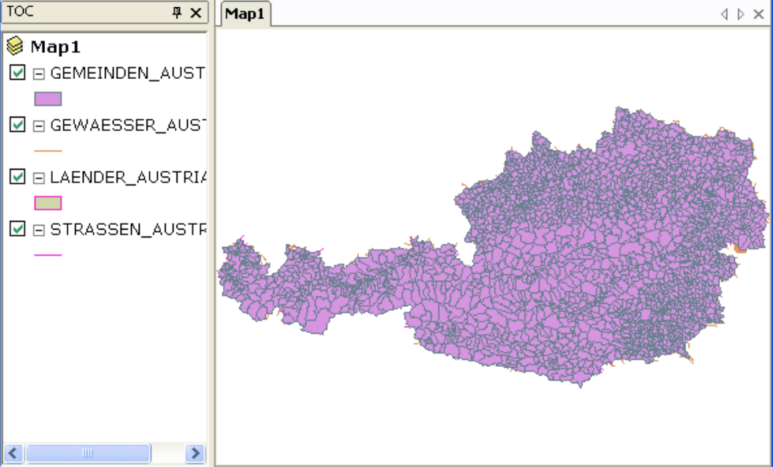

Add data
========

When creating a map, the first step is to add data.
To do this, click on the top node (the map) in the tree view. In the *Ribbon* *Context* commands appear that can be applied to the map:

The dialog is similar in navigation to the *gView Data Explorer*. Instead of the
Tree view of the Data Explorer is here a combo box (Search in). The middle part of the dialog corresponds to the contents area. Here are
however, in contrast to the *Data Explorer*, not all context menus available. For example,
always use *Data Explorer* to delete and rename objects.

In the first application, the connections to data sources may still have to be set. For example, if you want to integrate *PostGIS* data (recommended),
you have to change to the folder ``OGC`` in the dialog. There you will find the sub-item ``PostGIS`` under which all saved versions of *PostGIS Server* are listed.
If no connections exist yet, a new connection can be created via ``New Connection``:

Before the connection is applied, ``Test Connection`` can be used to check whether all settings are correct and a connection can be established.

Once the connection has been created, it can be opened with a double kick.

In the *Content area*, feature classes or a dataset can be selected before confirming the dialog with ``OK``. In the next step, a list of all selected
Feature classes will be displayed displayed:

Here, loading a feature class can undo. In addition you
can specify the primary visibility of the corresponding layer. With the
properties button [...] all properties such as legend, scale limits, filters, etc. can
assign for each layer before loading. However, all these actions are also
possible later. After confirming the dialog, you will receive, for example, the following
view:

