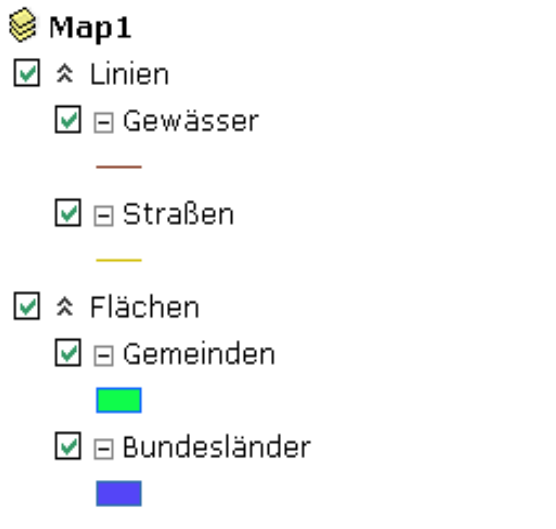

Grouping layers
===============

The layers can also be grouped in the TOC. To do this, click with the right
mouse button on any layer and select ``New Group Layer`` from the context menu. 
To move layers to a group, the layers must be selected. For this purpose, you can use the shift key or control key,
to select multiple layers. The moving is done via the context menu
``Move to group layer``.

To rename a layer or group, an element in the TOC can be double-clicked. 
This will display an input field with which a name can be changed. The new name is confirmed with the Enter key.

The work steps described above result, for example, in the following representation of the TOC:

The check boxes can be used to switch the visibility of the layers. 

.. note::
   If a group layer is set to invisible, all layers contained in it are also invisible, regardless of whether they have been set to visible.
