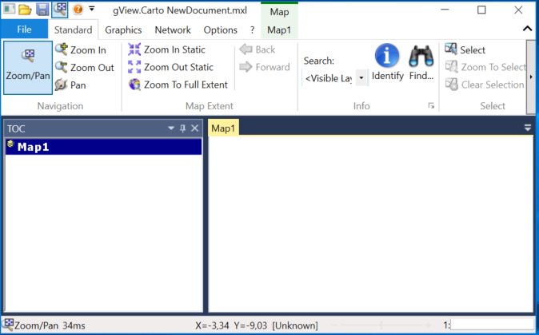

gView Carto
===========

The desktop application gView Carto is used to create and view maps. These
maps can be published to the *gView MapServer* and are then available in various interface formats.
The point in this section is to describe the process of creating maps. On the single tools
is only received briefly or not at all. However, after reading this chapter you should
be able to add data to a map and the create legends for each layer.

After starting the program with ``gView Carto.bat``, the applications show an empty
Map image:

.. toctree::
    :maxdepth: 2
    :caption: Table of contents:
 
    adddata
    layerorder
    grouplayers
    symbology
    labeling
    scales
    layerprops
    managemaps
