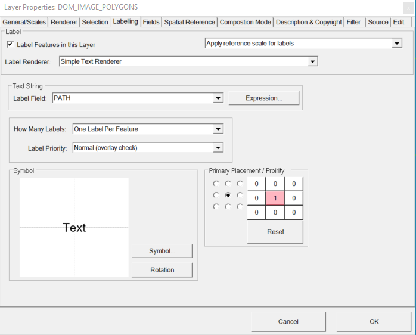
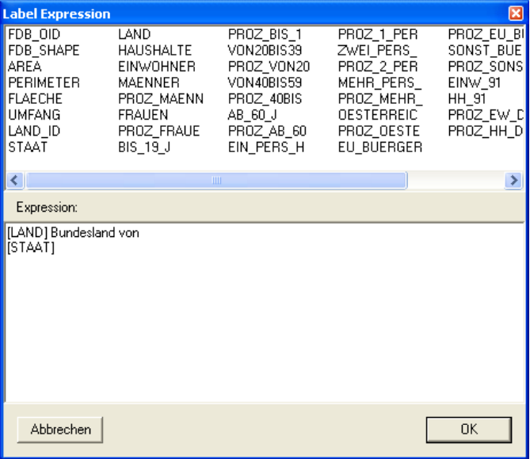
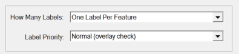
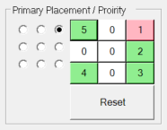

Labeling
========

Furthermore, it would be desirable to label the federal states from this example. This can also be done via the
the ``Properties`` dialog of the layer. The responsible tab is called ``Labeling``:

Here, the ``Label Layer`` check box controls whether a layer is labeled. Instead of a simple labeling by field-value that can also be set in this dialog,
a so-called ``expression`` can also be specified via the button of the same name. An *Expresson* can consist of several fields and fixed text:

The fields within an expression must be specified in square brackets. 
Double-clicking on a field name at the top of the dialog inserts the field at the current cursor position in the expression field.

.. note::
   Line breaks are also included in the expression.

Further setting options are offered for the labeling frequency:

* One Label Per Name: A name appears only once in the map per feature class.
* One Label Per Feature: An object is labeled only once, even if it consists of several parts.
* One Label Per Part: Every part of an object is labeled. For the federal states of Austria, e.B. Tyrol with East Tyrol represents a multi-part feature.

The label is usually arranged in such a way that there is no overlapping of the texts
gives. However, the objects of a layer should always be labeled, regardless of whether it is too
overlaps, set the priority to ``Always (no overlay check)``.

If texts cannot be displayed due to overlaps, the positioning of the label relative to the geo object can be used to further alternative 
Positions can be specified. The preferred position is indicated by the nine option buttons (black dots). In addition, by clicking on 
the buttons alternative positions are selected:

The number in the button indicates the sequence of ranges used to try to insert the text into the map without overlapping 
with existing texts. With the ''Reset'' button all alternative label positions are undone.
