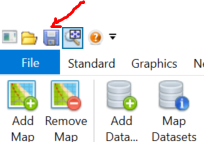

Store and manage map documents
==============================

Finally, of course, the card should still be saved. To do this, use the
corresponding tool or the menu item ``Save as``. Map documents become
always saved with the file extension mxl (Map XML). This is a
XML file in which all settings are stored.

When saving maps in the *gView Carto*, there are two possible:

Save 
----

.Save the current map. If the map already exists, it will be overwritten without confirmation.

Sava As
-------

This will save a map with a new name or location. 

.. image:: img/save2.png

If you save a map with ``Save As``, the following dialog is displayed before saving:

.. image:: img/save3.png

Typically, the connection properties to databases in the MXL file are encrypted. If you want to change these properties in a text editor, you can use the *checkbox* to determine
that the connection properties are stored in plain text.

.. note::
    For security reasons, the connection properties should always be encrypted. However, even this encryption is not 100% secure. *gView GIS* is an open source software and
    anyone can appropriate and bypass the mechanism of this encryption. MXL files with confidential connection properties should therefore always be treated with care and not passed on.

A saved map in ``mxl`` format can be seamlessly published to the *gView Map Server*.