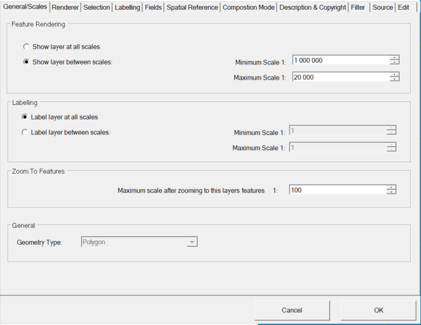

Scale limits
============

Very often it is necessary to create layers or labels only within certain
Display scale limits. This can also be set via the layer properties.
The corresponding tab is ``General/Scales``:

Here a layer is only displayed between 1:20,000 and 1:1,000,000

.. note::
   The scale limits can also be selected for the labeling, whereby the display scale area is always checked first. 
   This means that if a layer is not represented due to the scale limits, it will not be labeled.

