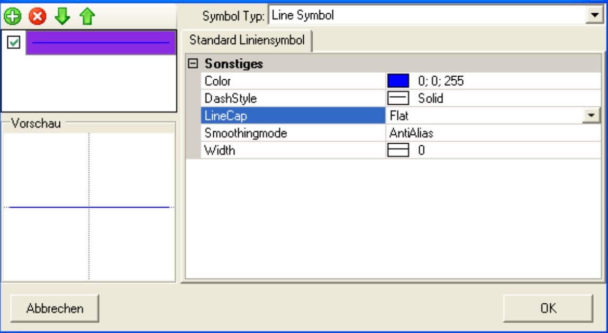
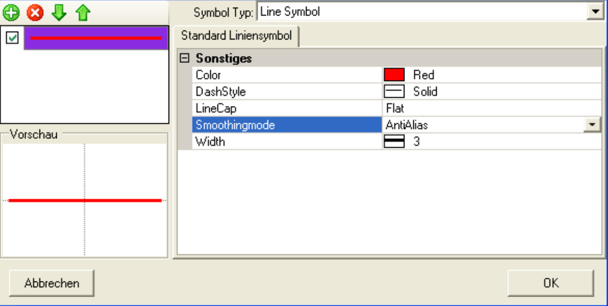
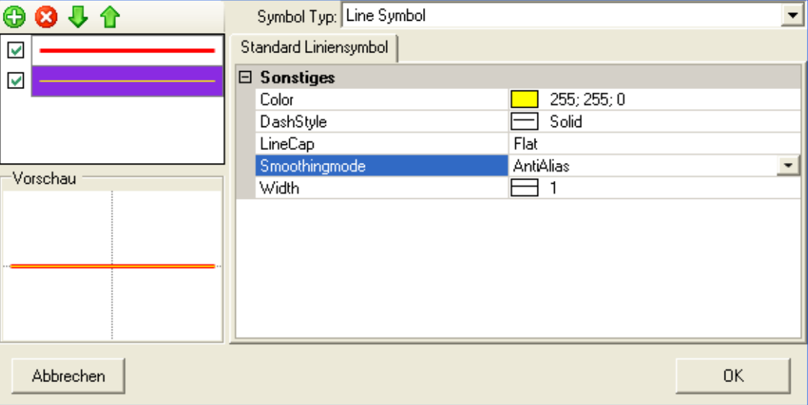
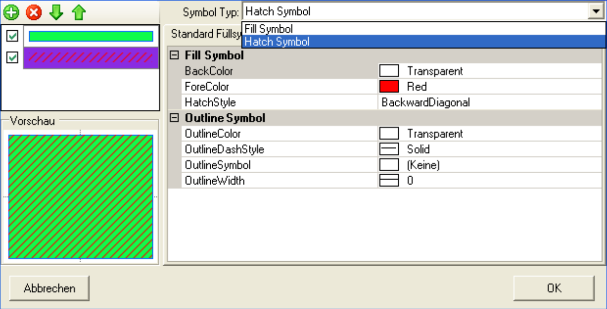
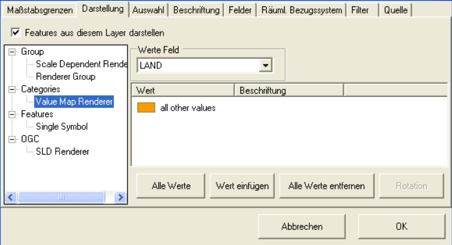
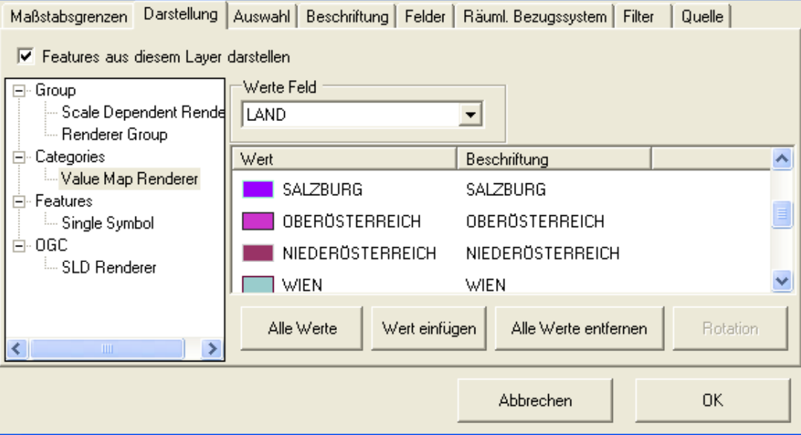

Symbology
=========

This chapter describes how to customize the appearance of a layers. In this example, waters should be blue and the
streets appear in yellow and red. The easiest way to change a the symbology is a
Double-click on the corresponding legend icon in the TOC. For the water line, for example, is the following dialog appears:

The *Symbol Composer* is similar for all symbols. On the right, the attributes
such as color, line weight, and so on for a symbol. on the left are the
symbol levels and the preview are displayed. It should be noted that for most
attributes a selection dialog exists. This opens with the triangle symbol, which
appears when you click in an attribute input line. In the case of color properties,
for example, shows a dialog as follows:

.. image:: img/symbology2.png 

``More Colors``and ``Transparency`` open new dialogs:

.. image:: img/symbology3.png 

An exact description is not discussed here, as the operation has been designed to be as intuitive as possible. if
the symbol preview fits to your ideas the dialog can confirmed with the ''OK'' button.

In this example, the symbolism of the streets should consist of several symbolic levels. For this purpose, the first layer is realized as a red line with the line thickness ``3``:

By clicking on the plus symbol (new layer) a new level with the default symbol will created. The properties can be changed for the symbol level,
which is selected in the symbol levels list:

The symbol level list also provides tools for deleting a symbol layer or for
change drawing order. The check box can be used to show a leel.
The following example shows how to use the *Symbol Composer* for a layer with polygon geometry type:

Different symbol types can be mixed as here:
* Fill Symbol: a simple fill symbol with a colored border
* Hatch Symbol: a simple hatching symbol
  
Changes to the symbol type always affect the currently selected symbol level.

For the municipal areas from the example, a transparent fill color (``no
Color``) and a black border selected:

.. image:: img/symbology7.png

For the federal state topic, in the next step, not only the
symbolism, but also the type of representation (renderering) can be changed. To do this, choose ``Properties``
via the context menu of the layer . In the dialog opened in this way
switch to the tab ``Rendering``:

Displays all available renderers for polygon features. The simplest is
the already well-known ``Single Symbol`` renderer, with which all previously treated feature layers
were presented. As the name suggests, it can be used to create exactly one symbol for each feature in the layer.

For the federal states, however, there is, for example, a different symbol, per federal state
desired. To realize this, the ``Value Map Renderer`` is used (see
Screenshot above). In the ``Values Field`` drop-down list, set the field after which
should be colored. Then click on the button ``All values``. In the database
all possible values are now searched and a random symbolism is assigned:

To change a symbol, double-click on the legend to open the *Symbol Composer*.

The legend entries can also be done by double-clicking on the corresponding text in the TOC:

.. image:: img/symbology10.png 

