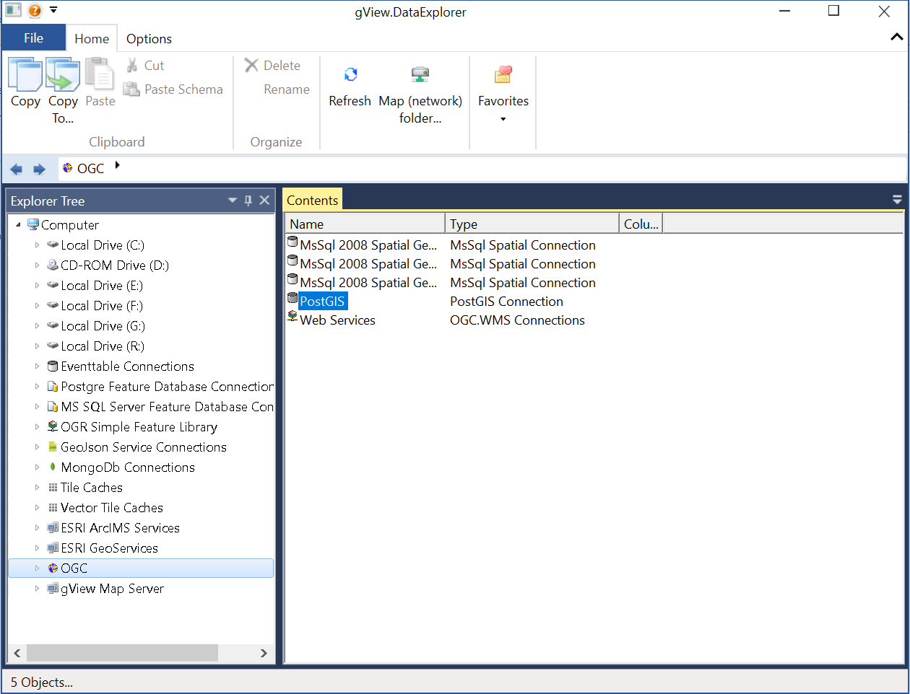

Data(base) connections
======================

With *gView.DataExplorer*, connections to GeoData can be managed sources and the data can be easily managed
and visualized.

File-based data sources can be easily displayed by navigating to the directory in the file system.

In the case of databases, the connected must first be created. Here it will be shown by way of example how the connection to 
of a PostsGIS database.

.. note::
   Connections created in *gView.DataExplorer* are also available in *gView.Carto* when inserting data.

PostGIS databases are integrated via the node ``OGC``:

Under ''PostGIS'' all existing connections are listed. With ''New Connection'' a new connection can be created:

.. image:: img/connections2.png 

After entering the connection parameters, you can check with ``Test Connection`` before creating,
whether a connection is possible. After confirming the dialog with ``OK``, the connection is created and appears in the 
list. Double-clicking opens the connection and lists the layers in the database.

If you click on a connection with the **right mouse button**, the context menu appears. This allows a connection to be renamed or deleted. 
With the menu item ``Connection Properties...`` the connection parameters can be changed.

.. note::
   If data is integrated via a database connection with *gView Carto*, all connection parameters are stored in the 
   MXL file. Changing the connection parameters in the *gView DataExplorer* does not affect 
   existing, already created *gView Carto* maps.

