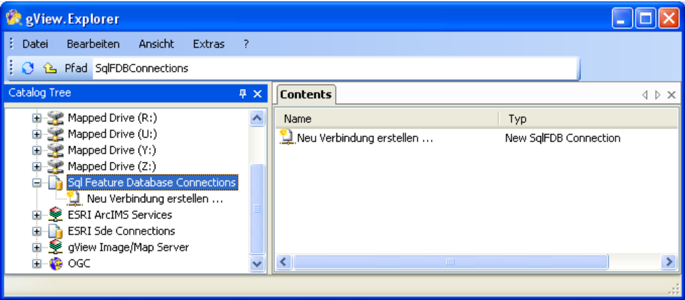
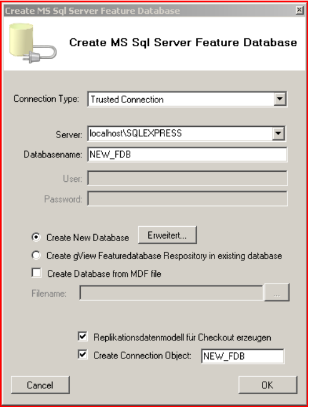
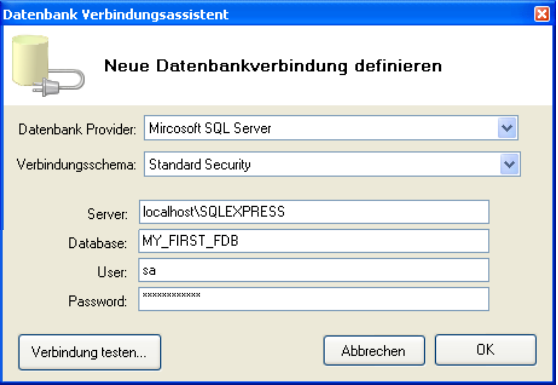
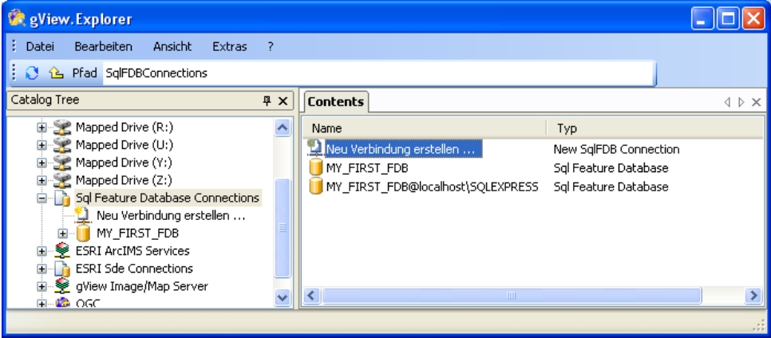
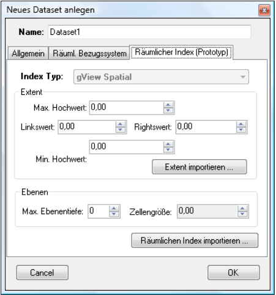
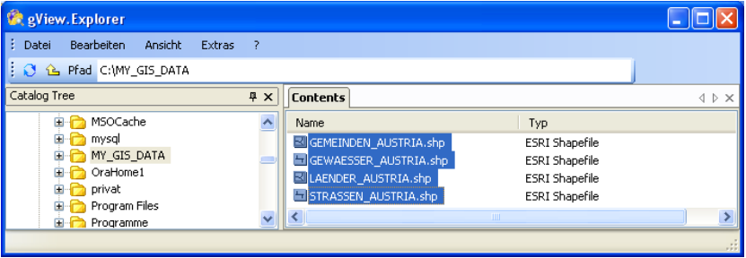
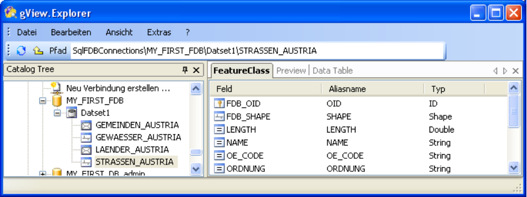
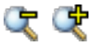
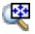

Creating an MS SQL Feature Database
===================================

This database is a proprietary format and can only be used with gView GIS. 
The advantage, however, is the high performance with large amounts of data.
In addition, with this format, image catalogs can be created an managed in a comfortable graphical
interface. Prerequisite for creating a database is
an MS SQLServer 2008 or higher. Will the free Express version of MS SQL, 
the corresponding restrictions of the server apply (max. 4GB per
Database, ...). However, this does not limit the Feature Database functionality.

.. note::
    The guide shown here refers to a *gView Feature Database* in SQLServer. 
    The creation of *gView Feature Database* in Postgres is analogous.
    To create a *gView Feature Database* based on SQLite, you must navigate to the file system where the database should be created. 
    In the *Context menu*  the item ``Create New: SQlite Feature Database`` can then be selected there.
 

To create a new Feature Database, select the node ``Sql Feature Database Connections`` in the tree view:

Now right-click in the *Contents area*. In the Context menu select ``New/Sql Feature Database``:

Set the connection to the SQL Server instance here. The connection type
specify whether to use Windows authentication or user name and
Password. The database name completes the properties of the new
database.

To be able to administer the database later via the *gView Data Explorer*, select
the option ``Create connection icon`` and enter a name for the icon
at.

After confirmation with ''OK'', the database with all necessary tables is created. if
the creation is successful, the Data Explorer displays the new database icon in the *Contents area*:

The icons in the *Contents area* are always opened with a double click. You can
also create a connection icon to an existing feature database. Double-click
simply use the icon ``Create new connection...``

For example, you can create an icon on our sample database with administrator rights:

Via the context menu (right mouse button) of an icon, it can be renamed:

In the next step, we want to create a dataset for our geodata. Datasets are
Collections of feature classes that have the same properties. For example,
all classes belonging to the cadastre in a dataset named CADASTRE.

.. note::
    All feature classes of a dataset use the same spatial reference system! So if your data is in different reference systems, you have to 
    split feature classes across multiple datasets. The **feature class name** must be unique in a **database**.
    
To create a new dataset, double-click the database icon
(MY_FIRST_FDB) in the *Contents area*. Since no datasets exist yet, only
an empty area is shown. Now right-click in the empty *Contents area*
and select ``New/Sql Feature Database Dataset``:
    

Change the name to ``Dataset1``. Leave the Feature Dataset setting as it is.
This means that in this dataset, vector data for all geometry types (point, line,
Area) can be stored. The type Image Dataset is used for creating
Image catalogs and will be discussed later.

The second tab of the dialog determines the spatial reference system for the
dataset. As already mentioned above, the reference system can only be determined at this level.
All Feature classes in a dataset inherit this property.

A spatial reference system always consists of two parts (coordinate systems and
geodetic datum), whereby the second part is theoretically omitted
can. However, no date transformation is then applied during the projection. With the
Select button, you can choose from predefined systems:

To narrow down the list, enter a search term (e.B. Austria, EPSG code) below and
click Search. Select your desired system and then confirm the
Dialog with OK. The procedure for the geodetic date is the same. For some
Projections, the date is already included. After successful selection, the dialog will see
for example, as follows:

With ``Edit`` you can change individual parameters of the projection. With ``Export``
and ``Import`` it is possible to save or load a spatial reference system.
Importing from existing datasets is also possible.

The third tab ,``Spatial Index`` can be used to create a prototype for the Spatial Index. 
If a new feature class is always created, this is
prototype proposed. Because later a separate index is created for each feature class, the specification of this prototype is optional.

The only property in this dialog that is included for the entire dataset and the ones it contains
Feature classes, is ``Index Type``. Creating and managing spatial indices
is discussed in the next section (The Spatial Index of the Feature Database).

After confirming the dialog, the new *Dataset* is created:

A name change can be made via the context menu of the dataset icon. It is also possible to change the parameters for the spatial reference system.

.. note::
    With a change of the spatial reference system, the
    Dataset feature classes are not projected. That is, the coordinates of the features
    remain the same. Only the projection parameters inherited from the dataset change.

In the next step we want to copy data from an ESRI shapefile into the Sql Feature Database. 
To do this, use the gView Data Explorer to navigate to the directory where
the shape data locatate.

Basically, copying data with the gView Data Explorer works - the same
as in Windows Explorer - by copying and pasting (copy/paste). To do this, choose
the desired files. With the Shift or Control key, you can
mark several files in the usual way. Now right-click and
select Copy. Navigate back to the dataset you created earlier. 
The *Contents area* of the dataset is still empty. After clicking on Insert from the context menu
the following dialog appears:

The list in the left part of the dialog lists the source feature classes. right
are the name of the target feature class and the fields. With the check boxes
you can determine which feature classes and fields should be migrated.
After clicking OK, the copying process begins. The source data is first
and creates a spatial index in the database. After that, the single
featureclasses will copied. After successful migration, the corresponding icons appear in the
*Contents area* of the dataset. By the symbols you can see which
Geometry type a feature classes has.

Now double-click on one of the newly created feature class icons. 
In the *Contents view* the fields with the corresponding field types appear:

In addition to ''FeatureClass'', other tabs appear: ''Preview'' and ''Data Table''. 
Both are used to display the content of the feature classes. ''Preview'' represents the
Geography of the data, ''Data Table'' displays the corresponding factual data:

In the geographic preview, some navigation tools are available, which are available in
identical form are also available in the visualization tool *gView Carto*. Here follows only
a short introduction to navigation:

The magnifying glass icons cause a "zoom into the map" or "zoom out from the map".
Either click into the map or press down the left mouse button or raise a window.

With the hand symbol, the map can be panned while holding down the left mouse button. The
map scale is retained.

The magnifying glass/move icon combines all three tools described above. the Left
Mouse button behaves like the Move tool on this tool. With pressed
with the right mouse button you can zoom in or out the map. Move the mouse up (from
away) cause you to zoom out of the map. Zoom in the opposite direction
Put them back into the map.

In addition to importing data into a Sql Feature Database, this data can also be returned
can be exported. To do this, enter the reverse as described above. Select and copy feature classes. 
Then navigate to the destination folder and there select
paste. If you copy data back to the file system, the copy dialog still needs the
Output format (output format):

In addition to ESRI Shape File, the OGC GML format is also possible. Both formats are
readable by most GI systems and are therefore very suitable for exchanging data
between different systems.

