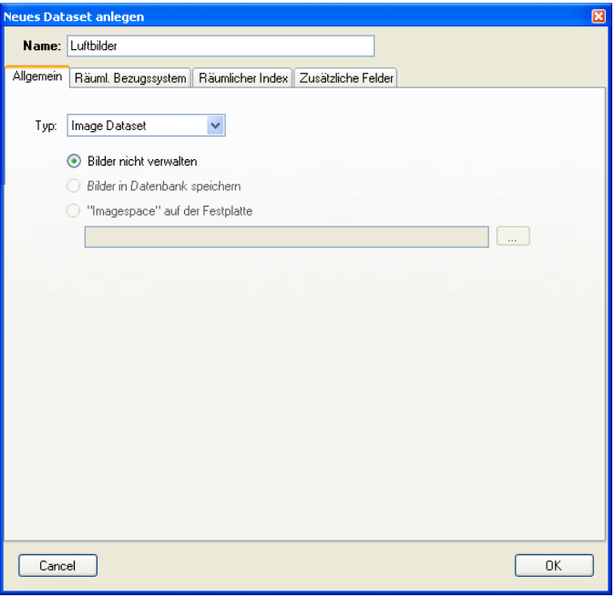
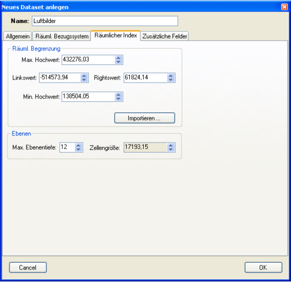
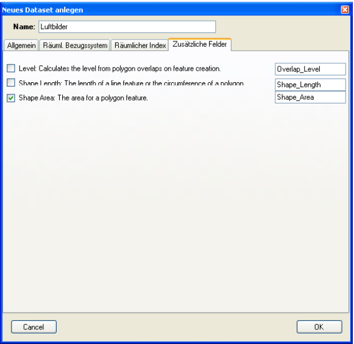
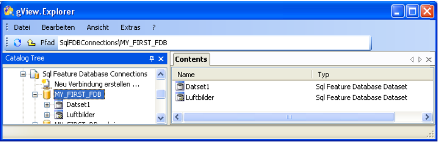
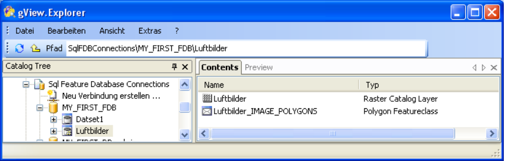
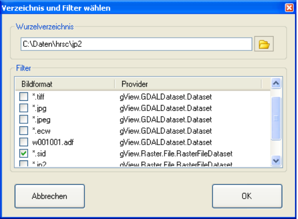
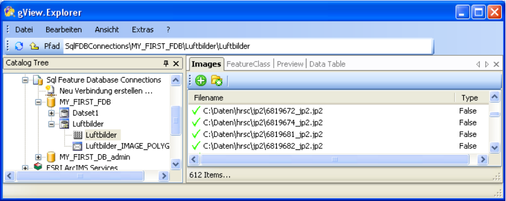
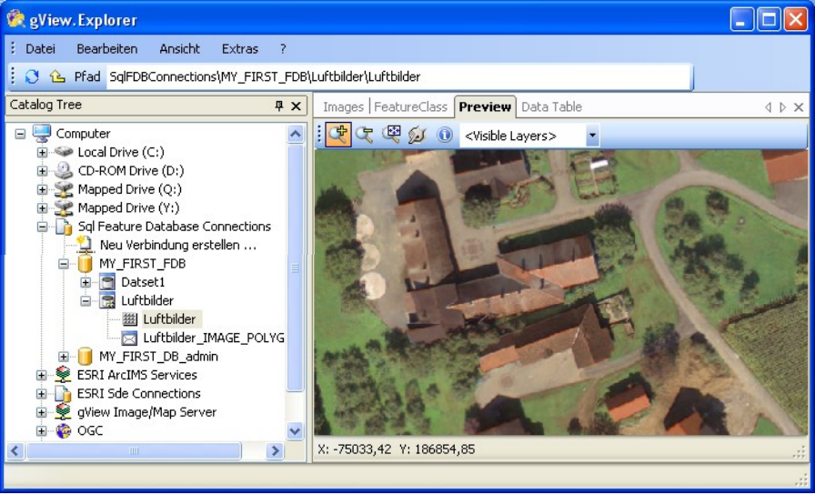

Creating a Raster(Catalog) Dataset
==================================

In this section, creating a raster catalog dataset in a gView feature
Database. These are datasets with only one feature class, where
the geometry of the features corresponds to the extents of each image. In the
property data of the feature class the references to the image files is stored.

To create data, proceed in the same way as with normal datasets. Right-click
Mouse button in the Contents area of a Sql Feature Database and select ''New/Sql Feature
Database Dataset''. In the dialog that appears, set the type Image Dataset:

Assign a telling name for the name of the dataset, e.B.e. "Aerial Photographs".
Currently, only the first option "Do not manage images" is possible. Not managing means
that the images remain in the file system. In the dataset, apart from the
Extent and location of the images no image information in the database
is stored.

In the "Spatial Reference System" tab, you assign the projection properties
for your data. The procedure has already been described above.

In contrast to the normal datasets, the tabs have been added to eu
Spatial Index and Additional Fields.

In a feature database, a spatial index is created for each feature class. these
is responsible for quick access to spatial search queries. When copying
of data, the spatial index is created automatically. This point was therefore omitted in the
method of data import described above. However, for raster catalogs, the spatial extent shoud be defined here. 
In doing so, the rectangular extent is specified so that all georeferenced images in the
fits. However, it is also possible to import images that are not within the
index extent. However, these images are not indexed. 

So give a generous extension. In order to make your work easier, there is the possibility of
Import extension from an existing feature class (button "Import...").
The indexing of the individual features takes place hierarchically in a tree structure.
You set the index tree to "Depth" in the Layers pane. To do this, increase the value
Maximum layer depth until the cell size is approximately two to three times greater
such as the geographical diagonal of a georeferenced image. Enter all values
for example, the dialog looks like this:  

Under ''Additional Fields'' you can then add fields to the Image feature class
, which are automatically calculated by the database for each image polygon. all
these fields are optional. For example, select ''Shape Area'' if you want to save the area of each image:

Finally, confirm the dialog with OK. The gView Data Explorer now creates the
Raster Catalog Dataset. The icon is slightly different from a normal dataset
Icon to make it clear that this is raster catalog dataset:

Double-clicking on the icon opens the contents of this dataset:

As described above, the image polygons are created in a feature class. the
Feature class name is always the same as the name of the dataset with attached
"_IMAGE_POLYGONS". This name may not be changed! The first icon with the
Name "Aerial images" (always the same as the dataset) is used to import the images. after
the opening by double-clicking the following view appears:

.. image:: img/raster6.png 

In the Images tab, the image files contained in the Raster Catalog Dataset are
Paths are displayed. Of course, the list is still empty after creation. To add data
two tools are available:

* Select image files. This opens a dialog to open
  Files in which a multiple selection is also possible.

* Search a directory and its subdirectories for images. thereby
  select a root directory and a filter in a dialog:

After you have selected images using one of the two methods, they are displayed in the raster catalog dataset:

You can now add more images or individual images if you wish
delete from the dataset. To do this, select the images in the list and choose via
the context menu (right mouse button) the corresponding menu item.

In the tab ''Preview'' you can view the imported images, where
You can navigate the map using the tools described above.

