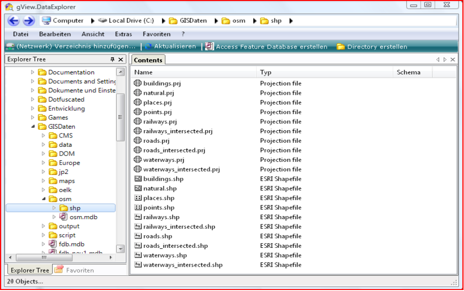
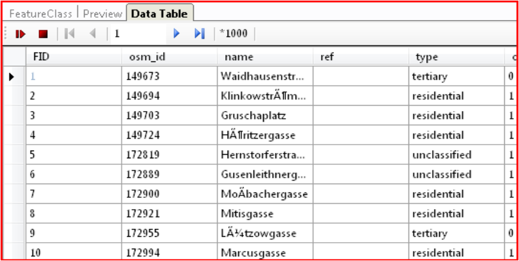
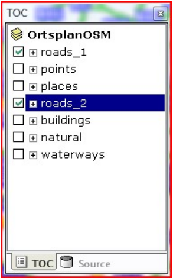
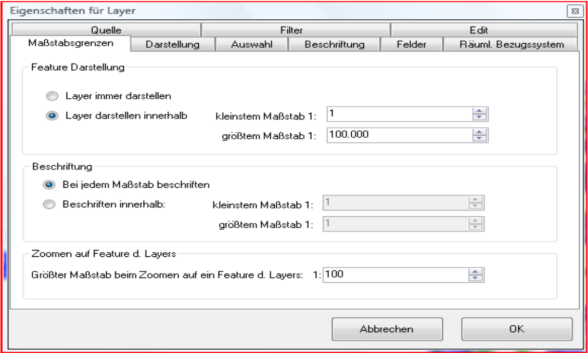
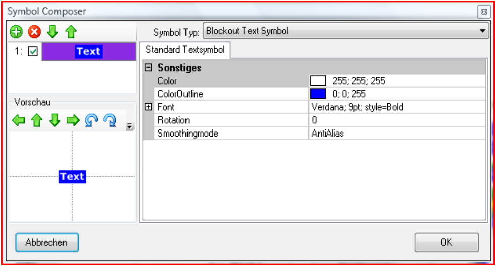
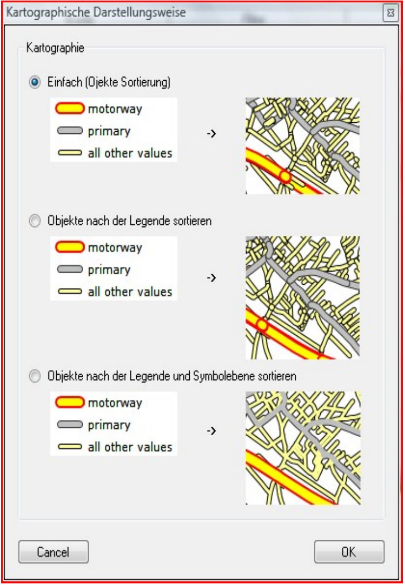
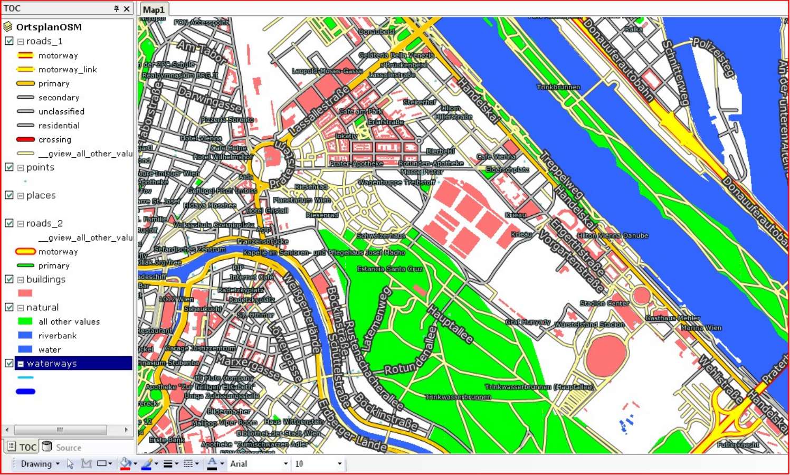
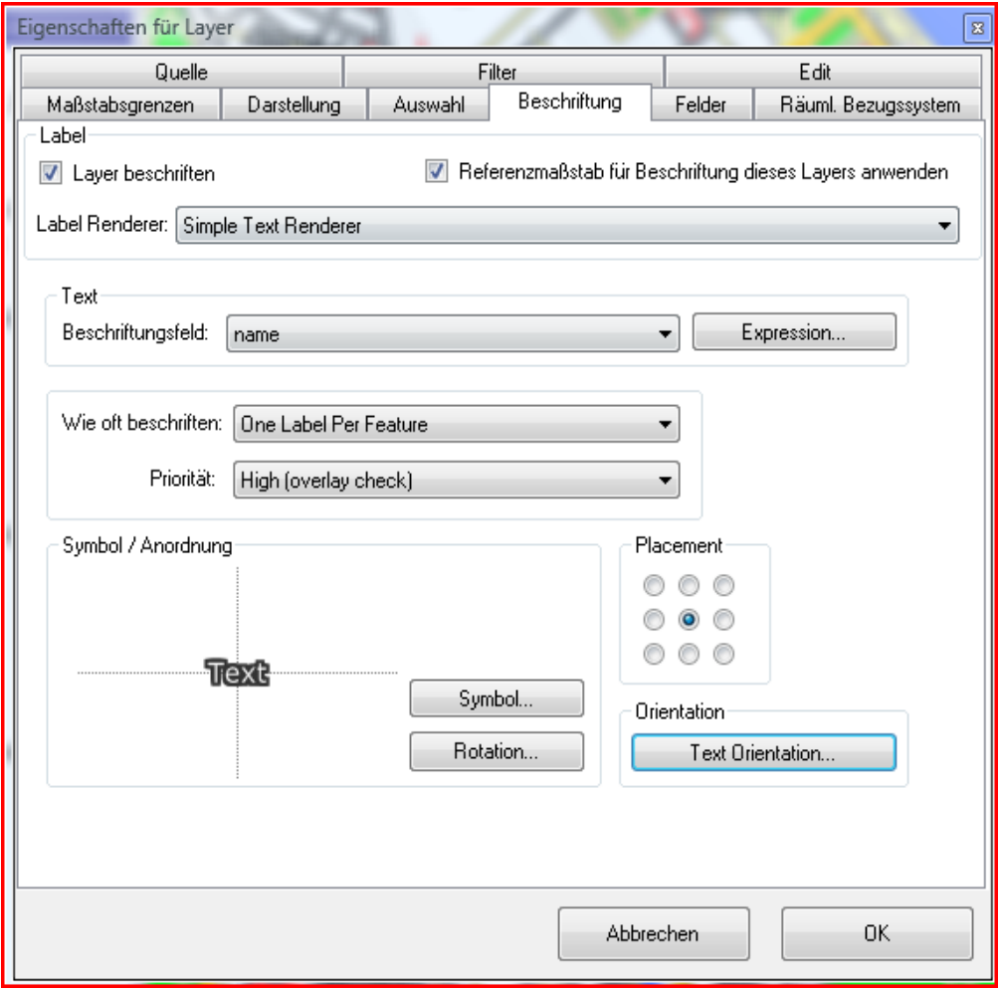
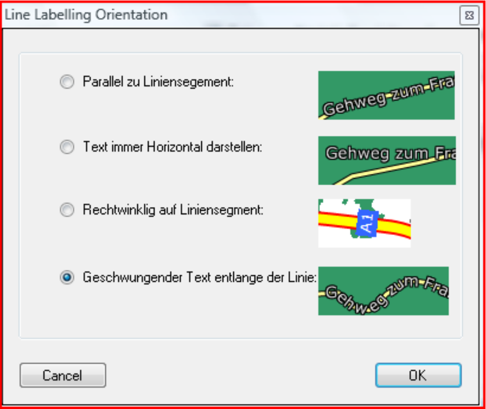

Create a site map
=================

Here it is explained briefly and concisely how to create a site map with gView GIS. this 
In particular, the report is intended to show the cartographic possibilities of gView GIS.

.. note::
   This description was created for gView 3.0. The screenshots have not been changed and differ partially from the current version.
   The basic procedure has not changed to the current version.

General
-------

In this document, the creation of a site map is used to describe the cartographic 
possibilities of gView GIS shown. Data from Open Street Map is used, which 
were downloaded as shape files from the Internet and for better performance of the site map in 
a PostGIS database has been loaded.

Data
----

As data, the Open Street Map Data was downlaoded as a shapefile for the area of Austria. 
After downloading, the files appear in the gView Explorer in the following  form:

However, when displaying the data table of the topics (e.B. roads.shp), it turns out that umlauts
are not displayed correctly encoded:

This is because gView GIS expects UTF7 encoding for shapefiles by default.
However, the OSM data is UTF8 encoded. Now to show gView GIS this encoding
in the directory where the shape files are located, you have to create a text file with the name
``dbf_default_encoding.txt``. In the first and only line in this file, the
entry ``utf-8``:

.. image:: img/data3.png

After that, the umlauts and special characters should be displayed correctly.

.. note::
   Shapefiles can be integrated into *gView* in different ways. Here the data is imported directly via your *gView Data Explorer* in the 
   Filesystem. In this case, the *gView Shape interface* reads the data. Alternatively, however, data can
   can also be integrated via OGR (GDAL) interface (shapefiles, GeoPackage, ...). Should, as here umlaut problems occur, 
   this can be solved by a change in the read interface.

.. note::
   The site map created here is converted into a tile cache in a further step. Via the *gView Server* only the 
   pre-processed tiles will be published. If you want to publish the maps that are rendered *live* by the *gView Server*, it recommends
   to keep the data in a (multiuser) database (PostGres/PostGIS, SQL Server)! 

Create a map project
---------------------

After starting gView Carto, the data can be added with the ``Add Data`` button. To do this, click on the map symbol in the TOC. In the ribbon, the relevant for the map appear
tools. Alternatively, you can also right-click on the map in the TOC and select the corresponding item from the context menu.
After insertion, the layer ``roads`` can be cloned via the context menu:

The double-inserted layer can be used to visiualize the streets in different map scales.
Let's start first with the overview presentation of the
streets (roads_2). From the context menu of the layer, the properties dialog can be opened:

First, the scale limits must be specified for this layer. The layer is intended for our
map can be viewed until 1:100,000 (streets overview).
A *Value Map Renderer* should be used for the display, with the values ``motorway``
and ``primary``. How these two categories are colored is shown in the following
listed representations:

.. image:: img/map3.png

Symbol for ``motorway``:

.. image:: img/map4.png

Symbol for ``primary``:

.. image:: img/map5.png

In order to obtain the desired representation, thicker red or black lines are used under
thinner yellow or green lines drawn. The ends of the lines are rounded. In addition,
is specified as the smoothing method *Antialias*. In the case of the ``motorways``, two more
*dummy* layers inserted; the actual symbolism only begins at levels 3 and 4. The reason
will be explained below.

Label should be labeled after the field ``ref`` where a block symbol is used:

.. image:: img/map6.png

After confirming the dialog with ``OK``, the representation of the layer in the
map should be like this:

.. image:: img/map8.png

Here you can see that when the layer is rendered, each object is drawn for itself.
The order of the objects corresponds to the order from the database. if two
streets are next to each other result unsightly effects appear. 
In addition, depending on the order,
*secondary roads* are displayed over highways. To improve this
the *properties dialog* must be opened. Again clicked on ``Display`` in the *Value Map Renderer*
and then click the button ``Cartography``:

To view, let's select only the second option (Sort objects by legend). at this
the objects are sorted according to the Value Map Renderer categories. So here are at the top
place the *highways* drawn:

.. image:: img/map10.png

However, the effect on the feature ends is still not fixed. To this end,
``Cartography`` selected the third option (sort objects by legend and symbol layer). 
For all features, the 1st symbol level and so on is drawn:

.. image:: img/map11.png

Now the legend can also be adjusted for all other layers. In the case of roads,
again on the cartographic interpretation of the legend link this:

The layer ``roads_1`` is only displayed below 1:100,000 and also shows other
Categories (motorway, motorway_link, ...). In addition, for this layer, the street names are
labeled:

In addition to the symbolism, the ``text orientation`` is also interesting here. One click on the button
opens the following dialog:

Here you can specify that the text is drawn along the street.
