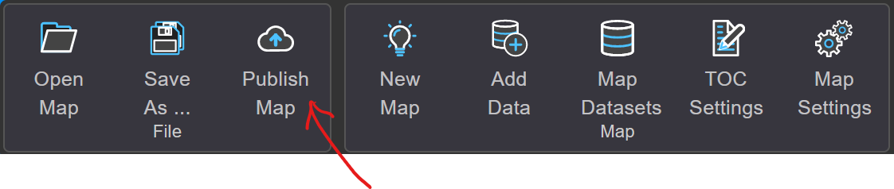
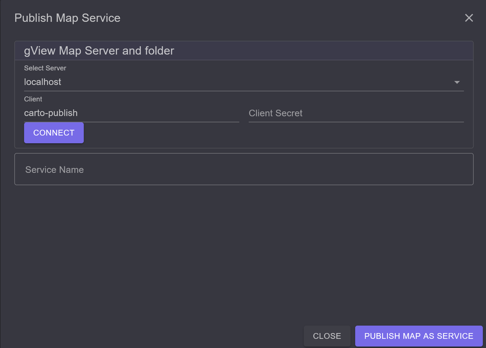

.. _publish-map-service-example:

Publishing Maps as *gView Server Service*
=========================================

Map projects created with *gView Carto* can be published on the *gView MapServer*.
This allows these maps to be integrated into various GIS applications 
(Desktop, WebGIS, Leaflet, ...).

The map services are provided through the *gView MapServer* via different interfaces, for example:

* **OGC WMS**: A widely used interface that can be integrated into all common GIS software packages.
  It allows for the generation of map images and legends, and simple feature queries can be performed 
  (*Point Identify*).

* **OGC WMTS**: Provision of pre-processed tile tiles.

* **GeoServices REST**: An interface defined by ESRI based on REST/Json.
  This allows for the retrieval of map and legend images and supports more complex queries (point, rectangle,
  arbitrary geometry) and searches by attributes.
  In addition to map services (*MapServer*), *feature* services (*FeatureServer*) are also offered, 
  allowing geo-objects to not only be retrieved/queried but also edited and created (*Editing*).

There are three ways to publish map services:

* **Command Line:** The command line approach is described in the section (:ref:`gview_cmd_mxlutil`).

* **MapServer WebUI:** Through the web interface of the **gView.Server**.

* **Carto:** Through the **gView.Carto** app.

Publishing via the MapServer WebUI
----------------------------------

The procedure described here takes place through the web interface of the server. 
After calling up the server, the following interface will be displayed:

.. image:: img/mapserver1.png

To publish map services, one must log in either as an administrator or as an authorized 
*Client* to the server. To log in as an administrator, click on the ``Manage`` tile. 
Then you must log in using the login form.

As a *Client*, you can log in via the *Sidebar* (left) using ``Login``. *Clients* have specific 
rights to services and directories with services (MapRequest, Query, Edit, Publish).
*Clients*, however, are not allowed to create directories themselves. Only administrators are permitted to do this.

Since a client is necessary for publishing services via command line or **gView.Carto**, 
here is a brief demonstration of how to create clients.

Create Client
++++++++++++++

Click on ``Security`` in the administration area:

.. image:: img/manage1.png

In this interface, a new client can be created:

The next step should be to create a directory where the new client can publish maps. 
For this, switch first via the *Sidebar* to ``Browse Services``.
In this view, a new directory can be created under ``Create Folder``. After clicking 
on ``Create new folder``, the new directory should appear in the list.

.. image:: img/manage3.png

Then switch back to the ``Manage`` area. There too, the new directory should now 
appear with an open lock. Open here means that every user has all rights (except *publish*) 
to this directory (not recommended for production systems).
Clicking on the lock opens a window. Here, the user created earlier can be found in the selection list. 
At least the ``publish`` right should be granted for this user. 
For the anonymous user ``_anonymous``, for example, only the ``map`` and ``query`` rights 
can be granted:

.. image:: img/manage4.png

The next steps can be carried out with the already logged-in Administrator user. 
However, one could now log out and then log in via the *Sidebar* with 
``Login`` as *Client* ``publish-test``.

Publish Services
++++++++++++++++

To publish services, switch to the ``Browse Services`` area (*Sidebar*). Here, 
you must also switch to the desired directory. If you are authorized to publish services with the logged-in user, 
the ``Publish`` button will appear. There, an MXL file (map project) can be selected:

.. image:: img/publish1.png

Under ``Service Name``, the name of the service can be specified (if it does not automatically match 
the name of the MXL file). Clicking on the ``Publish Service`` button, 
the service will be attempted to be published. During publishing, it is checked whether all data sources 
are accessible from the server and whether all used *Fonts* are installed. If the publishing is 
successful, the service will appear in the list. If a service with this name already exists, 
it will automatically be replaced.

Publishing via gView.Carto
--------------------------

Maps can also be published directly from the **gView.Carto** app. This has the advantage that 
you do not have to switch to the **gView.Server** web interface. However, some prerequisites are necessary:

* **gview-webapps.config:** In the file `_config/gview-webapps.config`, the section `Publish`
  must be defined (see :ref:`config_webapps`). This section lists the **Servers** and **Clients** that can be accessed for publishing via the **gView.Carto** app.

* **Publish Client:** As already described above, a *Client* is needed to publish services 
  (except when publishing via the **Server WebUI**, where one can publish directly using the administrator account).
  A *Client* can only publish services in one *Folder*. As described above, a *Client*, e.g., `carto-publish`, with a *Secret* must be created by the administrator.
  Then, as also described above, *Folders* must be created and the `publish` right assigned to the *Client* `carto-publish`.

Once all prerequisites are met, the following tool is available in the **gView.Carto** app:

.. note::

  This tool is only visible to **admin** users.

When you click on the button, the following dialog opens:

Here, you can select from different **gView.Server** instances via `Select Servers`.
If a `Client` **and** `Client Secret` have not already been defined in the configuration for an instance, the necessary **Credentials** must be entered here. 
When you click on `Connect`, a connection to the server is established, and the **Folders** where publishing is possible are listed:

.. image:: img/carto3.png 

If there are already *Services* in this *Folder*, they will also be listed. If you click on one 
of these Services, the name will be entered in the `Service Name` input field.

.. note::

  If you publish a map with the name of an existing *Service*, the 
  service on the **gView.Server** will be overwritten.

If you want to publish a new service, a name can be entered in `Service Name`.
Only lowercase letters, digits, `-`, and `_` should be used here!

With the `Publish map as service` button, the map is published. If the publishing is 
successful, it will be displayed in the dialog:

.. image:: img/carto4.png

If errors occur, they must be corrected so that the map can be published.
Errors may include:

* **Data Sources:** The **gView.Server** instance does not have access to the data sources in the 
  map.

* **Fonts:** Fonts in the map (Labels, TrueTypeMarker) are not installed on the server where 
  the **gView.Server** is running.

