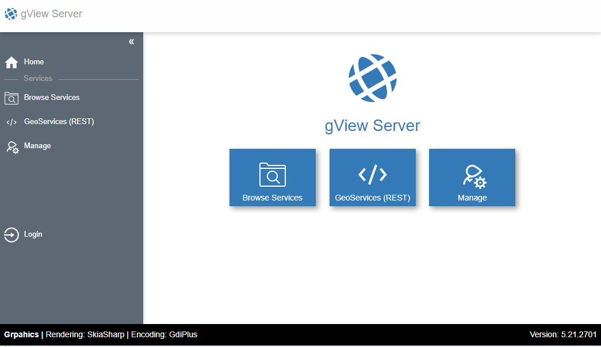

.. _publish-map-service-example:

Publish maps as *gView Server service*
======================================

Map projects created with *gView Carto* can be published to the *gView MapServer*. As a result, these maps can
can be integrated in a wide variety of GIS applications (Desktop, WebGIS, Leaflet, ...)

The map services are provided via the *gView MapServer* in different interfaces, e.g:

* **OGC WMS**: Very common interface, can be integrated into all common GIS software packages. Map images and legends can be generated and features can be queried in a simple form (*Point-Identify*)

* **OGC WMTS**: Provide pre-processed map tiles.

* **GeoServices REST**: an interface defined by ESRI based on REST/Json. This allows to export map images and legend images and 
  provide more complex query (point, rectangle, arbitrary geometry) and search for attributes. 
  In addition to the map services (*MapServer*), a *Feature* services (*FeatureServer*) are also offered here, with which geo-objects are not only queried
  but als can be edited and created (*Editing*)

There are two methodes to publish map services. The methods via the command line will be described later (gView.Cmd.MxlUtil).
The procedure described here is done via the web interface of the server. After calling the server, the following interface is displayed:

To publish map services, you must log in to the server either as an administrator or as an authorized *client*. To log in as an administrator,
must be clicked on the tile ``Manage``. Then you have to register via login form.
As a *client* you can log in via the *Sidebar* (left) via ``Login``. *Clients* have specific rights to services and directories with services (MapRequest, Query, Edit, Publish).
*Clients* are not allowed to create directories themselves. This is only allowed to the administrator.

Since a client is necessary for the later publishing of services using the command line, the procedure for creating clients is briefly shown here.

Create a client
---------------

In the administration area, click on ``Securtity``:

.. image:: img/manage1.png

A new client can be created in this interface:

.. image:: img/manage2.png

In the next step, a directory should be created in which the new client is allowed to publish maps. To do this, first switch to ``Browse Services`` via the *Sidebar*.
In this view, a new directory can be created under ``Create Folder``. Then click on ``Create new folder`` the new directory should appear in the list.

.. image:: img/manage3.png

Next you switch back to the ''Manage'' area. There, too, the new directory should now appear with an open lock. Open here means,
that every user has all rights for this directory (not recommended for production system).
If you click on the lock, a window opens. Here you can find the previously created user in the selection list. For this user at least the ``publish`` right should be assigned. 
For example, only the ''map'' and ``query`` rights can be assigned to the anonymous user ``_anonymous``:

.. image:: img/manage4.png

The next steps can done with the already logged in administrator user. However, you could now also log out and then use the *Sidebar* tp 
``Login`` as *Client* ``publish-test``.

Publish Services
----------------

To publish services, go to the ``Browse Services`` (*Sidebar*) section. Here you still have to change to the desired directory.
If you are authorized to publish services with the logged in user, the ``Publish`` button appears. There you can choose an MXL file (map project):

.. image:: img/publish1.png

Under ``Service Name`` the name of the service can be specified (if it does not automatically correspond to the name of the MXL file). Click on the button ``Publish Service``
attempts to publish the service. When publishing, it is still checked whether all data sources are accessible from the server and whether all *fonts* used 
are installed. If the release is successful, the service appears in the list.
If a service with this name already exists, it is automatically replaced.

