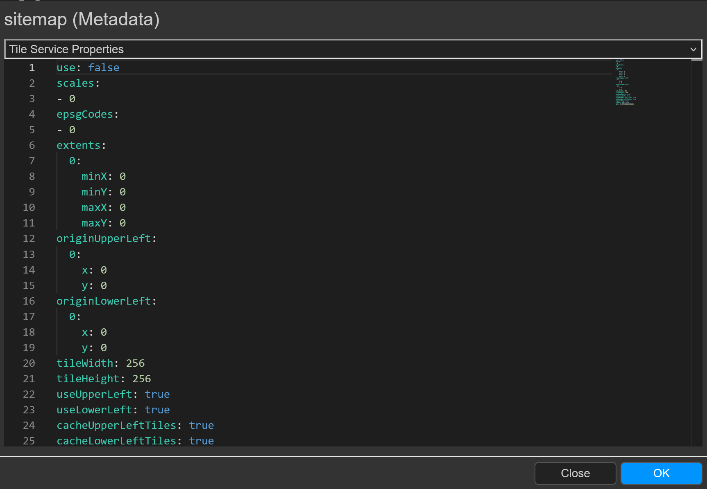
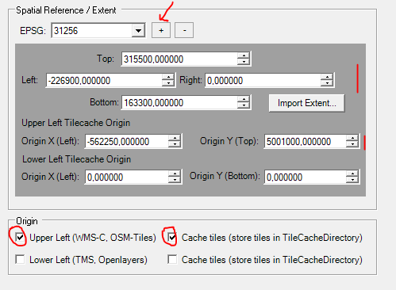
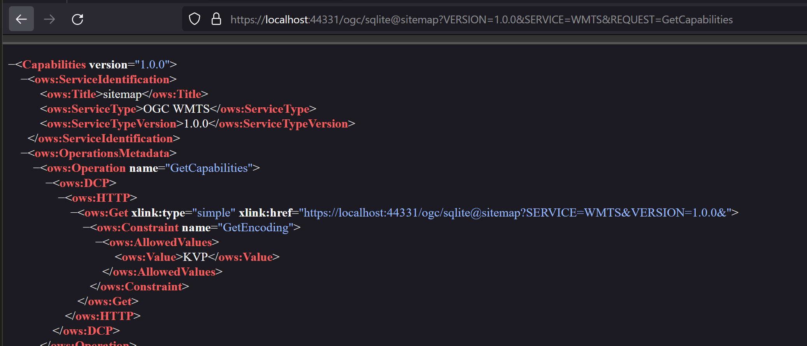
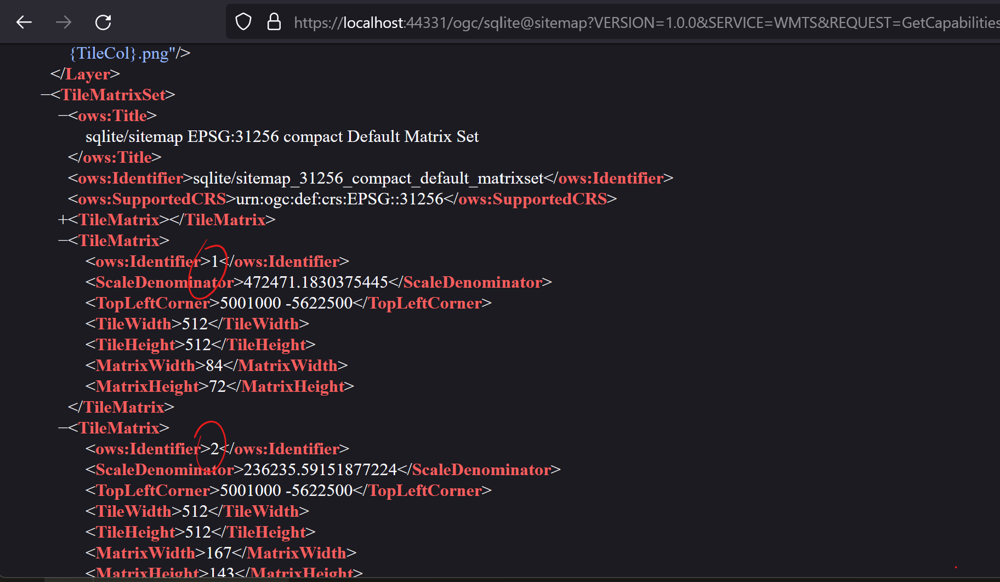

Calculation of a *TileCache* (site map)
=======================================

This example shows how to calculate a TileCache from an existing *gView Server* service.
This can be integrated into different applications via the WMTS interface. By pre-processing the tiles
increases the performance of the service. In addition, the server load is reduced.

A *TileCache* consists only of single (tile) images at the end. These can also be combined as *Compact TileCache tiles*,
which can reduce the number of single images (easier to copy, less storage space)

A *gView TileCache* offers different *styles*. For example, the tiles can also be displayed in black and white via filters *on-the-fly*.

MapService Metadata
-------------------

In order to be able to create a tilecache for a service later, this must already be defined in the map project in *gView Carto*. To this end, the corresponding
Map the *Map Properties* page are accessed. There you will find the *tab* ``MapService``. If you click on ``Metadata`` the 
Metadata dialog for the map service will shown. Under the metadata, for example, you can set in which projections WMS services are published.

Click on ''Tile Service Properties'' for the metadata. There you can set that tiling services for this card are allowed:

Here the desired scales are already defined and the tile sizes are changed from 256x256 to 512x512. Since the service is a site map, only ``image/png`` is offered as the image format.

The next step is to specify the extent of the TileCache service and the origin:
For a service, multiple TileCaches can be stored for different coordinate systems. Before the extent is set, a coordinate system must be selected
(``+`` button):

For the calculation of the tiles, an origin (Tile 0/0/0) can be specified in the upper left or lower left corner. Tilecaches with origin in the lower left corner are deprecated and 
are offered here only for completeness. For WMTS services, settings with the origin should be created in the upper left corner.

If the settings are also used for other services, they can also be saved or loaded with the ``Save`` / ``Load`` button.
For WebMercator maps, for example, the settings can be loaded from ``gview5/desktop/misc/tiling/osm.xml``.

Publish Service
---------------

The next step is to publish the service to *gView MapServer*. Any *gView MapServer* instance that provides access to the data can be used for this purpose.
Since the Calculation TileCaches can be resource and time consuming, a *local gView MapServer* instance can also be used here. This can be easily via the 
installation path can be started by script. This instance can be used to calculate the TileCache. After that, the service can also be published to a production instance 
and the TileCache can be copied.

The TileCache is created in the file system during the calculation. The path is specified in the file ``_config/mapserver.json``:

.. code::

    "tilecache-root": "C:\\temp\\tilecache"

All TileCaches are stored under this directory. The path can be changed later. All caches must be copied and after changing the entry in the 
``_config/mapserver.json`` and the *gView Server* has to be restarted.
    
For this example, the map service ``ortsplan`` (german for site map= has been published in the directory ``cache``:

.. image:: img/service1.png

If you click on the service in this view, all possible interfaces are listed with which the service can be queried.
This should also include an interface for TileCaches (*OGC Web Map Tile Service* or *WMTS*):

The link provided here redirects to the *Capabilities* of the *WMTS* service. The result should look something like this:

If the service is not allowed for tilecaches, you may receive the following error message:

.. image:: img/service4.png

In this case, the *MapService metadata* from the first step was not transferred to the service. To fix the error, the settings from the first step must be checked again
and the service has to republished. 

If you are familiar with *WMTS*, you will probably notice that no *MatrixSets* are specified in the *Capabilities* yet.
The reason is that the *gView Server* does not list the *MatrixSets* until tiles are available for them. In the directory tree in which the TileCache is created, it must be used for the corresponding scale 
enter a directory. Only if this directory exists, the scale is also listed in the *Capabilities*.

.. note::
    Here it is not checked whether all tiles are also available in the (scale) directory. As a rule, an empty directory is sufficient. An empty directory makes sense if the tiles for the service should be calculated *on-the-fly*.
    Then no tiles are created in the file system. In this case, the directories may have to be created manually. *On-the-fly* calculation should not be used in practice for performance reasons, why this 
    process is not described here.
   
Render Tiles
------------

To calculate the tiles a command line tool is offered ''gView.Cmd.RenderTileCache''. This calculates the individual tiles for a TileCache by specifying the server and the service.
The description is given in the section :ref:`commandline-tools` (:ref:`commandline-tools-render-tile-cache`).   

