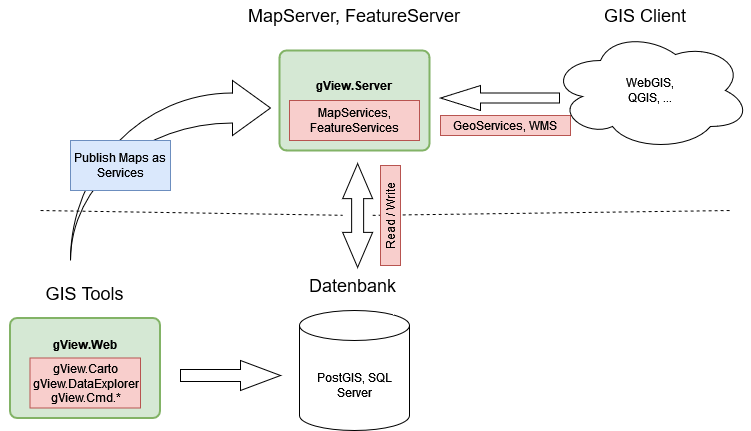

.. note::
  This documentation was based on the *gView documentation* in German
  Language.
  The translation was (semi) automated. 
  Feel free to contribute! More inforation in the document footer.

Welcome to gView GIS
====================

gView GIS is a user-friendly `Open Source` GI framework for creating map and feature services.

The tools for creating maps are offered through a web interface, which can be run locally 
on the client or hosted on a server.
The maps are created using the *gView Carto* program, which is available within the *gView.Web* 
application. The maps consist of layers based on various geo-data sources. Individual layers 
can be colored and/or labeled as desired.

Completed maps can be published via the *gView Server*. The created map and *feature* services 
can be accessed via defined interfaces (WMS, WMTS, GeoServices REST...).

Positioning of gView GIS
------------------------

*gView GIS* is not to be understood as an independent GIS platform. It merely provides a user-friendly 
authoring tool (*gView Carto*) for creating maps with attractive cartographic representation and a 
performant map server for publishing these maps. These maps are thus available through various 
interfaces and can be integrated into an existing WebGIS, for example.

*gView GIS* is not to be understood as desktop software that can visualize geo-data for analysis purposes. 
For these tasks, there are already powerful open-source projects like https://www.qgis.org.

Rather, the aim is to publish performant and cartographically appealing map services via the *gView.Server*. 
Analysis tools are offered in other/existing programs that can integrate *gView map services*.

A recommended productive setup for using *gView GIS* would be, for example:

The two components ``Database`` and ``Map-/Feature Server`` can be located on 
a server, and the ``GIS Client`` can run locally on the desktop or in a browser.
*gView Carto* is also installed locally on a desktop. The created maps 
are published in the *gView MapServer*. The *gView MapServer* also has a 
Security Layer, which determines which client can view, 
query, or edit the data.

Another use case for *gView GIS* is the creation of offline GIS solutions. 
These can be installed on any (Windows, Linux, MacOS) device and can 
serve as backup/emergency or offline systems (laptop).
For this, *gView GIS* offers the possibility via command-line tools to transfer all vector data 
of a map into a SQLite database. This eliminates the database layer, and the SQLite database 
can be easily copied to the target device. Only the *gView MapServer* and the corresponding 
client software need to be installed on the target device. The *gView MapServer* can be 
run on the target device as a *Standalone* application, as described in the installation 
instructions.

Components of gView GIS
-----------------------

The components of the gView Framework can be divided into three categories:

* **gView Web:** This includes the web applications *gView Carto* and *gView DataExplorer*. 
  Both can be operated via a web interface.
  Using these programs, maps can be created or geo-data can be managed.
  The basis for both programs is .NET 8 (Microsoft.AspNetCore.App 8.0.x Runtime)
  and thus runnable on Windows, Linux, and MacOS operating systems.

* **gView Server:** The gView Server is a map and feature server, 
  which can publish the created maps as map services.
  In addition to OGC standards (WMS, WFS), the services are also available in formats such as GeoServices REST 
  and ArcXML. This allows the services to be displayed and queried in any common GIS software.
  The basis of the program is .NET 8 (Microsoft.AspNetCore.App 8.0.x Runtime)
  and thus runnable on Windows, Linux, and MacOS operating systems.

* **gView Commandline Tools:** A collection of command-line tools that automate recurring 
  tasks in the *gView GIS* environment (e.g., publishing a map for the server).
  The tools are located in the same directory as *gView.Web* after installation
  and have the same runtime requirements.

 .. _`Open Source`: https://github.com/jugstalt/gview5
 .. _`Plattform`: https://gviewonline.com

.. toctree::
   :maxdepth: 2
   :caption: Table of contents:

   setup/index
   desktop/index
   server/index
   commandline/index
   examples/index
   appendix/index

