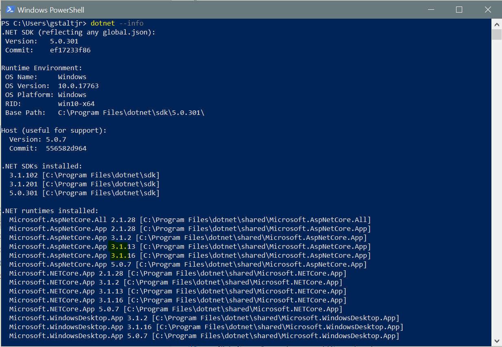
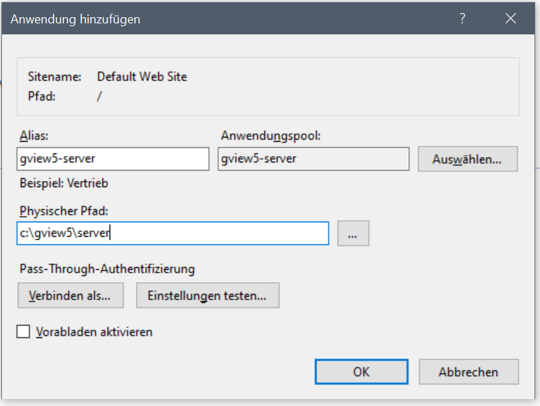
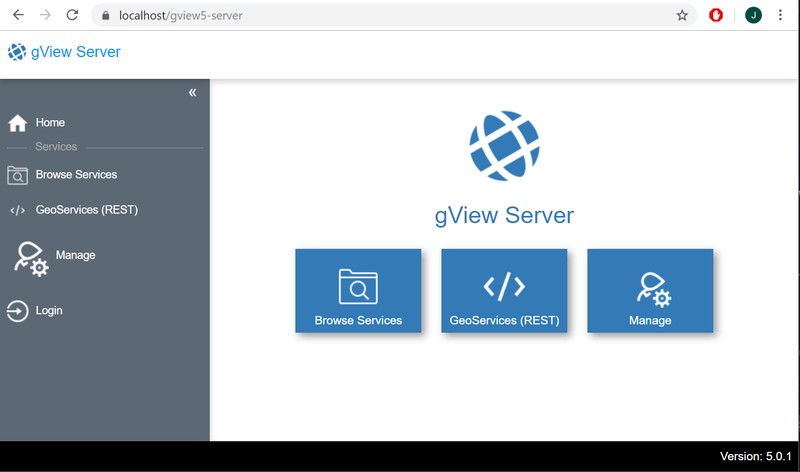

Microsoft Internet Information Server (IIS) (Windows) 
=====================================================

.NET Core Runtime installation
------------------------------

gView Server is a .NET Core application and therefore requires the .NET Core runtime environment. 
This can be downloaded from the following web page: 

https://dotnet.microsoft.com/download/dotnet-core

The current version must be selected here. At the time of the preparation of this documentation, the
current version for the gView server .NET Core 3.0

.. image:: img/iis1.png

Here you have to choose the *Runtime & Hosting Bundle* so that the application can be hosted in the IIS.

.. image:: img/iis2.png

Whether all necessary runtimes are available on the computer after installation, 
can be checked with the command line tool "dotnet.exe". 
(This should be found after successful installation if all the PATH variables are 
correctly).

After installing the *Runtime & Hosting Bundle* 
* Microsoft.AspNetCore.App 
* Microsoft.NETCore.App
should appear in the correct version. 

Include .NET Core application in IIS
------------------------------------

Prerequisite for .NET Core applications to run in IIS is the module 
"AspNetCoreModuleV2". This module controls the monitoring and forwarding of the 
requests from IIS to the application. Whether this module was installed correctly in the above step, 
can be checked via the IIS Manager:

.. image:: img/iis4.png

The next step is to create an application pool:

.. image:: img/iis5.png

It is important for .NET Core applications that the .NET CLR version is set to "No Managed Code." 

The next step is to include the application. To do this, the application should be on hard drive on yout the server. 
Right-click the Web Site in IIS Manager and choose *Add application*:

In the *Add application* dialog, an alias name must be choosen. With this name you can call the application later via the browser.
Furthermore, the previously created application pool must be set.

Now, for example, the gView server should be accessible via https://localhost/gview5-server:

GDAL Driver
-----------

GDAL for displaying raster data (GeoTIFF, ...) is included in the installation package.
In order for additional formats (JPG2000, ECW) to work, GDAL must find use the ''gdalplugins''. 
This is located in the program directory.
However, if the application is 
Hosted in an IIS application pool, the directory must be set via the environment variable 
``GDAL_DRIVER_PATH``. The path can be specified here as absolute or relative.

**Variant 1:**

* ``GDAL_DRIVER_PATH=C:\.....\gview\server\gdalplugins``
* ``GDAL_DRIVER_PATH=.\gdalplugins``

In order for the application pool to receive the information from the environment variables, the 
``Advanced Settings`` the ``Load User Profile`` option can be set to ``true``.

**Variant 2: (reommended):**

If you use IIS 10 you can use set environment variables for an application pool 
alternatively, via the IIS configuration (section ``system.applicationHost``):

https://docs.microsoft.com/en-us/iis/configuration/system.applicationhost/applicationpools/add/environmentvariables/

**Variant 3:**

If you run the application ``OutOfProcess``, the environment variable can be set in the ``web.config``
of the web application:

.. note::
   This method should only be used if variants 1 and 2 are not possible.
   It is recommended to run the application ``InProcess`` for performance reasons.

.. code::
   
   ...
   <aspNetCore processPath="%LAUNCHER_PATH%" stdoutLogEnabled="false" hostingModel="OutOfProcess">
      <environmentVariables>
        ...
        <environmentVariable name="GDAL_DRIVER_PATH" value=".\gdalplugins" />
      </environmentVariables>
   ...