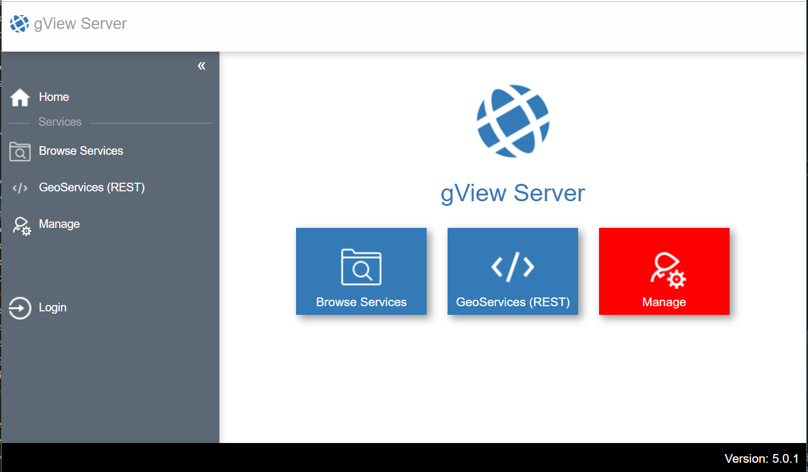

.. _server_postinstallation:

Post-installation
================

After installing the gView Server, post-installation follows. When the server is first accessed 
via the browser, the following message may appear:

.. image:: img/postinstallation1.png

This error message indicates that the server configuration is not yet correct.
In this example, the file ``_config/mapserver.json`` does not yet exist. The form and function 
of this file is shown in the section :ref:`config-server`.

After successful configuration, the application will look like this after the first launch:

The red ``Manage`` button indicates that no administrator has been created yet. The **gView Server**
requires an administrator user who can create **Logins** and **Folders** (directories for map services).

As long as this button is red, this administrator must be created. To create the administrator,
click on the red tile and assign a username and password for the administrator:

.. image:: img/postinstallation3.png

If the password is not strong enough, a stronger password may need to be specified.
After the administrator has been successfully created, the interface switches to the **Manage** area 
of the gView Server. This is only visible to the administrator after successful login:

.. image:: img/postinstallation4.png

