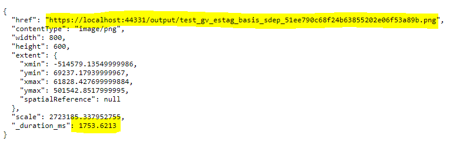

GeoServices REST Interface 
==========================

*GeoServices REST* is an interface developed by ESRI for ArcGIS Server.
*gView MapServer* supports this interface (*MapServer* and *FeatureServer*). With this 
interface various tools are offered in the web interface,
with which a *gView MapServer* service can be tested. Thats why there is an extra menu item for this interface:

*GeoServices REST* is a *RESTful API* in which via HTTP GET and POST requests, commands send to the server
and usually a JSON document is returned.

These JSON documents can be viewed via the web interface. For better readability YAML is chosen as the display standard.

The parent JSON file returns the *folders* and services of the first level:

Hyperlinks are highlighted as buttons in the YAML. In addition, some listings (services) are grouped by
defined attribute values (``Type: MapServer``, ``Type: FeatureServer``)

If you click on one of the hyperlinks you get to the next view. The YAML representation for a ''MapServer''
service looks something like this:

.. image:: img/geoservices3.png 

Here you can find further links to the layers of the service. In it, for example,
Details about the fields are listed.

Above the YAML display, there are further link buttons for some types.
For example, for ``MapServer`` types, ''ExportMap'' is interesting. With an ``ExportMap`` request,
a map image for a specific extend can be requested. Click on ´´ExportMap``
a form appears in which you can enter the values for the request:

.. image:: img/geoservices4.png

The output format can be changed from ``json`` to ``pjson`` (the ``p`` stands for *Pretty*, 
which guarantees better readability for the result). Confirm the form with ``Submit`` with the following result:

The server creates an image and stores it in the *output directory*. The returned url.
can be copied from the JSON to browser address line. If everything worked out, a map image should
be displayed.

The same result should be obtained if you take a step back and in the form as ``OutputFormat``
specifies the value ``image``. This eliminates the step via the JSON document:

.. image:: img/geoservices6.png

.. note::
   By default, the form displays the full map extend. If no layers are visible on this scale, the result can also be an empty image.
   In addition, the server returns the default layer visibility if no visibility is specified in the form.

In the same way, queries on layers can also be tested (go to the *Layer YAML* and click on ''Query'')

.. note::
   The parameters correspond to the GeoServices REST specification.
   This can be looked up at ESRI, for example under https://developers.arcgis.com/rest/services-reference/enterprise/export-map.htm