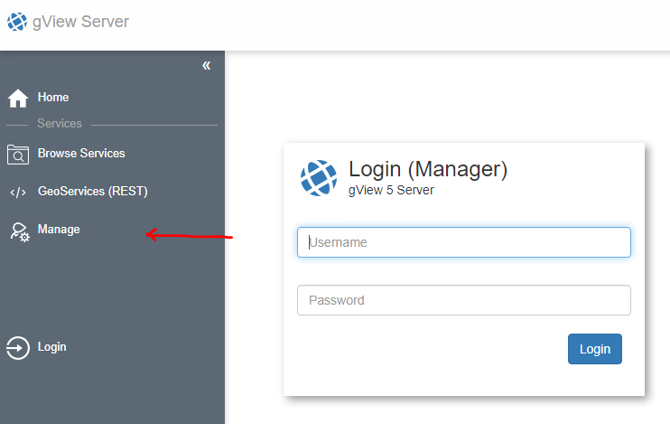
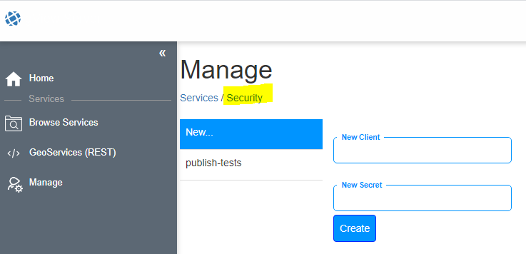

Manage gView Server
===================

To manage the *gView MapServer*, an administrator account has already been created under :ref:`server_postinatalltion`. 
With this user, you can:

- create new directories
- publish Services are via the web interface
- stop and restart services
- display log files of the services
- create clients

Log in as administrator
-----------------------

To login the link ''Manage'' from the sidebar:

Manager User Interface
----------------------

If you are logged in as an administrator, the manager user interface appears something like this:

.. image:: img/manage2.png 

On the left, the directories (folders) in which services are organized are displayed. Next to it, the services that are located in this directory are displayed.

Clients anlagen
---------------

*Clients* are well-known *WebApplications* that access the services in the *gView MapServer*. If, for example, a WebGIS application accesses services, a *client* can be created for this purpose.
Each *client* has a *secret* to log in to the *gView MapServer*. *Client* and *Secret* are similar to *User* and *Password* only the
a *client* is usually not a physical person but an application. If you want to give only certain users access to certain services later, it must be 
create a separate authorization layer in the respective *CLient* software (WebGIS)

In the Manager user interface you can switch between ``Services`` and ``Security`` at the top. Under Security, new *clients* can be created or existing *secrets* can be changed:

Services Permissions
--------------------

Basically, services with the same properties (productive/test, special permissions) should be organized within *folders*. 
Permissions can then be set at the *folder* level and apply to all services within the *folder*. Alternatively, permissions must be used individually set for each service.

.. note::
   Permissions are organized hierarchically. If a right over the *folder* is not possible, this is also not available in a service in this *folder*. 
   An additional permission of a service within a group can only be more restrictive.

Whether permissions have been set for a service or a *folder* can be recognized by the *lock symbol*. If the lock is open, no permissions have been set so far.
All services are then available to every user.
   
For example, if you click on the *lock symbol* for a *folder*, the following dialog opens:

.. image:: img/security1.png 

No permissions have yet been set here, which means that every user/client may use all services in this *folder* without restriction. 

.. note:: 
   An exception here is the *Publish Service* permission. This can only be assigned to a client. Only authorized clients and the administrator can publish services.

* **Export Map**: Map images may be collected for any extend.
* **Query**: Geo-objects can be queried and searched.
* **Features**: Geo objects can be downloaded or edited as features. This requires *GeoServices REST* as the interface. Which geo-objects may be edited is stored in the map project (MXL) via *gView Carto*
in the *Ribbon* under *Options*.
* **Publish Service**: Services may be published and deleted for this directory.
* **Schnittstellen**: Permissions can be restricted here for certain interfaces (WMS, ...).

An existing client can be selected from the list. The client ``_anonymous`` has a special position, which is automatically always offered in the selection list.
This is a *client*, which is always used as an authorization if no login is made by the *client* application. For this *client* you can use something like the following:

.. image:: img/security2.png 

This means that an *anonymous client* is allowed to retrieve map images and query geo-objects for the services in this *folder*. For the services, however, only the 
Interfaces ``WMS`` and ``WMTS`` available.

In the next step, clients will get more special rights:

.. image:: img/security3.png 

As can be seen above, further values can be entered for the folder in this dialog (``Oinline Resource (override)`` and ``Output Url (override)``).
This allows the values from the ''_config/mapserver.json'' to be overwritten. This can be useful if a server can be reached from the Internet via different urls or if services of a 
*Folders* can be published via a proxy. As a rule, these values can be left blank.

State of services
-----------------

Services can have a specific state at run time. This can be seen in the *Manage* user interface in the Services list (see above):

* **Idle**:  The service appears in the list "white*. The service is available, but has not yet been started/called by a client.
* **Running**: The service has been initialized and is running (green)
* **Stopped**: The service ist stopped by the administrator. The service is no longer visible to clients. In the Manage Web Interface, the service is displayed opaque.

Additional colors::

* **Rot**: The service has been causing errors since the last start.

Command buttons are also available for each service, which can be used to set its state, for example:

.. image:: img/status1.png 

* **Logs**: View (error) logs for this service
* **Security**: Set permissions for this service
* **Start**: Start service (if stopped)
* **Stop**: Stop service (no longer visible to clients)
* **Refresh**: a restart of the service is forced