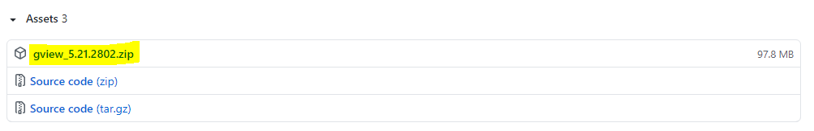
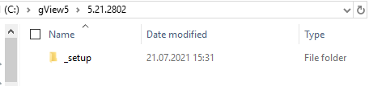
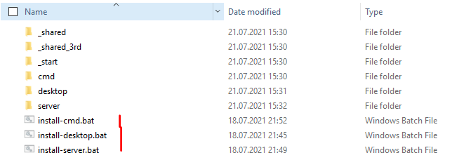
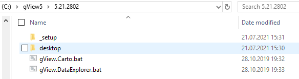
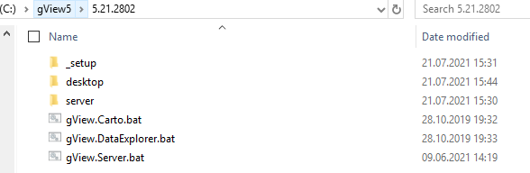
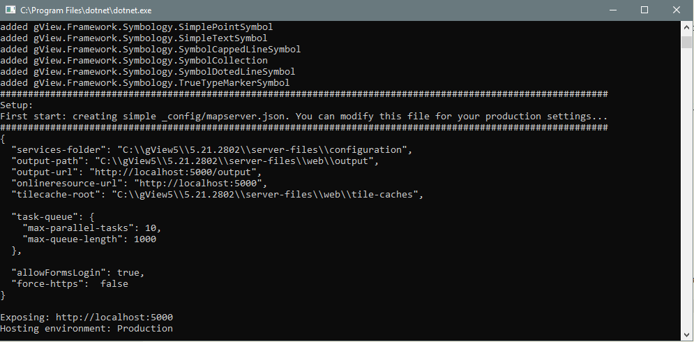
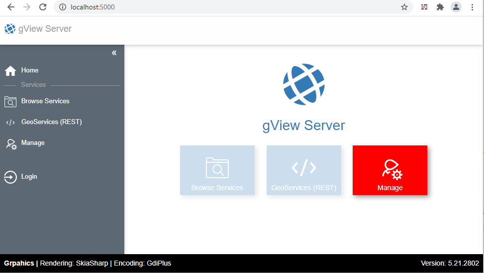

Installation
============

*gView GIS* runs on different platforms with the exception of desktop programs. The individual components are both (Windows) Destop, (Web) Server or command line tools.
Since all components run at least on Windows, there is an installation package for Windows. The software does not have to be installed directly but also runs as a *Portable* version.
However, the desktop programs (*gView.Carto* and *gView.DataExplorer*) on Windows require a .NET Framework 4.7.2. Server and command line tools set 
a .NET Core 3.1 runtime environment that is available for Windows, Linux and MacOS.

The installation packages can be downloaded from the GitHub repository https://github.com/jugstalt/gview5/releases under *Releases*:

The package consists of a ZIP file and 
must be unpacked at any point in the first step. Different versions of *gView GIS* can be installed side-by-side. It is recommended that the
For example, to unpack ZIP file under ``C:\gview5\5.21.2801``:

The directory ``_setup`` contains the following directory structure:

In the subdirectories shown here are the actual software components. These do not have to and should not be opened or changed.
The setup process is done by the three batch files:

* ``install-desktop.bat``: Installs the desktop applications *gView.Carto* and *gView.DataExplorer*
* ``install-server.bat``: Installs the *gView.MapServer*
* ``install-cmd.bat``: Installs the commandline tools

Desktop
-------

Double-click on ``install-desktop.bat`` starts compiling the necessary software components for *gView Desktop*. The script should only take a few seconds, depending on the speed of the disk.
The destination of each installation is always the folder in which the ''_setup'' directory is located. If you change a folder upwards, the following files/folders will now appear:

The directory ``desktop`` now contains the assembled software components. However, the content of the directory is not relevant. The two *desktop applications* are started by the corresponding
Batch files started (double click):

* ``gView.Carto.bat``: starts *gView.Carto*
* ``gView.DataExplorer.bat``: starts *gView.DataExplorer*

If you open *gView.Carto* a *Splash Screnn* appears and *gView GIS* searches the program directory for existing plugins. After that, the program should be displayed something like this:

.. image:: img/setup4.png

Server
------

The installation of the *gView.MapServer* is analogous to *gView.Desktop*:
``install-server.bat`` starts the copy process of the necessary server components. If you change a folder up, the following is displayed:

The server can be started in different ways (Microsoft IIS, Docker Container, Standalone). A description will be given later. Here the *standalone* variant can only be tested once briefly.
To do this, start the file ``gView.Server.bat``. Again, the software scans for plugins and then the server is started. If everything runs correctly, the output in the command line window looks something like this:

The map server needs some directories in which the map projects are later stored. In the standard configuration, this directory is created automatically: Directory ``server-files``
*gView.MapServer* runs *standalone* as a web server and now runs under http://localhost:5000

Command Line Tools
------------------

To install the tools, the file ``install-cmd.bat`` must be started under ''_setup''. One folder higher there is then a directory ``cmd``. This contains all the necessary software components.
With the command line tools, no ``.bat`` file is created for starting. The possible tools will be discussed later.

.. note::
   All three components shown here are independent of each other and can be installed individually or in combination. In principle, only the components that are needed should be installed.
   For example, if you use a local computer only maps that you want to publish on a productive *gView.MapServer*, a *gView.Desktop* installation is sufficient. If you also want the cards 
   via the command line (not via the web interface of the server), *gView.Cmd* must also be installed.
   If it is also necessary to test the services beforehand on a *local gView.MapServer*, this can also be installed as *standalone* if necessary.

   On the server you only have to install *gView.Server*.

